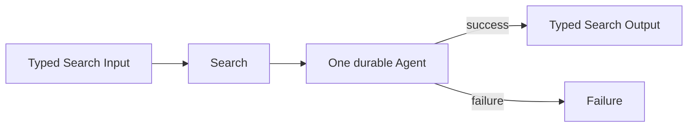

# Single-Shot Agent

## Intent

Use one Agent exactly once when one well-scoped role can transform the Search Input into an acceptable result without exploring alternatives, decomposing the problem, or coordinating multiple independent operations.

Apply the [Agent or Program rule](../../../SKILL.md#choose-agent-or-program) to every authored operation in this pattern.

This is the smallest useful Search pattern:

```text
one typed Input
→ one Agent invocation
→ one typed Output or Failure
```

A Single-Shot Search is not “missing” a workflow. It is the correct workflow when additional orchestration would not add useful information.

It is also the natural **base case** for recursive Search designs.

## Structure



The Agent’s declared structured-output verification remains part of the Agent family. Do not add a second evaluator merely to make the diagram look more sophisticated.

## Core idea

The Search already knows:

- what result is needed;
- which role can produce it;
- what typed Input that role needs;
- how the Agent Output becomes the Search Output.

There is no useful frontier, population, branching decision, or iteration.

The Search performs one explicit adaptation:

```text
Search Input
→ Agent Input
```

and one explicit adaptation:

```text
Agent Output
→ Search Output
```

## Search interpretation

| Search concept | Meaning in this pattern |
|---|---|
| State | The immutable Search Input and, after execution, the Agent Output |
| Candidate | At most one proposed result |
| Action | Run the single Agent |
| Observation | The Agent’s typed Output or Failure |
| Score | Usually absent; may already be part of the Agent Output |
| Aggregation | None |
| Frontier | None |
| Stop condition | The Agent becomes terminal |
| Result | Adapt the successful Agent Output into the Search Output |

This is a degenerate search space with one attempted transition. That is acceptable.

Do not create fake candidates, fake graph nodes, or an artificial search frontier to make the pattern appear more “search-like.”

## Mapping to the AIBuildAI SDK

The outer operation is a `Search` because it defines the orchestration boundary and returns the Search’s business result.

The single child is usually an `Agent` because one LLM role performs the transformation.

Use a `Composite` class instead when the operation represents a real domain candidate whose lifecycle matters independently.

Use a `Program` instead only when the selection guide admits it.

The normal Search implementation uses:

```text
handle = ctx.spawn(Agent invocation)
handle.result()
```

Invoke every Agent Action through `ctx.spawn()` so the Action keeps its typed Output, Attempt history, and DBOS workflow identity.

## Complete package

The folder beside this file holds a complete package for this pattern, activated by the repository gate through the real generated-definition loader on every change: `search/` is the authored layout (`search/__init__.py` exports `SEARCH_TYPE`; `search.py`, `io.py`, `agents/`, `prompts/agent/`), and `input_payload.json` is the Input that builds its `SEARCH_TYPE`. Read `search/search.py` for the control flow and `search/agents/io.py` for the typed boundaries. `ModelerAgent` is the one role; the Search adapts its Input to `ModelerInput` and the role's Output to the `SearchOutput`.

## When to use

Use Single-Shot Agent when most of the following are true:

- The objective can be stated as one bounded transformation.
- One role has all required context and tools.
- The result can be represented by one typed Output.
- There is no clear benefit from generating multiple alternatives.
- There is no independent subproblem that deserves a separate execution.
- A failure can be surfaced directly rather than repaired through orchestration.
- The task is cheap enough that additional planning would cost more than it saves.
- The Search is a recursive base case whose remaining subproblem is already small.

Typical examples:

```text
classify one task
extract one structured plan
summarize one bounded artifact
select one option from a small supplied set
translate one completed result
produce one final synthesis from already prepared evidence
```

## When not to use

Do not use this pattern merely because it is easy to implement.

Choose another pattern when:

- the task has fixed, meaningfully different stages;
- different input categories need different specialists;
- independent parts can run in parallel;
- multiple alternatives are valuable;
- a reliable evaluator can improve the result through feedback;
- the problem should be recursively decomposed;
- the next operation depends on intermediate evidence;
- one Agent would have to maintain several incompatible roles in one prompt.

A common warning sign is a prompt that says:

```text
First behave as a planner.
Then behave as an implementer.
Then independently criticize yourself.
Then choose the best answer.
```

That is usually several operations compressed into one Agent and should be reconsidered.

## Budget and stopping

The Search-level stopping rule is exact:

```text
stop when the one child Agent is terminal
```

The Search should not add an outer loop around the Agent.

If the Agent’s normal structured-output verifier rejects a submission and asks the same Agent to repair it, that remains Agent-family behavior. The Search does not duplicate that loop.

Recommended Search-level limits:

```text
maximum durable children: 1
maximum Search rounds: 1
maximum recursive Meta calls: 0
```

All direct children must be terminal before the Search returns.

## Recursive form

Single-Shot Agent is usually the terminal case of a recursive algorithm:

```text
if the subproblem is small enough:
    run one Solver Agent
    return its result
else:
    use a recursive decomposition pattern
```

Do not recursively create another Search merely to run another single Agent. That adds a layer without adding semantics.

A child Search is justified only when the child owns meaningful orchestration of its own.

## Useful hybrids

Single-Shot Agent commonly appears as:

- a leaf of a Tree Search;
- the terminal solver in divide-and-conquer;
- one specialist branch after a Router;
- one worker in parallel sectioning;
- the final synthesizer after a DAG join;
- the evaluator or optimizer inside an iterative pattern;
- the base case of a recursively generated Search.

## Common mistakes

### Adding multiple identical Agents without a selection rule

```text
Agent A
Agent B
Agent C
```

is not useful diversity if all three receive the same role, context, model, and objective and no later operation knows how to compare them.

That is an incomplete Best-of-N pattern, not Single-Shot Agent.

### Creating a fake Composite

Do not materialize a Composite merely because the delivery path historically expected one. A Composite should represent a truthful bounded operation.

### Returning raw text or a raw dictionary

The Agent and Search should both have explicit typed Outputs. The Search adapts one typed value into another.

### Reimplementing retry

Do not catch every Failure and run the same Agent again with unchanged Input. A retry with no new evidence is not search.

### Hiding multiple roles in one prompt

One Agent may use tools and reason internally, but it should still have one coherent responsibility.

### Using Single-Shot because the design phase was skipped

The correct question is not:

```text
Can one Agent produce something?
```

It is:

```text
Would another operation add independently useful information?
```

## Design checklist

Before selecting this pattern, answer:

```text
What exact typed value must the Agent return?
Why is one role sufficient?
What information would a second execution add?
Is there any meaningful branching or iteration?
What is the direct Failure behavior?
How does the Agent Output become the Search Output?
Does the Agent Action call declare `upstream=`, naming every producer its Input consumes?
```

If the answer to “what would a second execution add?” is unclear, remain with Single-Shot Agent.

## References

- Anthropic, **Building Effective Agents**: start with the simplest solution; for many tasks, one augmented LLM call with good tools, retrieval, and examples is sufficient. ([anthropic.com](https://www.anthropic.com/engineering/building-effective-agents))
- Anthropic, **Building Effective Agents Cookbook**: minimal implementations begin with the augmented LLM before introducing multi-step workflows. ([github.com](https://github.com/anthropics/claude-cookbooks/blob/main/patterns/agents/README.md?utm_source=chatgpt.com))
