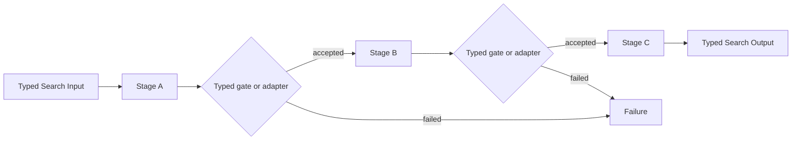

# Sequential Chain

## Intent

Use a Sequential Chain when the task can be cleanly decomposed into a fixed ordered series of transformations and each stage makes the next stage easier, narrower, or better specified.

Apply the [Agent or Program rule](../../../SKILL.md#choose-agent-or-program) to every authored operation in this pattern.

The stages and their order are known before execution begins:

```text
Stage A
→ Stage B
→ Stage C
→ final result
```

Each stage consumes a typed value and produces another typed value.

## Structure



The “gates” in this diagram do not require new Execution types.

A gate may simply be:

- the stage’s typed Output validation;
- an explicit ordinary Python condition;
- an adapter that refuses invalid business data;
- an existing Agent output verifier;
- a small deterministic check inside the parent Search.

## Core idea

The chain reduces one complex operation into a fixed sequence of simpler operations.

For example:

```text
understand the objective
→ produce a plan
→ implement the plan
→ inspect the implementation
→ return the result
```

The key word is **fixed**.

If the number or nature of the stages must be discovered at runtime, this is no longer a plain Sequential Chain. Consider Router, Orchestrator–Workers, Graph, or Recursive Decomposition instead.

## Search interpretation

| Search concept | Meaning in this pattern |
|---|---|
| State | The original Input plus the latest typed intermediate value |
| Candidate | Usually one evolving result |
| Action | Execute the next predetermined stage |
| Observation | The next typed intermediate Output |
| Score | Optional at fixed review stages |
| Aggregation | Each stage adapts the previous stage’s Output |
| Frontier | Exactly one next stage |
| Stop condition | The final stage becomes terminal |
| Result | Adapt the final stage Output into the Search Output |

There is no need to persist a separate mutable program counter such as:

```text
current_stage = 3
```

The ordinary Python order, durable child records, and workflow replay already determine which stage has completed.

## Mapping to the AIBuildAI SDK

A stage may be:

- an `Agent` for one LLM role;
- a `Composite` class for one domain candidate or domain operation;
- a `Program` admitted by the selection guide;
- a child `Search` if that stage contains meaningful orchestration of its own.

The parent Search explicitly performs every Output-to-Input conversion.

Example:

```text
PlannerOutput
→ ImplementationInput

ImplementationOutput
→ ReviewInput

ReviewOutput
→ FinalSearchOutput
```

The runtime must not infer these conversions.

Use:

```text
handle = ctx.spawn(...)
handle.result()
```

for ordinary sequential stages.

Use:

```text
capture_failure=True
```

only when the parent Search has an explicit fallback or recovery decision. Otherwise preserve default Failure propagation.

## Complete package

The folder beside this file holds a complete package for this pattern, activated by the repository gate through the real generated-definition loader on every change: `search/` is the authored layout (`search/__init__.py` exports `SEARCH_TYPE`; `search.py`, `io.py`, `agents/`, `prompts/agent/`), and `input_payload.json` is the Input that builds its `SEARCH_TYPE`. Read `search/search.py` for the control flow and `search/agents/io.py` for the typed boundaries. `PlannerAgent` runs first; `ImplementerAgent` names it in `upstream=` because its Input is adapted from the plan.

## When to use

Use a Sequential Chain when:

- the stages are known before the run starts;
- the order matters;
- each stage has a distinct responsibility;
- each stage produces a useful typed artifact;
- later stages depend on earlier results;
- splitting the task makes each LLM call substantially easier;
- intermediate validation can prevent later wasted work;
- parallelism would not help because the dependencies are genuinely sequential.

Typical examples:

```text
extract requirements
→ design solution
→ implement solution
→ review result

retrieve evidence
→ normalize evidence
→ synthesize argument
→ format final answer

draft outline
→ verify outline
→ write document

analyze dataset
→ choose method
→ execute experiment
→ interpret result
```

Prompt chaining is widely used for tasks that can be cleanly decomposed into fixed subtasks; the tradeoff is usually greater latency in exchange for simpler individual calls and potentially higher reliability. ([anthropic.com](https://www.anthropic.com/engineering/building-effective-agents))

## When not to use

Do not use a fixed chain when:

- the required stages cannot be predicted;
- some stages are independent and should run in parallel;
- different input categories need different paths;
- the task requires exploring alternatives rather than refining one result;
- the process must repeatedly evaluate and revise until a criterion is met;
- several earlier outputs must merge in non-linear ways;
- a stage often needs to return to multiple earlier stages.

A long chain is not automatically a good decomposition.

If every stage receives nearly the same context and produces nearly the same kind of answer, the chain may simply be one role fragmented into unnecessary calls.

## Budget and stopping

The number of Search-level stages should be bounded and known.

A typical stopping contract is:

```text
complete Stage 1
complete Stage 2
...
complete Stage N
return final typed Output
```

Recommended controls:

- define the maximum stage count structurally;
- do not append stages dynamically;
- let each child family own its own normal resource policy;
- stop immediately on an uncaptured Failure;
- use a fallback only when the fallback has different Input, tools, role, or evidence;
- never return while a spawned direct child remains open.

Avoid a chain with twenty micro-stages when three meaningful stages express the same semantics.

An Agent should not be created merely to:

```text
rename one field
format one small value
copy data from one type to another
perform a deterministic condition
```

Those belong in ordinary Python adapters.

## Recursive form

Any stage may be implemented by a child Search:

```text
Stage A: Planner Agent
Stage B: child Search that explores implementations
Stage C: Reviewer Agent
```

Use recursion when the stage genuinely owns a nested search problem.

If a custom child Search must be generated:

```text
if depth remains
and this stage requires a task-specific orchestration:
    run MetaAgent
    load the generated Search
    run the child Search
```


Do not recursively generate a Search to reproduce an ordinary fixed Agent stage.

## Useful hybrids

Sequential Chain composes naturally with:

- **Router → Chain**: each route selects a different fixed chain.
- **Parallel → Chain**: several independent chains run concurrently.
- **Chain → Parallel**: one planning stage fans out into independent workers.
- **Chain with Evaluator–Optimizer**: one stage contains an iterative refinement loop.
- **Chain with child Search**: one stage delegates a complex subproblem.
- **Chain ending in Tournament or Voting**: earlier stages generate candidates, later stages select.
- **DAG containing chains**: a linear segment is one subpath of a larger graph.

## Common mistakes

### Passing raw conversation history between stages

Each stage should receive a purpose-built typed Input, not the entire transcript by default.

### Treating prompts as state

The durable business state is represented by Inputs, Outputs, and child records. Prompt text is an implementation detail of an Agent role.

### Creating a general pipeline engine

Do not introduce:

```text
Pipeline
Stage
PipelineContext
PipelineRunner
```

merely to execute a fixed sequence.

Ordinary Python already expresses the order.

### Serializing independent work

If Stage B and Stage C depend only on Stage A, they should probably be spawned in parallel after A.

### Hiding fallbacks in broad exception handlers

Fallback is a business decision and must be explicit.

### Using the same Agent role at every stage

A chain should separate responsibilities. Repeating the same role with lightly modified prompts may accumulate errors without adding independent judgment.

### Forgetting original facts

A later Input may need both:

```text
the original objective
and the previous stage Output
```

Do not force every intermediate Output to duplicate the complete history.

## Design checklist

Before selecting this pattern, write down:

```text
What are the fixed stages?
Why must they occur in this order?
What typed value crosses each boundary?
Which stages are Agents, Composites, Programs, or child Searches?
Which checks are deterministic Python?
Which Failure stops the chain?
Which Failure has a real fallback?
Could any stages run independently?
Does every Action call declare its direct upstream Action occurrences?
```

If the stage list cannot be written before execution, use a more dynamic pattern.

## References

- Anthropic, **Building Effective Agents — Prompt Chaining**: fixed decomposition, intermediate checks, and the latency-versus-accuracy tradeoff. ([anthropic.com](https://www.anthropic.com/engineering/building-effective-agents))
- Microsoft AutoGen, **Sequential Workflow**: specialized Agents contribute in a deterministic, pre-specified order. ([microsoft.github.io](https://microsoft.github.io/autogen/stable/user-guide/core-user-guide/design-patterns/sequential-workflow.html))
