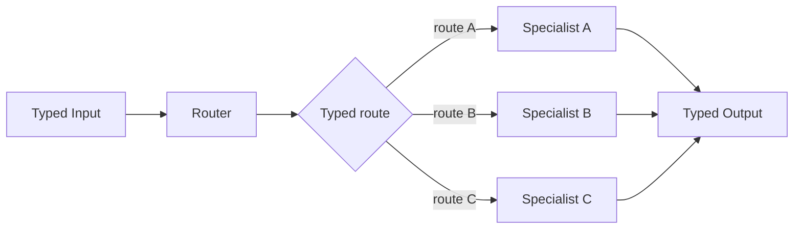
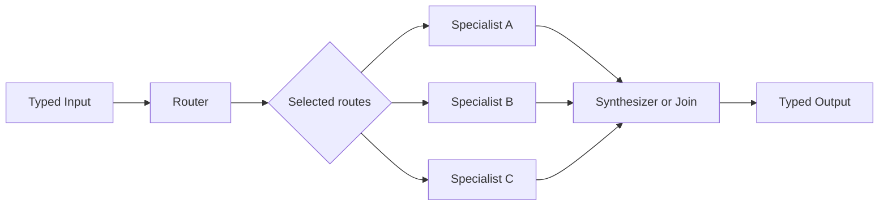

# Router and Specialists

## Intent

Use Router and Specialists when the current Input or intermediate state belongs to one or more recognizable categories and each category is better handled by a different role, toolset, model, or downstream Search.

Apply the [Agent or Program rule](../../../SKILL.md#choose-agent-or-program) to every authored operation in this pattern.

The pattern separates two questions:

```text
What kind of problem is this?
Who should solve that kind of problem?
```

The Router answers the first question.

The parent Search answers the second through an explicit typed dispatch table.

## Structure

### Single-route form



### Multi-route form



The Router may select exactly one branch or a bounded set of branches. These are two variants of the same pattern, but the selection cardinality must be explicit in the Router Output type.

## Core idea

A generalist prompt often performs poorly when:

- input categories require different expertise;
- categories need different tools;
- categories have incompatible constraints;
- optimizing one category harms another;
- simple and difficult cases deserve different budgets.

Routing isolates those concerns.

The Router should perform classification or dispatch, not solve the whole task and then ask a specialist to restate its answer.

## Search interpretation

| Search concept | Meaning in this pattern |
|---|---|
| State | The current typed Input and the typed route decision |
| Candidate | One selected specialist result, or several selected branch results |
| Action | Classify, then invoke selected branch or branches |
| Observation | Specialist Outputs |
| Score | Optional route confidence or downstream validation |
| Aggregation | None for single-route; explicit join for multi-route |
| Frontier | The selected specialist set |
| Stop condition | All selected branches required by policy are terminal |
| Result | Direct specialist result or synthesized multi-route result |

The route decision is a business value. It does not change durable class identity.

## Mapping to the AIBuildAI SDK

The Router is an `Agent` with a small structured Output: `RouterOutput` in `search/agents/io.py` holds `routes`, a tuple of one to three `RouteLabel` values, most relevant first.

The parent Search owns the mapping:

```text
"data_analysis"    → DataAnalysisSearch
"literature_review" → LiteratureSearch
"code_repair"      → CodeRepairSearch
```

Do not let the Router return:

```text
an arbitrary Python module
an arbitrary class name
a source path to import
a raw durable type key
```

Routing chooses among capabilities the parent Search has intentionally offered.

### Single-route execution

Use:

```text
ctx.spawn(selected child)
handle.result()
```

### Multi-route execution

Use:

```text
ctx.spawn(each selected child)
ctx.wait(handles)
handle.result()
ctx.spawn(synthesizer)
handle.result()
```

All selected direct children must become terminal before the Search returns.

## Complete package

The folder beside this file holds a complete package for this pattern, activated by the repository gate through the real generated-definition loader on every change: `search/` is the authored layout (`search/__init__.py` exports `SEARCH_TYPE`; `search.py`, `io.py`, `agents/`, `prompts/agent/`), and `input_payload.json` is the Input that builds its `SEARCH_TYPE`. Read `search/search.py` for the control flow and `search/agents/io.py` for the typed boundaries. Five roles cover the pattern end to end: `RouterAgent` classifies, `DataAnalysisAgent`, `LiteratureReviewAgent`, and `CodeRepairAgent` are the declared specialists, and `SynthesisAgent` joins the reports when more than one route is selected; `search/search.py` dispatches through the explicit `SPECIALIST_AGENTS` dictionary the design rule above calls for, never through reflection.

The dispatch table the parent Search owns is `SPECIALIST_AGENTS` in `search/search.py`: it maps each `RouteLabel` to its specialist Agent class, so the Router only ever returns one of the three declared labels, never a module, a class name, or an import path.

## When to use

Use Router and Specialists when:

- the Input falls into distinct categories;
- the categories can be classified reliably;
- each category benefits from a different role, prompt, model, toolset, or Search;
- some Inputs are cheap and routine while others require deeper work;
- a generalist role is being forced to compromise between incompatible tasks;
- only a subset of specialists should run for each Input;
- routing can save substantial cost or context.

Typical examples:

```text
data task vs literature task vs coding task
classification vs generation vs extraction
easy/common vs hard/unusual
text vs table vs image processing
bug repair vs feature implementation vs architecture analysis
retrieval-heavy vs reasoning-heavy
```

Routing is most useful when categories are genuinely distinct and classification is easier and more reliable than directly solving every category with one universal prompt. ([anthropic.com](https://www.anthropic.com/engineering/building-effective-agents))

## When not to use

Do not use routing when:

- the category boundaries are vague;
- most Inputs require several specialists anyway;
- every specialist uses the same prompt, model, and tools;
- the Router must understand the full solution before selecting a route;
- classification errors are more damaging than generalist performance;
- the task is better represented as fixed decomposition;
- the subtasks must be discovered rather than selected from known categories.

If every route ends in the same implementation with a different label, remove the Router.

If all specialists are usually needed, use a graph, parallel sectioning, committee, or orchestrator pattern instead.

## Single-route versus multi-route

Choose **single-route** when:

```text
exactly one specialist owns the task
```

Choose **multi-route** when:

```text
several distinct perspectives may be independently necessary
```

Do not allow an unconstrained number of routes.

The Router Output should encode:

```text
minimum selected routes
maximum selected routes
whether order matters
whether one branch is primary
whether all selected branches are required
```

These are business semantics, not runtime configuration.

## Budget and stopping

Recommended controls:

```text
Router calls: exactly 1
Maximum selected routes: fixed and small
Maximum specialist children: bounded by the Output schema
Maximum reroutes: 0 in the basic pattern
```

A basic Router should not repeatedly reclassify the same unchanged Input.

If no route is applicable, prefer an explicit typed route such as:

```text
"unsupported"
```

or return a clear Failure.

Do not silently select a generalist fallback unless that fallback is part of the declared design.

For multi-route execution, define the Failure policy before running:

```text
all branches required
at least one branch required
specific branch required
failed branch may be omitted
```

The Search, not `ctx.wait`, owns this business decision.

## Recursive form

A selected specialist may be:

- a built-in child Search;
- a task-specific child Search generated by `MetaAgent`;
- a simple durable Agent;
- a `Composite` class or a Program admitted by the selection guide.

Example:

```text
Router selects "specialized_research"

if an existing ResearchSearch fits:
    run it
else if a task-specific workflow is justified:
    run MetaAgent
    load the generated Search
    run that Search
else:
    return Failure
```

Recursion belongs in the selected branch.

Do not make the Router recursively route again unless the child has produced new evidence that changes the classification problem.

## Useful hybrids

Router and Specialists commonly combines with:

- **Router → Sequential Chain**: each category has its own pipeline.
- **Router → Tree Search**: only difficult categories explore alternatives.
- **Router → Single-Shot**: simple categories end in one Agent.
- **Multi-route → Committee**: selected specialists vote.
- **Multi-route → DAG Join**: several branches feed a typed synthesis stage.
- **Router → Evaluator–Optimizer**: one category receives iterative refinement.
- **Hierarchical Routing**: a broad route selects a narrower router, but only when the hierarchy reflects real domain structure.

## Common mistakes

### Returning untyped route text

Bad:

```text
"Probably use the data specialist."
```

Better:

```text
RouteDecision(routes=("data_analysis",))
```

### Letting the Router choose arbitrary code

The Router selects a declared business route. It does not import classes or construct type keys.

### Giving the Router the full specialist job

A Router should classify using the minimum evidence needed. If its prompt asks it to solve the problem completely, the specialist becomes redundant.

### Repeated routing without new state

```text
route
→ specialist fails
→ route identical Input again
→ repeat
```

is not a recovery strategy.

### Specialists that are not specialized

Different class names are not enough. Specialists should differ in relevant context, tools, method, budget, or output contract.

### Hiding routing in the durable execution layer

`ExecutionContext` must not infer which child type to run. Routing is Search business logic.

### Forgetting multi-route synthesis

Running three specialists and returning an arbitrary last result is incomplete. Multi-route execution needs an explicit aggregation rule.

## Design checklist

Before selecting this pattern, answer:

```text
What are the exact route labels?
Can the categories be classified reliably?
Does each route have meaningfully different behavior?
Can one route or several routes be selected?
What is the maximum fan-out?
What happens when no route applies?
What happens when one selected branch fails?
How are multiple Outputs combined?
May a branch be a recursive child Search?
Does every Action call declare its direct upstream, including the router Action that selected it?
```

If the route labels cannot be stated clearly, the structure is probably not ready for a Router.

## References

- Anthropic, **Building Effective Agents — Routing**: classify Input and direct it to specialized downstream tasks when distinct categories can be handled reliably. ([anthropic.com](https://www.anthropic.com/engineering/building-effective-agents))
- LangGraph, **Workflows and Agents — Routing**: a routing step directs state to context-specific tasks and may later synthesize the branch result. ([langchain-ai.github.io](https://langchain-ai.github.io/langgraph/agents/tools/?utm_source=chatgpt.com))
- LangChain, **Multi-Agent Patterns**: Router is distinct from handoff, skill loading, and central subagent coordination. ([langchain-ai.github.io](https://langchain-ai.github.io/langgraph/tutorials/multi_agent/multi-agent-collaboration/?utm_source=chatgpt.com))
