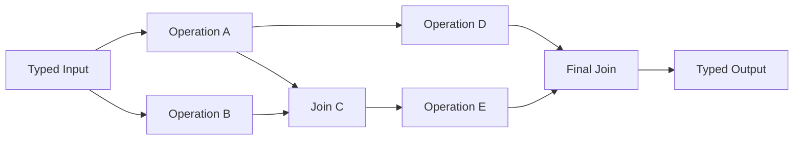
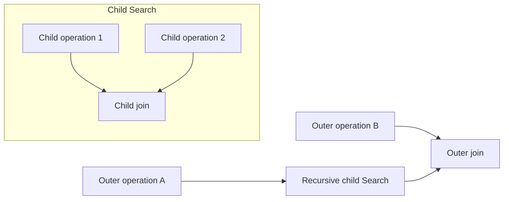

# Dependency Graph with Joins

## Intent

Use a Dependency Graph when the task has a known non-linear dependency structure:

Apply the [Agent or Program rule](../../../SKILL.md#choose-agent-or-program) to every authored operation in this pattern.

- several operations can begin independently;
- one intermediate result may feed several later operations;
- one operation may require Outputs from several predecessors;
- branches may diverge and later join;
- the final result depends on multiple typed paths.

The basic pattern in this reference is a **directed acyclic graph**, or DAG.

Cycles, repeated revision, open-ended expansion, and feedback loops belong to later iterative or recursive patterns unless they are represented by an explicit bounded loop in ordinary Search code.

## Structure



This is different from a tree:

- `C` has two upstream dependencies.
- `A` contributes to both `C` and `D`.
- `D` and `E` later merge into `F`.

## Critical distinction: business DAG versus runtime ownership tree

The diagram above is a **business data-dependency graph**.

It is not the durable ownership graph.

The durable ownership may remain:

```text
Parent Search
├── Operation A
├── Operation B
├── Join C
├── Operation D
├── Operation E
└── Final Join F
```

Every materialized child has exactly one runtime owner: the parent Search.

The fact that `Join C` consumes both `AOutput` and `BOutput` is declared as `upstream=` on its Action call, while the values themselves travel in its typed Input. `search/search.py` shows this for `SelectorAgent`: `ctx.spawn()` names the Handles for `profile_agent` and `baseline_agent`, while `profile.summary` and `baseline.score` cross through `SelectorInput`.

It is not represented by giving `Join C` two runtime parents. Runtime ownership stays one tree: every execution has exactly one owner. The `upstream=` tuple is recorded with the execution and rendered by the product, so the data dependency is visible without a second ownership tree. `upstream` starts nothing, awaits nothing, and passes nothing; the payload still crosses through the typed Input.

This separation is essential:

```text
runtime ownership
    → lifecycle, cancellation, records, workspace

business graph
    → values, dependencies, joins, control flow
```

Do not persist a second ownership tree to represent the DAG.

## Core idea

A chain supports:

```text
one predecessor
→ one successor
```

A tree supports:

```text
one predecessor
→ several descendants
```

A DAG additionally supports:

```text
several predecessors
→ one join
```

and:

```text
one intermediate result
→ several downstream consumers
```

This allows information to be reused rather than recomputed and lets independent work run concurrently.

## Search interpretation

| Search concept | Meaning in this pattern |
|---|---|
| State | A typed collection of completed intermediate Outputs |
| Candidate | An intermediate result or branch result |
| Action | Run any operation whose dependencies are satisfied |
| Observation | The operation’s typed Output |
| Score | Optional per operation or branch |
| Aggregation | Explicit typed join operations |
| Frontier | Operations whose required Inputs are available |
| Stop condition | Required sink Outputs are produced and all direct children are terminal |
| Result | Adapt the final sink or join Output into the Search Output |

For a small known DAG, the frontier is implicit in ordinary Python control flow.

Do not build a generic frontier scheduler unless a real task requires one.

## Mapping to the AIBuildAI SDK

Use:

```text
ctx.spawn(...)
```

for independent operations that can run concurrently.

Use:

```text
ctx.wait(...)
```

to record a terminal barrier.

Use:

```text
handle.result()
```

to retrieve typed Outputs after the barrier.

Use:

```text
ctx.spawn(...)
handle.result()
```

for joins and subsequent operations whose Inputs are now ready.

Use:

```text
ctx.cancel(...)
```

only when Search business logic determines that a pending branch is no longer needed.

Use:

```text
ctx.step(...)
```

for an opaque nondeterministic leaf inside an Execution, not as a replacement for a graph node that deserves its own lifecycle.

Each logical graph operation may be an Agent, Composite, Program, or child Search.

## Complete package

The folder beside this file holds a complete package for this pattern, activated by the repository gate through the real generated-definition loader on every change: `search/` is the authored layout (`search/__init__.py` exports `SEARCH_TYPE`; `search.py`, `io.py`, `agents/`, `prompts/agent/`), and `input_payload.json` is the Input that builds its `SEARCH_TYPE`. Read `search/search.py` for the control flow and `search/agents/io.py` for the typed boundaries. `ProfileAgent` and `BaselineAgent` start independently and join into `SelectorAgent`; `QualityCheckAgent` reuses `ProfileAgent` alone while `TrainerAgent`, which declares `task_environment=True` and is granted the card with `gpus=1`, runs the selector's frozen `train.py` itself, and `FinalDecisionAgent` joins both of those into the result.

## Why the graph should usually remain ordinary Python

AIBuildAI already has durable execution through `ExecutionContext`.

Adding a second generic graph runtime would duplicate:

```text
child creation
identity
waiting
cancellation
failure propagation
replay
lifecycle
```

The Search should write the graph as ordinary orchestration code.

A small local collection is acceptable, and `search/search.py` keeps exactly this: `profile_handle`, `baseline_handle`, `selector_handle`, `quality_handle`, and `tuned_handle` are plain local variables, never a second framework object.

But these are local conveniences, not new framework objects or durable authorities.

## When to use

Use a Dependency Graph when:

- several operations are independent at the beginning;
- downstream work requires multiple earlier Outputs;
- one expensive intermediate should be reused by several branches;
- the workflow contains meaningful fan-out and fan-in;
- a chain would serialize independent work;
- a tree cannot express later joins cleanly;
- the dependency structure is known before execution;
- typed intermediate artifacts have clear consumers.

Typical examples:

```text
independent evidence collection
→ joint analysis
→ separate verification and extension
→ final synthesis

data inspection + literature review
→ methodology choice
→ implementation and risk analysis
→ launch decision

several feature extractors
→ shared representation
→ multiple downstream evaluators
→ aggregate result
```

Structured directed graphs are a common way to express sequential, parallel, conditional, and joined multi-agent operations when strict execution relationships matter. ([microsoft.github.io](https://microsoft.github.io/autogen/stable/user-guide/agentchat-user-guide/graph-flow.html))

Graph-based reasoning literature similarly emphasizes that information units may have arbitrary dependencies, may be reused, and may be combined into later results instead of being restricted to a single chain or tree. ([arxiv.org](https://arxiv.org/abs/2308.09687))

## When not to use

Do not use a graph when:

- the workflow is a simple chain;
- branches never join;
- the only goal is to run several attempts and choose one;
- the next tasks cannot be predicted in advance;
- the process is fundamentally iterative or cyclic;
- the graph exists only to make a simple flow appear sophisticated;
- every operation receives the complete same Input and produces interchangeable results.

Choose:

- Sequential Chain for one fixed path;
- Tree Search for branch expansion without joins;
- Parallel Best-of-N for independent alternatives;
- Orchestrator–Workers for dynamically discovered subtasks;
- Evaluator–Optimizer for feedback cycles;
- Recursive Divide-and-Conquer for recursively generated subproblems.

## Static DAG versus dynamic graph

This reference describes a mostly static graph:

```text
the operation types and dependency shape are known
```

The exact business data may vary, but the structural relationship is coded in the Search.

If the graph itself must be generated dynamically:

```text
unknown number of operations
unknown dependencies
runtime-created joins
```

consider an Orchestrator–Workers or Recursive Graph pattern.

Do not immediately build a universal graph interpreter. First determine whether an ordinary list of typed task descriptions plus explicit `spawn` and `wait` is sufficient.

## Budget and stopping

A DAG must have a finite sink condition.

Define:

```text
maximum materialized graph operations
maximum fan-out
required sink operations
optional branches
join Failure policy
cancellation rule
```

A basic DAG should not contain cycles.

The Search stops when:

1. every required sink Output has been produced;
2. every direct child is terminal or explicitly cancelled;
3. the final typed Output has been constructed.

A join must define its failure semantics.

Examples:

```text
Join requires all upstream Outputs.
Join requires at least two of three.
One verification branch is optional.
One authoritative branch is mandatory.
Any Failure stops the graph.
```

`ctx.wait()` only reports terminal Handles. It does not decide which business Outputs are sufficient.

## Recursive form

Any graph vertex may be a child Search.

For example:

```text
Graph operation E
    = a recursively generated Search
```

Conceptually:

```text
if E requires task-specific orchestration:
    run MetaAgent
    load child Search
    spawn child Search as E
else:
    run an existing Agent, Composite, Program, or Search
```

The child Search returns one typed Output to the parent graph.

Its internal subtree does not become additional business parents of other outer graph operations. The outer graph only consumes the child Search Output.

A recursive graph may therefore look like:



Each Search retains one workspace and one direct ownership subtree.

## Useful hybrids

Dependency Graph combines naturally with:

- **Router → Graph**: select one graph topology for the input category.
- **Graph containing chains**: linear subpaths form graph segments.
- **Graph containing parallel Best-of-N**: one vertex explores alternatives.
- **Graph with recursive child Searches**: complex vertices own subgraphs.
- **Graph with committee join**: several branches vote or rank.
- **Map–Reduce graph**: map branches feed a reduction join.
- **Graph with evaluator stage**: final branch checks the joined result.
- **Graph with branch-and-bound**: later patterns may cancel branches using bounds.

## Common mistakes

### Confusing business dependencies with runtime ownership

A child Execution cannot have two durable parents. Runtime ownership stays one tree, with one owner per execution.

Pass producer values through one typed Input, and declare each producer with `upstream=` on the consumer Action call. The product records exact Action occurrences, so the dependency is visible; `upstream` itself starts nothing, awaits nothing, and passes nothing.

### Building a second graph runtime

Do not add:

```text
GraphEngine
GraphExecutionContext
GraphHandle
GraphEvent
GraphState
```

`ExecutionContext` already supplies durable execution mechanics.

### Persisting the frontier unnecessarily

For a fixed DAG, Python order and recorded child executions are enough. Do not add a second durable `current_frontier` state unless a real dynamic algorithm requires it.

### Creating hidden shared mutable state

Do not let several concurrent children mutate one dictionary or file as their communication mechanism.

Children return typed Outputs. The parent joins them.

### Waiting sequentially after spawning

Bad:

```text
spawn A
spawn B
await A result
await B result
```

This may still run concurrently at runtime, but using an explicit `wait` barrier makes the intended observation and ownership clearer.

### Joining raw strings

A join should receive purpose-built typed Inputs, not an unstructured transcript dump from every predecessor.

### Adding cycles without a stopping rule

A cycle changes the algorithm. Use a later iterative pattern and define maximum rounds, evaluation, and termination.

### Recomputing shared intermediates

If `AOutput` feeds both C and D, reuse the recorded typed value. Do not run A twice merely because two branches need it.

## Design checklist

Before selecting this pattern, draw:

```text
the operations
the data-dependency edges
the independent source operations
the join operations
the required sink
```

Then answer:

```text
Which edges are typed Output-to-Input adaptations?
Which producers does each operation name in `upstream=`?
Which operations can spawn concurrently?
Which joins require all predecessors?
Which branches are optional?
What is the Failure policy at each join?
What is the maximum number of operations?
Does any edge create a cycle?
Could a simpler chain or tree express the same task?
Which vertices, if any, deserve child Searches?
```

Finally verify:

```text
The business diagram may be a DAG.
The durable ownership graph remains a tree.
Every Action call declares `upstream=`.
```

## References

- Microsoft AutoGen, **GraphFlow**: directed graph workflows support controlled sequential, parallel, conditional, and looping behavior; simpler patterns remain preferable when they are sufficient. ([microsoft.github.io](https://microsoft.github.io/autogen/stable/user-guide/agentchat-user-guide/graph-flow.html))
- Besta et al., **Graph of Thoughts: Solving Elaborate Problems with Large Language Models**: arbitrary graph relationships allow intermediate thoughts to be combined, reused, and transformed beyond chain and tree structures. ([arxiv.org](https://arxiv.org/abs/2308.09687))
- LangGraph, **Workflows and Agents**: routing, parallelization, and explicit synthesis are expressed as graph dependencies and joins. ([langchain-ai.github.io](https://langchain-ai.github.io/langgraph/agents/tools/?utm_source=chatgpt.com))
