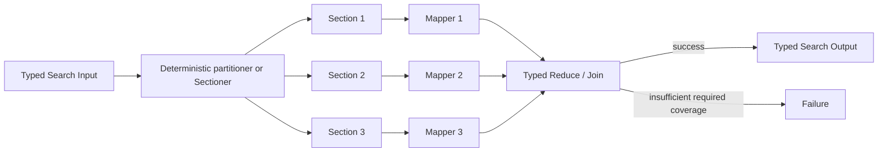

# Map-Reduce / Sectioning

## Intent

Use Map-Reduce / Sectioning when one objective can be partitioned into a bounded set of independent sections, each section can be processed under the same or a compatible typed contract, and the section Outputs must then be combined into one result.

Apply the [Agent or Program rule](../../../SKILL.md#choose-agent-or-program) to every authored operation in this pattern.

The shape is:

```text
one Input
→ explicit sectioning
→ many independent map operations
→ one explicit reduction
→ one Output
```

The mapper results are **complementary pieces of coverage**.

They are not interchangeable attempts at the whole task.

That distinction separates this pattern from Parallel Best-of-N:

```text
Map-Reduce:
    every required mapper covers a different piece
    and its Output contributes to the final result

Best-of-N:
    every candidate attempts the same objective
    and only one or a small subset is retained
```

## Structure



The partitioner may be ordinary deterministic Python.

Use a Sectioner Agent only when identifying meaningful sections requires semantic judgment.

The reducer may also be ordinary Python when aggregation is mechanical. Use a Reducer Agent when the mapped Outputs require synthesis, conflict resolution, interpretation, or compression.

## Core idea

The Search separates three responsibilities:

```text
1. define the coverage units
2. process those units independently
3. combine the typed results under an explicit completeness policy
```

A good section has:

- one stable `section_id`;
- one bounded scope;
- enough context to be processed independently;
- a typed payload;
- a clear relationship to the final result;
- no requirement to mutate another section’s state.

A good mapper has one responsibility:

```text
SectionSpec
→ SectionResult
```

A good reducer has a different responsibility:

```text
original Search Input
+ ordered SectionResults
+ explicit missing-section information
→ final Search Output
```

The reducer does not infer which sections should have existed. The parent Search supplies the declared section set and the observed outcomes.

## Search interpretation

| Search concept | Meaning in this pattern |
|---|---|
| State | The original Input, the declared section set, and the collected mapper outcomes |
| Candidate | Usually one section result, not an alternative whole-task solution |
| Action | Process one declared section |
| Observation | One mapper’s typed Output or Failure |
| Score | Optional per-section quality or completeness measure |
| Aggregation | One explicit reduce operation over the section outcomes |
| Frontier | Declared sections whose mapper has not become terminal |
| Stop condition | Required map operations and the reducer are terminal |
| Result | The reducer’s typed aggregate Output |

The section list is business state.

It should be derivable from the Input or returned by one recorded Sectioner execution. Do not let concurrent workers discover and append sections to a shared mutable collection.

## Mapping to the AIBuildAI SDK

Represent each unit of coverage with a typed value. The declared package to review is `PackageReviewInput` in `search/agents/io.py`: an `objective`, the read-only `repo_dir`, and one `package_path`.

A mapper may be:

- an `Agent` when one LLM role processes the section;
- a `Composite` class when the section operation creates a truthful domain candidate;
- a `Program` admitted by the selection guide;
- a child `Search` when processing one section requires meaningful orchestration of its own.

The parent Search normally uses:

```text
ctx.spawn(...)
```

once for each bounded section, then:

```text
ctx.wait(...)
```

for the terminal barrier, followed by:

```text
handle.result()
```

to retrieve each typed mapper outcome.

The reduction is usually:

```text
ctx.spawn(Reducer invocation)
handle.result()
```

or an ordinary deterministic Python function.

`ctx.wait()` does not perform reduction. It only records which Handles are terminal.

The parent Search remains responsible for:

- associating every Output with its `section_id`;
- deciding whether a failed or absent section is acceptable;
- ordering mapped Outputs where order matters;
- detecting duplicate or missing coverage;
- constructing the Reducer Input;
- validating that every spawned direct child is terminal or cancelled before return;
- declaring `upstream=` on every mapper and on the reducer, so the reducer lists every mapper whose Output it consumes.

## Complete package

The folder beside this file holds a complete package for this pattern, activated by the repository gate through the real generated-definition loader on every change: `search/` is the authored layout (`search/__init__.py` exports `SEARCH_TYPE`; `search.py`, `io.py`, `agents/`, `prompts/agent/`), and `input_payload.json` is the Input that builds its `SEARCH_TYPE`. Read `search/search.py` for the control flow and `search/agents/io.py` for the typed boundaries. `PackageReviewerAgent` is the mapper, one instance per declared package; `ReviewReducerAgent` is the single reducer that consumes every mapped package and writes the one combined report.

This package reads every mapper result with `capture_failure=True` so that one Failure can name every package that did not complete; because every declared package is required, any missing package stops the Search before the reducer runs.

If every section is mandatory and any Failure must stop the Search, default Failure propagation may be simpler. In that form, retrieve each result without `capture_failure=True`.

## Choosing the sectioner

### Deterministic sectioning

Prefer ordinary Python when the boundary is already present in the Input:

```text
document pages
dataset shards
benchmark examples
repository packages
table partitions
supplied source list
declared evaluation dimensions
```

The complete package beside this file takes this route: `CodeReviewMapReduceSearch.explore()` in `search/search.py` reads the declared `packages` tuple straight off `CodeReviewMapReduceInput`, one package path per section, with no separate sectioning step.

This is cheap, reproducible, and easy to audit.

### Semantic sectioning

Use one Sectioner Agent when the Input must first be decomposed by meaning:

```text
identify the major claims in a report
separate a request into independent policy questions
group files by architectural responsibility
identify non-overlapping experiment families
```

The Sectioner Output must still be bounded and typed:

```text
minimum sections
maximum sections
stable section IDs
scope of each section
required versus optional status
coverage rationale
```

A Sectioner that dynamically delegates arbitrary work and reacts to worker results is no longer simple sectioning. That is closer to Orchestrator–Workers.

## Coverage and overlap

The Search must define whether sections are:

```text
disjoint
overlapping by design
hierarchical
ordered
unordered
```

Disjoint sections simplify reduction.

Overlapping sections may be useful for context at boundaries, but the reducer must know how to handle duplicated evidence.

For example:

```text
document chunks overlap by 200 tokens
→ mapper extracts claims with source spans
→ reducer deduplicates by normalized claim and source span
```

Do not rely on the Reducer Agent to notice accidental overlap from raw prose.

Represent enough metadata to make the rule explicit.

## When to use

Use Map-Reduce / Sectioning when:

- the task has natural coverage units;
- the units can be processed independently;
- all or most units contribute to the final result;
- the same mapper contract can be reused;
- parallel execution reduces wall-clock latency;
- the whole Input is too large for one useful Agent context;
- the final aggregation rule can be stated explicitly;
- the maximum fan-out can be bounded before spawning work.

Typical examples:

```text
analyze every section of a long report
→ synthesize one finding set

inspect independent repository packages
→ combine defects into one review

evaluate a model on benchmark shards
→ aggregate metrics

clean or generate disjoint data shards
→ validate and merge one dataset

collect evidence from declared source categories
→ synthesize one argument

run the same extraction over many records
→ combine normalized records
```

For a post-training task, one stage might use:

```text
partition the available training examples
→ independently filter or annotate each shard
→ merge, deduplicate, and validate the resulting dataset
```

Every shard contributes data. This is sectioning, not a competition among dataset recipes.

## When not to use

Do not use this pattern when:

- every worker attempts the same whole objective;
- the goal is to select one winner rather than combine coverage;
- mapper operations depend on each other’s Outputs;
- the required subtasks cannot be identified until workers return evidence;
- the reducer would need to recreate the entire task from untyped transcripts;
- the Input is already small enough for one coherent operation;
- the number of sections is unbounded;
- one section’s result changes what another section should do;
- the process requires iterative revision rather than one fan-out and fan-in.

Choose:

- **Parallel Best-of-N** for interchangeable alternatives;
- **Dependency Graph** for known non-linear dependencies;
- **Orchestrator–Workers** for dynamically discovered subtasks;
- **Evaluator–Optimizer** for feedback and revision;
- **Committee / Voting** when several independent judgments are aggregated rather than several coverage units.

## Budget and stopping

Define the following before execution:

```text
maximum section count
maximum mapper cost per section
maximum total mapper cost
required versus optional sections
minimum acceptable coverage
maximum reducer Input size
reduction strategy
```

The basic stopping rule is:

```text
all required mapper children are terminal
and every optional child is terminal or cancelled
and the reducer is terminal
```

Do not spawn one Agent per tiny item merely because the Input contains many items.

If 50,000 records can be handled in 20 bounded batches, create 20 sections rather than 50,000 Agent executions.

The useful unit is the smallest section that:

- fits the mapper’s context and resource limits;
- contains enough work to justify one durable child;
- can fail and be retried or omitted under a meaningful business policy;
- produces a typed result worth recording independently.

### Large reducer Inputs

If all mapper Outputs cannot fit into one reducer context, use hierarchical reduction:

```text
many mapper Outputs
→ several bounded partial reducers
→ one final reducer
```

That is still Map-Reduce, provided the aggregation is associative enough or the hierarchy preserves the necessary information.

Do not silently truncate mapper Outputs to fit the final reducer.

## Failure policy

State one policy explicitly.

Common policies are:

```text
all sections required
all required sections plus any successful optional sections
at least k of n sections required
coverage threshold required
specific authoritative sections required
```

A mapper Failure is not automatically a negative mapper result.

Keep these separate:

```text
SectionResult(
    finding="no issue found"
)

Failure(
    reason="worker did not complete"
)
```

If the Search may proceed after a Failure, the Reducer Input should include the missing-section metadata so the final Output can represent reduced confidence or incomplete coverage.

## Recursive form

A mapper may be a child Search when one section contains its own search problem:

```text
outer Search partitions a codebase by package
→ each package is processed by a child Search
→ package Outputs are reduced into one repository review
```

Hierarchical sectioning is also natural:

```text
if a section fits the leaf budget:
    run one mapper
else:
    split the section
    run child Map-Reduce Search
    return the child aggregate
```

Use recursion only when the section remains meaningfully too large or internally structured.

Do not create another Search merely to wrap one ordinary mapper Agent.


The parent reducer consumes one typed child Search Output. It does not reach into the child’s internal mapper records.

## Useful hybrids

Map-Reduce / Sectioning commonly combines with:

- **Sequential Chain → Map-Reduce**: prepare or normalize Input, then fan out.
- **Map-Reduce → Sequential Chain**: reduce evidence, then review and format it.
- **Router → Map-Reduce**: select a sectioning policy for the task category.
- **Map-Reduce with child Searches**: each section owns deeper orchestration.
- **Map-Reduce with Best-of-N per section**: generate several alternatives for each section, select one, then reduce the section winners.
- **Map-Reduce with Committee reducer**: several judges assess the aggregate.
- **DAG containing Map-Reduce**: one graph vertex is a regular fan-out/fan-in computation.
- **Recursive Divide-and-Conquer**: recursively section oversized subproblems and combine their typed results.

## Common mistakes

### Treating alternatives as sections

Bad:

```text
five workers each design the entire training pipeline
→ concatenate all five designs
```

Those are alternatives. Use Best-of-N, Committee, Tournament, or Mixture-of-Agents.

### Letting workers mutate one shared artifact

Concurrent workers should not append to the same file or dictionary as their communication protocol.

Each mapper returns one typed Output. The parent performs the merge.

### Losing stable section identity

Do not associate Outputs by completion order.

Use a stable `section_id` derived from the declared section set.

### Assuming concatenation is reduction

A reducer must define:

```text
ordering
deduplication
conflict handling
completeness
normalization
final Output construction
```

Joining strings is often not enough.

### Creating thousands of micro-children

Durability does not make unbounded fan-out free.

Coarsen the section size and declare a maximum.

### Hiding missing coverage

Do not omit failed sections from the Reducer Input and then present the result as complete.

### Using an Agent for deterministic aggregation

Counting records, concatenating already normalized arrays, taking a weighted mean, or sorting by a stable key should usually remain ordinary Python.

### Recomputing the section list during reduction

The reducer receives the original declared sections. It does not infer them from whichever mapper Outputs happened to succeed.

## Design checklist

Before selecting this pattern, answer:

```text
What exactly is one section?
Are the sections disjoint, overlapping, ordered, or hierarchical?
Who creates the section list?
What is the maximum number of sections?
What typed Input does one mapper receive?
What typed Output does one mapper return?
Are all sections required?
What happens when one mapper fails?
How are duplicate or conflicting results handled?
Can the reducer fit every mapped Output?
Would hierarchical reduction preserve the needed information?
Why are these pieces complementary rather than competing alternatives?
```

If the last question cannot be answered clearly, compare this design against Parallel Best-of-N.

## References

- Dean and Ghemawat, **MapReduce: Simplified Data Processing on Large Clusters**: a map operation processes partitioned Inputs into intermediate values and a reduce operation combines those values. ([research.google](https://research.google/pubs/mapreduce-simplified-data-processing-on-large-clusters/))
- Anthropic, **Building Effective Agents — Parallelization**: distinguishes sectioning, where independent subtasks run concurrently, from voting, where the same task is run several times for diverse judgments. ([anthropic.com](https://www.anthropic.com/engineering/building-effective-agents))
