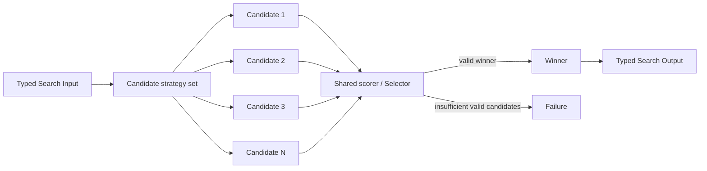

# Parallel Best-of-N

## Intent

Use Parallel Best-of-N when several independent executions can attempt the same objective, their Outputs are comparable under one declared evaluation rule, and the Search should retain the strongest candidate rather than combine every candidate.

Apply the [Agent or Program rule](../../../SKILL.md#choose-agent-or-program) to every authored operation in this pattern.

The shape is:

```text
one objective
→ N independent candidate attempts
→ one shared evaluation rule
→ one selected winner
```

Every candidate addresses the same decision point.

This distinguishes Best-of-N from Map-Reduce:

```text
Best-of-N:
    candidates are substitutes
    one or a small subset survives

Map-Reduce:
    mapper Outputs are complementary coverage
    all required pieces contribute
```

Best-of-N is useful when one attempt has meaningful variance and parallel breadth is more valuable than immediate sequential revision.

## Structure



The scorer or Selector may be:

- a deterministic external metric;
- an existing evaluator Program;
- an Evaluator Agent;
- a Committee;
- a Tournament;
- a typed combination of hard constraints and a scalar score.

The basic pattern requires one declared selection rule. The Search must not improvise a different rule after seeing the candidates.

## Core idea

Best-of-N buys breadth at one point in the Search.

It assumes:

```text
one candidate may fail or be mediocre
another independent candidate may discover a better solution
a reliable comparison can identify the difference
```

The pattern therefore has two equally important components:

```text
candidate diversity
selection quality
```

Generating many nearly identical candidates without a trustworthy selector only multiplies cost.

Using an excellent selector over candidates that differ only cosmetically adds little value.

A good design states both:

```text
Why should the candidate attempts differ?
Why should the evaluator recognize the better one?
```

## Search interpretation

| Search concept | Meaning in this pattern |
|---|---|
| State | The original Input, candidate specifications, candidate outcomes, and selection result |
| Candidate | One complete attempt at the same objective |
| Action | Generate or execute another candidate attempt |
| Observation | A candidate Output, Failure, or candidate score |
| Score | One comparable metric, rubric result, ranking, or preference |
| Aggregation | Selection, not synthesis |
| Frontier | Candidate attempts that have not become terminal |
| Stop condition | The required candidate set and selector are terminal, or an explicit early-stop rule fires |
| Result | The selected candidate adapted into the Search Output |

The winner is a business value.

It may be identified by:

```text
candidate_id
Composite reference
artifact reference
checkpoint reference
typed candidate Output
```

Do not use child completion order as candidate identity.

## Mapping to the AIBuildAI SDK

The candidate plan is explicit. `search/io.py` carries it as the `approaches` tuple of `BestOfNSearchInput`, one entry per candidate; `search/agents/io.py` adapts each entry into `CandidateInput`.

A candidate execution may be:

- an `Agent` when one role can produce the full candidate;
- a `Composite` class when the candidate is a truthful domain candidate whose identity and lifecycle matter;
- a `Program` admitted by the selection guide;
- a child `Search` when producing one candidate requires its own orchestration.

The parent Search normally:

```text
ctx.spawn(each candidate, capture_failure=True)
ctx.wait(all candidate Handles)
handle.result()
```

Candidate Failures are often captured because the Search may still select among the surviving candidates.

The parent then either:

```text
selects deterministically from comparable scores
```

or:

```text
ctx.spawn(Selector Agent or evaluator)
handle.result()
```

The Selector should return a stable candidate identifier, not duplicate the full candidate value.

The parent validates:

```text
the selected ID exists
the candidate succeeded
the candidate passed required constraints
the score or verdict belongs to the same evaluation objective
```

## Complete package

The folder beside this file holds a complete package for this pattern, activated by the repository gate through the real generated-definition loader on every change: `search/` is the authored layout (`search/__init__.py` exports `SEARCH_TYPE`; `search.py`, `io.py`, `agents/`, `prompts/agent/`), and `input_payload.json` is the Input that builds its `SEARCH_TYPE`. Read `search/search.py` for the control flow and `search/agents/io.py` for the typed boundaries. Every candidate is one `CandidateAgent` spawned before any is awaited; one `ctx.wait` barrier, then `max` over the successes.

## Candidate diversity

Parallelism alone does not create useful diversity.

Candidate attempts may differ along one or more declared axes:

```text
reasoning strategy
data recipe
model or model family
prompt or role
tool access
search method
initial hypothesis
training method
hyperparameter region
random seed
resource budget
constraint emphasis
```

The difference should plausibly change the solution, not just its wording.

Examples:

```text
Candidate A: conservative baseline
Candidate B: data-quality-first approach
Candidate C: stronger optimization approach
Candidate D: robustness-first approach
```

or:

```text
Candidate A: SFT only
Candidate B: SFT followed by RL
Candidate C: rejection sampling followed by SFT
```

The candidates still solve the same declared objective and are evaluated under the same final contract.

### Diversity versus fairness

Useful diversity does not require identical internal methods.

It does require comparable evaluation.

State which resources are equal and which are intentionally different:

```text
same total wall-clock budget
same evaluator dataset
same final artifact contract
different training recipe
different model role
different initialization
```

Do not call a comparison fair when one candidate receives privileged evaluation data or a larger undeclared budget.

## Selection rules

Choose the cheapest reliable rule.

### Deterministic score

Use a scalar score when it is authoritative and comparable:

```text
validation accuracy
held-out reward
runtime under a correctness constraint
test pass rate
benchmark score
constraint violations followed by quality score
```

A common lexicographic rule is:

```text
1. reject candidates that violate hard constraints
2. maximize the primary score
3. use a stable declared tie-breaker
```

### Selector Agent

Use one Selector Agent when quality is semantic and a common rubric can compare all candidates in one context.

Its typed Output should contain:

```text
winner_id
rubric findings
optional ranking
optional confidence
```

The parent validates the ID.

### Tournament or Committee

Use a Tournament when:

```text
all candidates cannot fit in one comparison
or pairwise judgment is more reliable
```

Use a Committee when:

```text
one judge is too noisy
and several independent ballots should be aggregated
```

These are hybrids, not hidden implementation details.

## A post-training example

Best-of-N can be used at one fixed stage of a larger Sequential Chain:

```text
Stage 1: prepare data
    run 5 candidate data recipes in parallel
    evaluate all with the same baseline
    retain the strongest dataset artifact

Stage 2: SFT
    run several training recipes from that selected dataset
    evaluate checkpoints
    retain the strongest checkpoint

Stage 3: RL
    run bounded RL alternatives from the selected checkpoint
    evaluate
    return the final winner
```

Each stage is one Best-of-N decision.

The outer structure is still a Sequential Chain because the stages and their order are fixed.

Do not flatten all candidates across all stages into one undifferentiated population. A later-stage candidate depends on the winner selected by the earlier stage.

## When to use

Use Parallel Best-of-N when:

- one attempt has material variance;
- several approaches can be tried independently;
- candidate attempts are substitutes for one another;
- a reliable comparison or score exists;
- candidate generation is parallelizable;
- breadth is more useful than revising one candidate immediately;
- a failed candidate need not stop the entire Search;
- the candidate count can be bounded;
- the final result should be one winner or a small declared top set.

Typical examples:

```text
generate several solution plans
→ choose the strongest plan

run several training recipes
→ select the best checkpoint

produce several code patches
→ run the same tests and retain the best valid patch

sample several reasoning paths
→ select by verifier score

try several data preparation recipes
→ evaluate with one fixed baseline

run several retrieval strategies
→ choose the answer with the strongest grounded evaluation
```

Best-of-N is especially effective when external evaluation is cheaper or more reliable than generation.

## When not to use

Do not use this pattern when:

- every Output covers a different required part of the task;
- there is no reliable way to compare candidates;
- candidates must exchange information while being produced;
- the process should iteratively improve one candidate using feedback;
- one deterministic method already dominates and diversity adds no information;
- the candidates have incompatible final contracts;
- the Search needs a population over many generations;
- the evaluator is substantially weaker than the candidate generator;
- candidate cost is so high that breadth prevents any attempt from reaching adequate quality.

Choose:

- **Map-Reduce** when every branch contributes coverage;
- **Committee / Voting** when several judgments are aggregated;
- **Tournament** when selection must be staged through pairwise or small-group matches;
- **Evaluator–Optimizer** when feedback should revise one candidate;
- **Evolutionary Search** when the population persists and changes over generations;
- **Dependency Graph** when candidates are actually dependent operations.

## Budget and stopping

Define:

```text
maximum candidate count N
minimum successful candidates
candidate budget per attempt
total candidate budget
evaluation budget
hard validity constraints
selection metric
tie-break rule
early-stop threshold, if any
```

The basic stopping rule is:

```text
all candidate Handles are terminal
and the selector is terminal
and one valid winner has been identified
```

### Candidate Failure

A candidate Failure and a low-quality candidate are different outcomes.

Do not assign the lowest score to a failed execution unless that is an explicit external evaluation rule.

Instead record:

```text
candidate failed to produce an evaluable artifact
```

and require a declared minimum number of successful candidates.

### Early stopping

An advanced Best-of-N Search may stop before every candidate completes when:

- a valid winner exceeds an authoritative threshold;
- remaining candidates cannot mathematically overtake the current winner;
- the business objective requires the first candidate meeting a hard condition.

If early stopping fires:

```text
cancel every no-longer-needed direct child
wait for terminal cancellation records
then return
```

Do not return while pending candidate children remain open.

An uncertain LLM judge preference is not normally sufficient for early cancellation.

## Recursive form

Any candidate may be a child Search:

```text
one candidate = one complete task-specific search strategy
```

For example:

```text
Candidate A: built-in linear Search
Candidate B: task-specific generated Search
Candidate C: tree Search
```

All three must return a comparable typed candidate contract.

If `MetaAgent` generates a candidate Search:

```text
generate package
load child Search
spawn child Search as one candidate
```


The parent sees one candidate Output. It does not compare internal child Composites directly unless those Composites are intentionally exposed through the candidate contract.

Best-of-N can also be recursive over subproblems:

```text
for each subproblem:
    run bounded Best-of-N
    return one local winner
combine local winners later
```

Do not recursively create another Best-of-N layer with the same unchanged objective and no new diversity rule. That only obscures the candidate count.

## Useful hybrids

Parallel Best-of-N commonly combines with:

- **Sequential Chain containing Best-of-N stages**.
- **Map-Reduce with Best-of-N per section**.
- **Best-of-N → Tournament** for scalable pairwise selection.
- **Best-of-N → Committee** for multi-judge selection.
- **Router → Best-of-N** only for difficult categories.
- **Best-of-N → Evaluator–Optimizer**: select a strong initial candidate, then refine it.
- **Orchestrator–Workers with Best-of-N per discovered subtask**.
- **Recursive Divide-and-Conquer with local Best-of-N merge decisions**.
- **Evolutionary Search initialization**: Best-of-N supplies the first bounded population.

## Common mistakes

### Generating identical candidates

Changing only `candidate_id` does not create diversity.

State the actual strategy, seed, role, model, data, or method difference.

### Selecting by completion order

The fastest candidate is not the best candidate unless latency is the declared metric.

### Letting each candidate use a different evaluator

Candidates must be compared under one final rule.

Internal self-evaluation may help generation, but it does not replace shared final evaluation.

### Asking the Selector to invent candidates

The Selector chooses among supplied successful candidates. It does not rewrite them or introduce a new option.

### Failing to validate `winner_id`

A structured Selector can still return an unknown or failed candidate identifier. The parent must check it.

### Treating failed attempts as bad scores

Execution Failure, invalid artifact, and valid low score are distinct states.

### Returning a synthesis instead of a winner

If the Selector combines pieces from several candidates, the design has moved toward Mixture-of-Agents or a synthesis DAG.

That may be useful, but it is no longer plain Best-of-N.

### Increasing N without measuring marginal value

More candidates increase cost and evaluator load.

Use the smallest N that produces useful diversity.

### Leaking private evaluation data

Do not give candidate generators access to held-out evaluation information merely because the parent Search will later use it for selection.

## Design checklist

Before selecting this pattern, answer:

```text
What exact objective does every candidate attempt?
Why should the attempts differ?
What is the maximum N?
What typed contract makes candidates comparable?
Which candidate Failures may be tolerated?
What is the minimum number of successful candidates?
What hard constraints apply before scoring?
What shared score, rubric, Tournament, or Committee selects the winner?
How is a tie resolved?
How is the selected candidate identified and validated?
Does every construction declare its direct upstream, including the Selector's fan-in over every successful candidate?
Would all Outputs be more useful combined rather than selected?
Would feedback-based revision be more efficient than parallel breadth?
```

If no reliable answer exists for the selection rule, do not spend budget generating N candidates.

## References

- Cobbe et al., **Training Verifiers to Solve Math Word Problems**: generate many candidate solutions and select the one ranked highest by a verifier. ([arxiv.org](https://arxiv.org/abs/2110.14168))
- Anthropic, **Building Effective Agents — Parallelization**: running the same task several times can provide diverse Outputs that are aggregated or selected for higher confidence. ([anthropic.com](https://www.anthropic.com/engineering/building-effective-agents))
