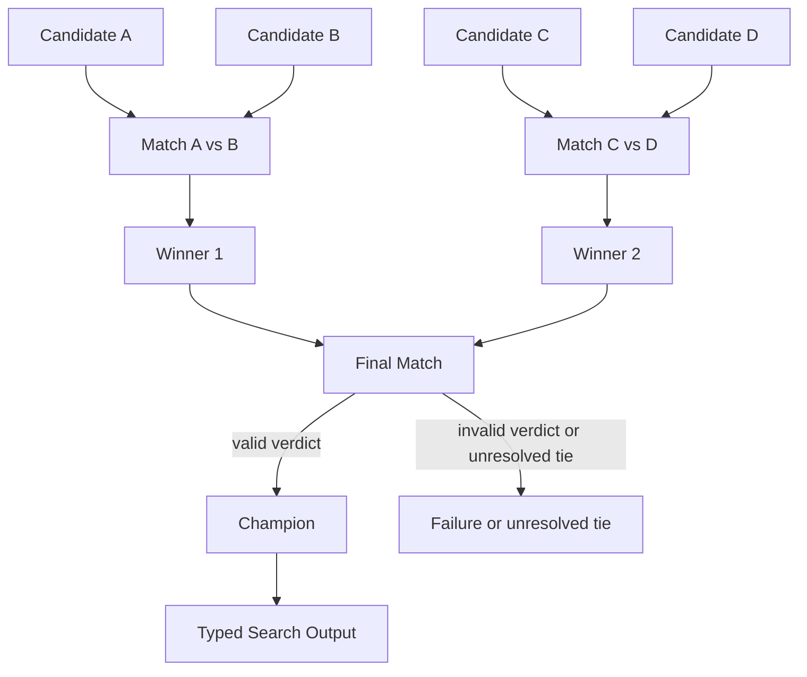

# Tournament

## Intent

Use a Tournament when the Search must select from a bounded candidate set, direct comparison between a small number of candidates is more reliable or affordable than scoring the entire set at once, and candidates can be eliminated through explicit rounds until one champion or a declared top set remains.

Apply the [Agent or Program rule](../../../SKILL.md#choose-agent-or-program) to every authored operation in this pattern.

The basic shape is:

```text
candidate set
→ round of independent matches
→ smaller candidate set
→ another round
→ champion
```

A Tournament is a **selection topology**.

It does not define how candidates are generated. Candidates may already exist, or they may come from an earlier Best-of-N, Tree, Evolutionary, or Orchestrator stage.

## Structure



Matches within one round may run in parallel.

Rounds are sequential because the next round depends on the prior winners.

## Core idea

A global Selector asks:

```text
Which of these N candidates is best?
```

A Tournament asks a sequence of smaller questions:

```text
Which is better, A or B?
Which is better, C or D?
Which is better, the two winners?
```

This is useful when:

- candidates are too large to compare all at once;
- the evaluator is better at relative preference than calibrated absolute scoring;
- pairwise or small-group rubrics are easier to specify;
- matches can run concurrently within each round;
- the Search needs an explicit elimination history.

The tradeoff is path dependence.

A strong candidate can be eliminated early by a noisy match, and the bracket determines which comparisons occur.

The bracket, tie policy, and match protocol are therefore part of the algorithm, not presentation details.

## Tournament versus adjacent patterns

### Tournament versus Parallel Best-of-N

```text
Parallel Best-of-N:
    generate N alternatives
    apply one shared score or global Selector
    retain the best

Tournament:
    compare candidates in bounded matches
    eliminate candidates over several rounds
```

Best-of-N often generates the initial slate. Tournament often selects from that slate.

### Tournament versus Committee / Voting

```text
Tournament:
    candidates compete
    winners advance
    candidate set shrinks by rounds

Committee:
    voters independently judge the same slate or question
    ballots are aggregated
    no elimination bracket is required
```

A Tournament match may itself be judged by a Committee.

### Tournament versus Evolutionary selection

A one-time Tournament selects from one fixed slate.

Evolutionary Search repeatedly selects, mutates, recombines, and evaluates a population over generations.

## Search interpretation

| Search concept | Meaning in this pattern |
|---|---|
| State | The immutable candidate records, active candidate IDs, completed match verdicts, and bracket position |
| Candidate | One solution, artifact, plan, Composite, or child Search result competing for selection |
| Action | Run one declared match |
| Observation | A typed winner, tie, invalidation, or Failure |
| Score | Usually relative preference; optional seed score or match confidence |
| Aggregation | Elimination and advancement through the bracket |
| Frontier | The matches in the current round |
| Stop condition | One champion or the declared number of survivors remains |
| Result | The champion adapted into the Search Output |

The active candidate set can remain an ordinary local Python value.

The durable match children and their typed Inputs and Outputs record what occurred. Do not create a second mutable tournament database unless a real algorithm requires one.

## Mapping to the AIBuildAI SDK

Every contestant needs stable identity: `Contestant` in `search/io.py` carries a `candidate_id`, the candidate's artifact directory, a summary, and the seed score reported for the eventual champion.

One match is represented explicitly: `JudgeInput` in `search/agents/io.py` carries the objective, the rubric, the round and match index, and the two `Contestant` values being compared.

A Match Output should identify only a supplied contestant: `JudgeOutput` in `search/agents/io.py` carries `winner_id`, `tied`, and a rationale.

The parent Search validates:

```text
winner_id is left or right
tied and winner_id are consistent
both candidates were eligible
the verdict used the declared rubric
```

A match may be:

- an Evaluator `Agent`;
- a Program admitted by the selection guide that runs tests or a benchmark;
- a child `Search` that performs a richer comparison;
- a Committee of judges;
- a two-leg pairwise judge that swaps candidate order.

Within each round, the parent normally uses:

```text
ctx.spawn(each Match)
ctx.wait(all round Handles)
handle.result()
```

The next round begins only after every required match in the current round is terminal.

## Complete package

The folder beside this file holds a complete package for this pattern, activated by the repository gate through the real generated-definition loader on every change: `search/` is the authored layout (`search/__init__.py` exports `SEARCH_TYPE`; `search.py`, `io.py`, `agents/`, `prompts/agent/`), and `input_payload.json` is the Input that builds its `SEARCH_TYPE`. Read `search/search.py` for the control flow and `search/agents/io.py` for the typed boundaries. `JudgeAgent` is the one role, run once per match; the structural idea is a round loop that pairs the active contestants, spawns one judge per pair, waits for the round, then feeds each round's winners into the next round through the `upstream=` tuple naming the judge that made each of them a winner.

## Building the bracket

The bracket must be deterministic from recorded Input.

Common policies include:

```text
stable input order
seed by an authoritative prior score
pair strongest against weakest
random seed supplied explicitly in Input
group by declared diversity category
```

Do not call an unrecorded random function while constructing the bracket.

If random seeding is useful, generate or supply the seed as an explicit value whose effect is reproducible.

### Odd candidate counts

When one round has an odd number of contestants, define a bye policy:

```text
highest seed receives the bye
lowest-cost candidate receives the bye
stable first candidate receives the bye
one preliminary match reduces the field
```

Do not silently drop the unpaired candidate.

### Re-seeding

Choose whether winners preserve bracket position or are re-seeded after each round.

Both are valid, but they produce different comparisons.

State the rule before execution.

## Designing one match

A match should compare candidates under one shared objective and rubric.

The Match Input should include only evidence relevant to comparison:

```text
original objective
hard constraints
candidate A artifact or summary
candidate B artifact or summary
reference answer or tests, when available
declared tie policy
```

Do not give the judge one candidate’s private chain of thought while withholding the other’s.

### Pairwise order effects

An LLM judge may prefer a candidate partly because it appears first or second.

For material decisions, one match may use a two-leg protocol:

```text
Judge 1: A then B
Judge 2: B then A
```

Then:

```text
same winner in both orders
    → advance that candidate

inconsistent verdicts
    → tie or explicit tie-breaker
```

This doubles the judge cost but makes the order policy explicit.

Do not claim the bias is solved merely by assigning a fixed left side.

### Objective evaluation

When candidates can be tested mechanically, prefer that evidence.

Examples:

```text
run both patches against the same test suite
compare both checkpoints on the same held-out evaluator
measure both plans against the same hard constraints
```

An Agent may interpret the resulting evidence, but it should not replace authoritative tests with aesthetic preference.

## When to use

Use a Tournament when:

- many candidates must be reduced to one or a small top set;
- pairwise or small-group comparison is easier than global ranking;
- candidates are too large to fit into one Selector context;
- relative preference is more reliable than absolute scores;
- matches within a round can run concurrently;
- the comparison history is useful for audit;
- one scalar metric is unavailable or insufficient;
- the bracket size can be bounded.

Typical examples:

```text
compare several architecture proposals
→ advance preferred designs through rounds

select among long code solutions
→ use pairwise tests and review

choose a post-training pipeline
→ compare candidate artifacts under one evaluator

rank generated research hypotheses
→ use pairwise rubric judgments

select survivors from an evolutionary population
→ run local tournaments
```

## When not to use

Do not use a Tournament when:

- every candidate already has an authoritative comparable scalar score;
- all candidate Outputs should contribute to one synthesis;
- the candidate set is so small that one direct comparison is clearer;
- early elimination by a noisy judge is unacceptable;
- no stable bracket or tie policy can be stated;
- candidates are not comparable under one objective;
- the process needs deliberation among candidates rather than elimination;
- the goal is to estimate consensus rather than select a champion.

Choose:

- deterministic `max` for a trusted scalar score;
- **Parallel Best-of-N** with one Selector for a small globally comparable slate;
- **Committee / Voting** for independent ballots;
- **Mixture-of-Agents** when candidate information should be synthesized;
- round-robin or repeated evaluation when every pair must be observed;
- **Evolutionary Search** when selection is one repeated population operation.

## Budget and stopping

For a single-elimination Tournament with `N` valid contestants:

```text
required matches = N - 1
```

For a power-of-two field:

```text
rounds = log2(N)
```

For other field sizes, byes or preliminary matches determine the exact round count.

Declare:

```text
maximum contestants
match size
bracket policy
bye policy
re-seeding policy
judge budget per match
tie budget
maximum tie-break attempts
winner count
```

The basic stopping rule is:

```text
current round is terminal
and its winners are valid
and one champion remains
```

### Match Failure

A Match execution Failure is not a loss by either candidate.

Do not advance the opponent merely because the judge crashed.

Choose an explicit policy:

```text
propagate the Failure
run one different tie-break or fallback judge
use an authoritative precomputed score
mark the match unresolved and fail the Tournament
```

A candidate may advance automatically only when the other candidate has been independently verified as invalid under a declared hard constraint.

### Ties

A match Output should be able to represent a tie.

Then choose:

```text
one bounded tie-breaker
two-order consistency check
authoritative secondary metric
both candidates advance, if the next round supports it
Tournament returns an unresolved tie
```

Do not repeatedly ask the same unchanged judge until it produces the desired winner.

### Early stopping

A Tournament normally cannot declare a champion before the bracket path completes.

It may stop early only when the business objective asks for:

```text
any candidate meeting a hard acceptance threshold
a fixed number of qualified survivors
```

If pending matches become irrelevant, cancel their Handles explicitly and wait for terminal cancellation before returning.

## Recursive form

A match may be a child Search when comparison itself requires several operations:

```text
run tests
→ inspect failures
→ perform pairwise review
→ return one MatchOutput
```

A hierarchical Tournament is also naturally recursive:

```text
split a very large candidate set into bounded groups
→ run one child Tournament per group
→ run a final Tournament over group champions
```

This can control context and fan-out.

The outer Search consumes only each child Tournament’s typed champion Output.

Do not reach into a child Tournament’s match records as if they were outer candidates.


Do not generate a child Search for a trivial deterministic score comparison.

## Useful hybrids

Tournament commonly combines with:

- **Parallel Best-of-N → Tournament**: generate candidates in parallel, then select through matches.
- **Tournament with Committee matches**: several judges vote on each comparison.
- **Map-Reduce with local Tournaments**: choose the best result for each section, then reduce section winners.
- **Recursive Divide-and-Conquer with Tournament merge**.
- **Evolutionary Search with tournament selection**.
- **Router → Tournament**: only ambiguous categories need competitive selection.
- **Evaluator–Optimizer → Tournament**: compare several refined variants.
- **Tournament → Final verification**: independently validate the champion before delivery.

## Common mistakes

### Using an unstable bracket

Do not build pairings from set iteration, completion order, or unrecorded randomness.

### Treating judge Failure as contestant defeat

The failed operation is the comparison, not either candidate.

### Omitting a tie state

A judge forced to choose may invent confidence it does not have.

### Returning an unknown winner

The parent must verify that `winner_id` is one of the Match Input contestants.

### Comparing different objectives

A candidate optimized for speed and another optimized for accuracy cannot be compared until the Search declares how those objectives trade off.

### Ignoring position bias

A fixed A/B order is still an order policy.

Use randomization, order swapping, or a deterministic neutral protocol when the risk matters.

### Rewriting candidates during matches

A Match selects. It does not revise or synthesize contestants.

If the judge creates a new combined answer, the design has moved toward Mixture-of-Agents or Evaluator–Optimizer.

### Keeping eliminated work open

Candidate generation children and match children must already be terminal. Any additional speculative child that is no longer needed must be cancelled.

### Building a universal Tournament framework

For a bounded bracket, a local list, pair-construction function, and ordinary loop are enough.

## Design checklist

Before selecting this pattern, answer:

```text
Where do the initial contestants come from?
What typed contract makes them comparable?
Why is pairwise or small-group judgment preferable to global scoring?
How is the first bracket seeded?
How are odd counts handled?
Are winners re-seeded?
What exactly does one Match receive and return?
Can a Match return a tie?
What happens when the judge fails?
Is candidate order swapped or randomized?
How many matches and tie-breaks can run?
What is the final survivor count?
Would an authoritative scalar score make the Tournament unnecessary?
Does every Match and tie-breaker declare upstream= for the producers of the contestants it compares?
```

If bracket order would dominate the result more than candidate quality, use a less eliminative selection method.

## References

- Zheng et al., **Judging LLM-as-a-Judge with MT-Bench and Chatbot Arena**: studies pairwise LLM judgment, its agreement with human preference, and biases including candidate position. ([arxiv.org](https://arxiv.org/abs/2306.05685))
- Miller and Goldberg, **Genetic Algorithms, Tournament Selection, and the Effects of Noise**: analyzes tournament selection as a bounded competitive selection mechanism and shows how tournament size and noisy evaluation affect selection pressure. ([complex-systems.com](https://www.complex-systems.com/abstracts/v09_i03_a02/))
