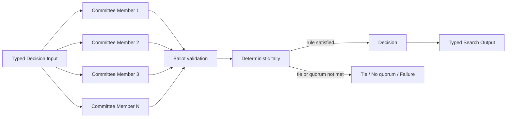

# Committee / Voting

## Intent

Use Committee / Voting when several independent members can judge the same question, candidate slate, or acceptance decision, and the Search should aggregate their typed ballots under a declared rule.

Apply the [Agent or Program rule](../../../SKILL.md#choose-agent-or-program) to every authored operation in this pattern.

The shape is:

```text
one shared decision
→ several independent ballots
→ deterministic ballot validation
→ declared aggregation rule
→ decision, tie, or abstention
```

The committee members are **judges or voters**.

They are not necessarily candidate generators, and their Outputs are not concatenated as complementary sections.

A Committee is useful when one judgment is noisy but multiple sufficiently independent judgments provide a more stable decision.

## Structure



The committee may vote on:

```text
a supplied set of candidate IDs
a binary approve / reject decision
a finite label set
a ranked option set
a normalized answer
```

The ballot space must be explicit before the members run.

## Core idea

A Committee separates three concerns:

```text
1. who is allowed to vote
2. what one valid ballot means
3. how valid ballots become one decision
```

A useful Committee depends on both:

```text
member competence
member independence
```

Five copies of the same model with the same prompt, context, tools, and deterministic decoding may produce five correlated ballots, not five independent judgments.

Independence may come from:

```text
different role emphasis
different model family
different evidence subset
different rubric dimension
different prompt formulation
different random sample
different tool access
```

The aggregation rule must match the meaning of those differences.

If each member evaluates a different required dimension and all dimensions must pass, that may be a Dependency Graph with an AND join rather than majority voting.

## Committee versus adjacent patterns

### Committee versus Parallel Best-of-N

```text
Best-of-N:
    candidate generators produce alternative solutions
    a selector retains one candidate

Committee:
    members produce ballots about the same decision
    a tally aggregates those ballots
```

A Best-of-N slate may be judged by a Committee.

### Committee versus Tournament

```text
Tournament:
    candidates compete in rounds
    winners advance and losers are eliminated

Committee:
    members vote on the same slate or decision
    ballots are aggregated directly
```

A Committee can judge each Tournament match.

### Committee versus Mixture-of-Agents

```text
Committee:
    aggregate discrete votes, rankings, or scores

Mixture-of-Agents:
    aggregate substantive candidate content into a new synthesis
```

If the final Agent reads every proposed answer and writes a new combined answer, that is not plain voting.

### Committee versus Multi-Agent Debate

Committee members vote independently.

Debate members observe and respond to one another before the final decision.

If interaction is essential, use the debate pattern and optionally end it with a vote.

## Search interpretation

| Search concept | Meaning in this pattern |
|---|---|
| State | The shared decision Input, committee specification, collected ballot outcomes, and tally |
| Candidate | An option on the ballot, not usually a voter |
| Action | Ask one declared member for one ballot |
| Observation | A valid ballot, abstention, or member Failure |
| Score | Vote count, weighted vote, rank points, median score, or another declared aggregate |
| Aggregation | Deterministic tally under the declared voting rule |
| Frontier | Committee members whose ballots are not terminal |
| Stop condition | Quorum and decision conditions are satisfied and all direct children are terminal or cancelled |
| Result | The winning option, approval decision, tie, or no-quorum Output |

The tally is normally deterministic Python.

Do not create a Tally Agent to count typed ballots.

Use an Agent only when semantic normalization or post-decision synthesis is genuinely required.

## Mapping to the AIBuildAI SDK

The committee is declared before execution as `CommitteeMemberSpec` in `search/io.py`: a `member_id`, a `role`, a fixed `weight`, and whether the member is `required`.

The closed ballot contract is `VoterOutput` in `search/agents/io.py`: a `member_id`, a `choice_id` that is null only when `abstained` is true, and a `rationale`.

The parent Search validates:

```text
member_id belongs to the declared committee
each member submits at most one terminal ballot
choice_id belongs to the supplied option set
abstained and choice_id are consistent
weight comes from MemberSpec, not from the ballot
required rubric fields are present
```

The normal execution uses:

```text
ctx.spawn(each Committee Member, capture_failure=True)
ctx.wait(...)
handle.result()
```

Committee-member Failures are often captured because the Search may proceed if quorum remains possible.

The parent then:

```text
separates valid ballots, abstentions, and Failures
checks required members and quorum
runs a deterministic tally
applies the tie rule
constructs the typed Search Output
```

A committee member may be:

- an `Agent` with one judging role;
- a Program admitted by the selection guide;
- an Agent when human or external review evidence requires judgment;
- a child `Search` when one seat requires meaningful internal analysis.

## Complete package

The folder beside this file holds a complete package for this pattern, activated by the repository gate through the real generated-definition loader on every change: `search/` is the authored layout (`search/__init__.py` exports `SEARCH_TYPE`; `search.py`, `io.py`, `agents/`, `prompts/agent/`), and `input_payload.json` is the Input that builds its `SEARCH_TYPE`. Read `search/search.py` for the control flow and `search/agents/io.py` for the typed boundaries. `VoterAgent` is the one role every member runs, casting one independent ballot each; every member is spawned before any is awaited, and a private deterministic `_tally()` function, never an Agent, turns the counted ballots into the single strict-majority winner, or a Failure when no majority, no quorum, or a missing required vote makes the tie or the shortfall the honest answer.

## Ballot forms

### Choice ballot

One member selects one option: `VoterOutput(choice_id="candidate-b", abstained=False, ...)` in `search/agents/io.py`.

Use this for plurality, majority, or weighted-choice voting.

### Binary ballot

One member returns:

```text
approve
reject
abstain
```

Use this for acceptance gates, safety reviews, or launch decisions.

Do not encode a member Failure as `reject`.

### Ranked ballot

One member ranks a fixed option set:

```text
candidate-c
candidate-a
candidate-b
```

The parent may apply a declared rank aggregation rule such as Borda count.

Do not ask members to rank candidates they were not given.

### Score ballot

One member assigns comparable bounded scores:

```text
correctness: 0–4
relevance: 0–4
robustness: 0–4
```

The parent may aggregate by:

```text
median
trimmed mean
weighted mean
threshold count
```

State the scale and aggregation before execution.

### Normalized-answer voting

Members may independently solve the same objective, then vote by normalized answer:

```text
raw reasoning paths differ
normalized final answer is the same
```

The normalization must be deterministic or handled by one explicit normalization operation.

Do not majority-vote arbitrary long strings using exact text equality.

## Voting rules

Choose one rule whose semantics match the decision.

### Plurality

```text
option with the most votes wins
```

A winner need not have more than half of all votes.

### Majority

```text
winner must receive more than half of counted ballots
```

Define whether abstentions count in the denominator.

### Supermajority

```text
winner or approval requires a declared threshold
```

Useful when false acceptance is more costly than indecision.

### Weighted voting

```text
each MemberSpec contributes a fixed declared weight
```

Weights must be assigned before ballots are observed.

Do not use a member’s self-reported confidence as an automatic voting weight unless the system has validated that confidence calibration.

### Rank aggregation

Use when members can compare the entire slate but a single top-choice ballot discards too much information.

Keep the rule deterministic and documented.

### Veto or mandatory approval

Some decisions should not be reducible to majority rule.

Example:

```text
security reviewer must approve
and
majority of general reviewers must approve
```

Represent this as an explicit compound rule.

Do not let three generalist votes silently override one required specialist whose concern is authoritative.

## Independence and information flow

Members should normally vote without seeing one another’s ballots.

This prevents:

```text
anchoring
herding
social pressure
early-majority imitation
```

Give every member the same candidate slate and core rubric unless their declared role intentionally differs.

If members receive different evidence, the final rule must reflect that design.

Examples:

```text
three independent generalist judges
→ majority vote

one correctness specialist
one safety specialist
one efficiency specialist
→ all required checks or typed compound rule

several sampled reasoning paths
→ normalized-answer majority
```

The second example is often better modeled as a graph of required checks than as equal-vote majority.

## When to use

Use Committee / Voting when:

- one judgment is noisy;
- the decision can be represented by a closed ballot;
- several independent perspectives can reduce variance;
- a quorum and tie rule can be stated;
- there is no single authoritative scalar metric;
- candidate selection requires more than one judge;
- false positive and false negative tradeoffs can be expressed through thresholds;
- disagreement itself is useful evidence;
- the committee size can be bounded.

Typical examples:

```text
several judges select the best generated plan

multiple reviewers approve or reject a checkpoint

independent reasoning samples vote on one normalized answer

several security reviewers classify a finding

a committee ranks candidate training pipelines

several role-specific evaluators vote on release readiness
```

Parallel voting is useful when multiple independent attempts or perspectives increase confidence, especially for review and classification decisions. The value comes from aggregation, not merely parallel execution.

## When not to use

Do not use this pattern when:

- member Outputs are complementary evidence that must be synthesized;
- the ballot space cannot be normalized;
- members must interact to expose flaws;
- all members are highly correlated copies;
- one authoritative test or metric already decides the question;
- a critical specialist must not be outvoted;
- the task requires staged candidate elimination;
- the final answer should combine content from several proposals;
- the system would change the voting rule after seeing the result;
- no meaningful quorum or tie policy exists.

Choose:

- **Dependency Graph** for complementary required evaluations;
- **Mixture-of-Agents** for synthesis;
- **Multi-Agent Debate** for interaction before decision;
- **Tournament** for staged elimination;
- deterministic evaluation for authoritative metrics;
- **Best-of-N** when one Selector is sufficient.

## Budget and stopping

Declare:

```text
maximum committee size
member roles
member weights
required members
quorum
abstention policy
member-Failure tolerance
voting rule
decision threshold
tie rule
maximum tie-break operations
```

The basic stopping rule is:

```text
all member Handles are terminal
and quorum is satisfied
and the tally produces a valid decision or typed tie
```

### Quorum

Quorum is the minimum number of valid counted ballots.

It is not:

```text
number of spawned members
number of terminal children
number of non-Failure outcomes including abstentions
```

State whether abstentions count toward quorum.

### Member Failure

Keep three states separate:

```text
vote against an option
abstain
member execution Failure
```

A Failure means the member did not deliver a valid ballot.

The Search may proceed only if its declared quorum and required-member rules still hold.

### Early decision

A Committee can sometimes decide before every member finishes when the remaining ballots cannot change the result.

For example:

```text
five equal-weight members
three valid votes already approve
two votes remain
simple majority is irreversible
```

An advanced Search may then:

```text
cancel the no-longer-needed pending member Handles
wait for terminal cancellation
return the decision
```

The basic pattern should wait for all members unless early-decision arithmetic is exact.

Do not use an LLM’s claimed confidence as proof that remaining votes cannot matter.

### Re-voting

Do not ask the same unchanged Committee to vote repeatedly until a preferred result appears.

A second round is justified only when something changes:

```text
new evidence
revised candidates
clarified rubric
debate transcript
tie-break protocol
different declared committee
```

## Ties and uncertainty

A tie is a valid outcome, not necessarily a system error.

Possible policies are:

```text
return a typed tie
run one bounded tie-breaker
apply a declared secondary metric
require human review
advance all tied options to a later Tournament stage
```

The tie-breaker should not secretly reuse the same majority rule with one more arbitrary member unless that extra member was part of the declared policy.

For high-stakes decisions, returning uncertainty may be better than manufacturing consensus.

## Recursive form

A committee seat may be a child Search when that member requires internal orchestration:

```text
SecurityMemberSearch:
    inspect artifacts
    run tests
    synthesize findings
    return one Ballot
```

The parent Committee sees one typed ballot from that child.

It does not aggregate the child’s internal opinions as extra outer votes.

A recursively generated specialist seat is justified when:

```text
the role requires task-specific search
and no existing member Search fits
```

Then:

```text
run MetaAgent
load the generated child Search
spawn it as one committee member
```


Do not recursively create committees whose members recursively create identical committees on the same unchanged question. That multiplies correlated votes without new evidence.

## Useful hybrids

Committee / Voting commonly combines with:

- **Parallel Best-of-N → Committee**: several candidates are judged by several voters.
- **Tournament with Committee matches**.
- **Router → Committee**: select the relevant specialist voters.
- **Map-Reduce → Committee**: mapped evidence is reduced, then independently reviewed.
- **Committee → Sequential finalization**: decide, then format or deliver.
- **Multi-Agent Debate → Committee vote**: members deliberate, then cast independent final ballots.
- **Evaluator–Optimizer with Committee evaluator**: revision uses aggregated feedback.
- **Recursive Divide-and-Conquer with committee merge decisions**.
- **DAG of required specialists plus generalist vote**: combine mandatory gates with majority preference.

## Common mistakes

### Majority-voting raw prose

Two semantically identical answers may use different text.

Normalize to a closed option or answer representation before tallying.

### Counting correlated copies as independent experts

More calls do not guarantee more information.

State the source of diversity.

### Letting voters observe earlier ballots

That changes independent voting into sequential influence or debate.

### Changing the rule after the tally

Bad:

```text
plurality was planned
but the preferred option lost
so now use confidence-weighted voting
```

The rule belongs in the Search Input or code before execution.

### Using self-reported confidence as weight

Confidence may be useful metadata, but it is not automatically calibrated expertise.

### Treating Failure as rejection

A crashed member did not vote “no.”

### Omitting abstention

Forcing a choice can turn insufficient evidence into false certainty.

### Letting a majority override a mandatory specialist

Use required-member or veto semantics when one dimension is authoritative.

### Asking an Agent to count ballots

Typed ballots should be tallied deterministically.

### Returning a new synthesized option

If the final operation writes a new answer from several proposals, use Mixture-of-Agents or an explicit synthesis stage.

### Duplicate member identity

Every ballot must map to exactly one declared `member_id`.

## Design checklist

Before selecting this pattern, answer:

```text
What exact question is the committee deciding?
What is the closed ballot space?
Who are the members?
Why are their judgments meaningfully independent?
Do members see the same evidence?
Which members are required?
What counts toward quorum?
Can a member abstain?
How are member Failures handled?
What voting or rank aggregation rule is used?
Are any weights fixed in advance?
Can one specialist veto or require approval?
How is a tie represented or resolved?
Can the result be decided early by exact arithmetic?
Would synthesis, debate, or a dependency graph better represent the task?
```

If the ballot cannot be typed without losing the information the final result needs, plain voting is probably the wrong pattern.

## References

- Anthropic, **Building Effective Agents — Parallelization**: identifies voting as running the same task several times to obtain diverse Outputs and aggregating them for higher-confidence review or classification. ([anthropic.com](https://www.anthropic.com/engineering/building-effective-agents))
- Wang et al., **Self-Consistency Improves Chain of Thought Reasoning in Language Models**: samples diverse reasoning paths and selects the most consistent normalized answer by marginalizing over those paths. ([arxiv.org](https://arxiv.org/abs/2203.11171))
- Zheng et al., **Judging LLM-as-a-Judge with MT-Bench and Chatbot Arena**: documents strengths and biases of automated preference judgments, motivating explicit ballot protocols and multi-judge safeguards for consequential selection. ([arxiv.org](https://arxiv.org/abs/2306.05685))
