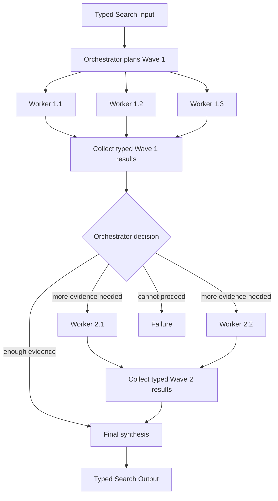

# Orchestrator–Workers

## Intent

Use Orchestrator–Workers when the Search cannot know every useful subtask before execution begins, but one central Orchestrator can inspect the objective and accumulated evidence, create a bounded set of typed worker assignments, observe their results, and decide whether to synthesize, delegate another bounded wave, or stop.

Apply the [Agent or Program rule](../../../SKILL.md#choose-agent-or-program) to every authored operation in this pattern.

The shape is:

```text
one objective
→ Orchestrator discovers the next useful tasks
→ several Workers execute those tasks
→ Orchestrator inspects the typed results
→ synthesize, delegate another bounded wave, or stop
```

The defining property is **dynamic delegation**.

The Orchestrator does not merely choose among a fixed set of routes. It creates concrete task descriptions whose number, scope, and worker role depend on the current state of the Search.

## Structure



The diagram shows two waves only for illustration.

A valid Search may use one wave or several bounded waves. The maximum number of waves and total assignments must be declared before execution.

## Core idea

The Orchestrator owns the evolving task decomposition.

Workers own bounded execution of individual assignments.

The parent Search owns durable composition, validation, budget, and stopping.

The responsibilities are:

```text
Orchestrator:
    inspect objective and accumulated evidence
    identify the next missing information or work
    emit bounded typed assignments
    decide whether another wave is justified
    request final synthesis or stop

Worker:
    perform exactly one assigned task
    return one typed result or Failure
    not redesign the whole workflow

Parent Search:
    validate every assignment
    materialize workers through `ExecutionContext`
    collect terminal outcomes
    update the ordinary typed orchestration state
    enforce total limits
    construct or obtain the final Output
```

The Orchestrator is not a second runtime.

It proposes business work. The Search still uses ordinary Python and `ExecutionContext` to run that work.

## Distinction from adjacent patterns

### Orchestrator–Workers versus Map-Reduce

```text
Map-Reduce:
    the section set is known from the Input
    or produced once before the map wave
    every required section follows a stable mapper contract

Orchestrator–Workers:
    the next assignments depend on the current evidence
    later tasks may not be knowable before earlier Workers return
```

If the entire work list can be declared before the first Worker starts, prefer Map-Reduce, a DAG, or a fixed parallel pattern.

### Orchestrator–Workers versus Router and Specialists

```text
Router:
    selects one or a bounded subset of known branches

Orchestrator:
    creates concrete task instances and may create later tasks
    from the results of earlier tasks
```

A Router might choose `literature_review`.

An Orchestrator might create:

```text
review the three papers supporting claim A
inspect the benchmark protocol for leakage
compare two alternative data sources
```

### Orchestrator–Workers versus Worker–Iterator

```text
Orchestrator–Workers:
    may create several tasks in one wave
    then reason over the wave as a set

Worker–Iterator:
    normally executes one bounded work item
    then chooses exactly one next work item or stops
```

Use Worker–Iterator when the task is naturally serial and every observation determines one next action.

### Orchestrator–Workers versus Selector Group Chat

```text
Orchestrator–Workers:
    explicit typed task assignment
    Workers return task results
    central state is a task/evidence ledger

Selector Group Chat:
    participants contribute to one shared public conversation
    a Selector repeatedly chooses the next speaker
```

Do not use a chat transcript as a substitute for typed worker assignments.

### Orchestrator–Workers versus Dependency Graph

A DAG has a largely known dependency shape.

Orchestrator–Workers discovers at least part of that shape during execution.

If the Orchestrator emits the same graph for every Input, encode the graph directly instead.

## Search interpretation

| Search concept | Meaning in this pattern |
|---|---|
| State | The objective, bounded evidence summary, completed assignment results, unresolved needs, and remaining budget |
| Candidate | A proposed subtask, a Worker result, or a candidate synthesis |
| Action | Delegate one bounded wave of assignments |
| Observation | Worker Outputs and Failures |
| Score | Optional task priority, evidence sufficiency, or final quality score |
| Aggregation | Orchestrator update and final synthesis |
| Frontier | The assignments in the current wave |
| Stop condition | The Orchestrator requests finalization, a hard acceptance rule is met, or the declared budget is exhausted |
| Result | One typed synthesis or selected artifact |

The orchestration state is a business value.

It is not another runtime state machine, journal, or scheduler.

For a small implementation, it may be an immutable value reconstructed in the local Search loop, held only as the plain lists `search/search.py` builds each wave from `AssignmentResult` and `AssignmentFailure` in `search/agents/io.py`.

Do not store live Handles, DBOS objects, mutable Agent instances, or filesystem resources in this value.

## Mapping to the AIBuildAI SDK

Use `ctx.spawn` for each unit of work. Spawn on the same identity object again only when later work needs its state. Put `upstream=` on each Action call, not on the identity constructor. A Handle names the exact spawned Action.

## Complete package

The folder beside this file holds a complete package for this pattern, activated by the repository gate through the real generated-definition loader on every change: `search/` is the authored layout (`search/__init__.py` exports `SEARCH_TYPE`; `search.py`, `io.py`, `agents/`, `prompts/agent/`), and `input_payload.json` is the Input that builds its `SEARCH_TYPE`. Read `search/search.py` for the control flow and `search/agents/io.py` for the typed boundaries. The three roles are `OrchestratorAgent`, `WorkerAgent`, and `SynthesizerAgent`; the wave loop is the one structural idea, since the orchestrator decides both the next wave's assignments and when to stop.

## Planning and assignment contract

A good assignment is:

```text
bounded
independently executable
traceable to one missing need
clear about its expected typed Output
small enough for one Worker
large enough to justify one durable child
```

A poor assignment is:

```text
solve the whole objective
investigate anything useful
continue until done
create as many agents as necessary
```

Every assignment should contain:

```text
stable assignment_id
one declared role
one objective
necessary evidence or artifact references
expected Output contract
required versus optional status
```

The parent should reject:

```text
duplicate assignment IDs
unknown roles
empty objectives
fan-out beyond the remaining budget
assignments that ask Workers to alter durable execution state
assignments that require another Worker implicitly
```

The Orchestrator may propose dependencies among assignments, but for a minimal implementation prefer bounded waves:

```text
all tasks in one wave can run independently
later dependencies are expressed by a later wave
```

If a static dependency graph is already known, use the DAG pattern instead of forcing it through repeated Orchestrator calls.

## One-wave and multi-wave forms

### One-wave orchestration

Use one wave when the task set is unknown initially but becomes clear after one planning call:

```text
objective
→ Orchestrator emits bounded assignments
→ Workers run in parallel
→ Synthesizer combines results
```

This is the cheapest form.

### Multi-wave orchestration

Use several waves only when earlier results can reveal genuinely new tasks:

```text
first wave finds a benchmark discrepancy
→ second wave inspects the evaluation data
→ final synthesis resolves the discrepancy
```

Do not add another wave merely because the Orchestrator can produce one.

Each wave must consume new evidence or resolve a stated missing need.

## When to use

Use Orchestrator–Workers when:

- the useful subtasks cannot all be listed before execution;
- the objective is open-ended but still bounded by a clear deliverable;
- different discovered subtasks require different specialist roles;
- several discovered tasks can run concurrently;
- later work depends on evidence returned by earlier Workers;
- one central decomposition policy is useful;
- a final synthesis must account for which work was completed or failed;
- total waves and assignments can be bounded.

Typical examples:

```text
inspect an unfamiliar repository
→ identify relevant subsystems
→ delegate focused inspections
→ synthesize an architecture review

investigate a benchmark regression
→ delegate data, model, training, and evaluation checks
→ create follow-up tasks from the evidence
→ produce a root-cause report

prepare a research survey
→ identify evidence gaps
→ delegate topic-specific research
→ request focused follow-ups
→ synthesize one report

solve an ML engineering task
→ inspect task and data
→ delegate candidate experiments
→ use results to choose the next experiments
→ return the best artifact
```

This pattern is appropriate when a lead Agent must plan, track progress, and redirect specialized Agents as new information arrives.

## When not to use

Do not use this pattern when:

- the stages and dependencies are already known;
- one Agent can complete the task directly;
- the task is one fixed chain;
- every subtask is known and independently sectioned;
- exactly one next action should occur at a time;
- the objective is to revise one candidate under feedback;
- a shared conversation is more important than task assignment;
- the Orchestrator would emit the same work list for every Input;
- the Worker set or number of waves cannot be bounded.

Choose:

- **Sequential Chain** for fixed ordered stages;
- **Map-Reduce** for known complementary sections;
- **Dependency Graph** for known dependencies and joins;
- **Router and Specialists** for fixed route selection;
- **Worker–Iterator** for one adaptive next action at a time;
- **Evaluator–Optimizer** for iterative revision of one candidate;
- **Selector Group Chat** for shared conversational turn-taking.

## Budget and stopping

Declare:

```text
maximum waves
maximum assignments per wave
maximum assignments over the whole Search
maximum simultaneous Workers
available Worker roles
per-role cost or time budget
required versus optional assignment policy
finalization rule
```

The parent Search must validate every Orchestrator plan against the remaining budget.

The Orchestrator’s natural-language claim that a task is important does not increase the budget.

The basic stopping rules are:

```text
Orchestrator emits ready_to_finalize
and final synthesis succeeds
```

or:

```text
an external hard acceptance criterion is met
```

or:

```text
maximum waves or assignments is exhausted
→ return the declared best-so-far result or Failure
```

Choose the final budget-exhaustion behavior in advance.

### No-progress condition

A simple no-progress rule may stop when:

```text
the Orchestrator repeats the same unresolved needs
and proposes no new valid assignments
```

Do not build a complex semantic loop detector for the initial pattern. The hard wave and assignment limits remain authoritative.

## Worker Failure and replanning

A Worker Failure is evidence about execution, not a valid task result.

Keep separate:

```text
WorkerResult(
    finding="no issue exists"
)

WorkerFailure(
    reason="worker could not complete the assignment"
)
```

Before execution, choose one policy:

```text
any required Worker Failure stops the Search
optional Worker Failures are supplied to the next Orchestrator call
one different fallback role may attempt the assignment
final synthesis may proceed with explicit incomplete coverage
```

Do not automatically rerun the same Worker with unchanged Input.

If the Orchestrator sees a Failure and proposes a new assignment, the new assignment must differ meaningfully:

```text
different evidence
different role
different scope
different method
```

The parent validates that the total budget still holds.

## State compression

A multi-wave Orchestrator can accumulate too much context.

Do not pass every raw Worker transcript into every later Orchestrator call.

Prefer:

```text
typed Worker Outputs
artifact references
short declared findings
unresolved needs
stable assignment IDs
```

When detailed artifacts matter, pass references and let the relevant Worker or finalizer read them.

A separate summary operation is justified only when context size is a real constraint. Do not create a summary framework by default.

## Recursive form

A Worker assignment may be a child Search:

```text
assignment requires its own planning, parallelism, or iteration
→ spawn one child Search
→ consume one typed child Output
```

A task-specific child Search may be generated by `MetaAgent` when:

```text
the assignment has meaningful internal orchestration
no existing child Search fits
```


The outer Orchestrator sees only the child Search Output and Failure. It does not manage the child’s internal Workers.

A hierarchical form is possible:

```text
root Orchestrator
→ delegates one broad task to a child Orchestrator Search
→ child coordinates its own bounded Workers
→ returns one typed result
```

Do not recursively create another Orchestrator merely to rename one assignment. Recursion must introduce a real subproblem boundary.

## Useful hybrids

Orchestrator–Workers commonly combines with:

- **Orchestrator → Map-Reduce** for a dynamically chosen dataset or source set.
- **Orchestrator with Best-of-N per assignment**.
- **Orchestrator with Committee review** of the final synthesis.
- **Orchestrator → Evaluator–Optimizer** for difficult Worker Outputs.
- **Router → Orchestrator** only for open-ended categories.
- **Orchestrator with child DAG Searches** for discovered structured subproblems.
- **Orchestrator with Tournament selection** among experimental results.
- **Recursive Orchestrator hierarchy** for genuinely nested domains.
- **Worker–Iterator inside one assignment** for an adaptive serial investigation.

Limit hybrids to the structures the objective actually requires.

## Common mistakes

### Creating a generic task scheduler

Do not add:

```text
TaskRuntime
TaskHandle
OrchestratorContext
WorkerRegistry
DelegationEngine
```

`ExecutionContext` already materializes, waits for, and cancels durable work.

### Letting the Orchestrator call `ExecutionContext`

The Orchestrator returns a typed business plan.

The parent Search performs `spawn`, `wait`, and `cancel`.

### Accepting arbitrary Worker types

The parent offers a closed role set. The Orchestrator does not import code or choose raw class names.

### Unbounded delegation

Every plan must fit the remaining assignment and wave budget.

### Treating every Worker result as final evidence

The parent or Orchestrator must validate that a result belongs to the requested assignment and uses the expected contract.

### Replanning without new evidence

Another Orchestrator call is justified by new Worker outcomes, changed budget, or a resolved dependency.

### Using a shared mutable scratch file as the task ledger

Workers return typed Outputs. The parent builds the next typed Orchestrator Input.

### Giving Workers the whole orchestration responsibility

A Worker should solve its assignment, not independently spawn an uncontrolled team.

A Worker may be a child Search only when that nested orchestration is explicit.

### Passing raw transcripts forever

Use typed summaries and artifact references.

### Confusing optional Failure with negative evidence

A failed Worker did not prove the assignment had no finding.

## Design checklist

Before selecting this pattern, answer:

```text
Why can the full task list not be known initially?
What does one valid assignment contain?
Which Worker roles are offered?
What is the maximum fan-out per wave?
What is the maximum total assignment count?
What new evidence can justify another wave?
What typed result does each role return?
Which assignments are required?
How are Worker Failures represented?
What does the Orchestrator need to see from prior waves?
What is the final synthesis contract?
What exact condition ends the Search?
Would a static DAG or Map-Reduce design be simpler?
Which assignments, if any, justify recursive child Searches?
```

If the Orchestrator cannot explain what information one proposed assignment adds, reject that assignment.

## References

- Anthropic, **Building Effective Agents — Orchestrator–Workers**: a central LLM dynamically breaks down tasks, delegates them to Workers, and synthesizes their results when the required subtasks cannot be predicted in advance. ([anthropic.com](https://www.anthropic.com/engineering/building-effective-agents))
- Fourney et al., **Magentic-One: A Generalist Multi-Agent System for Solving Complex Tasks**: a lead Orchestrator plans, tracks progress, replans, and directs specialized Agents over a bounded task. ([arxiv.org](https://arxiv.org/abs/2411.04468))
