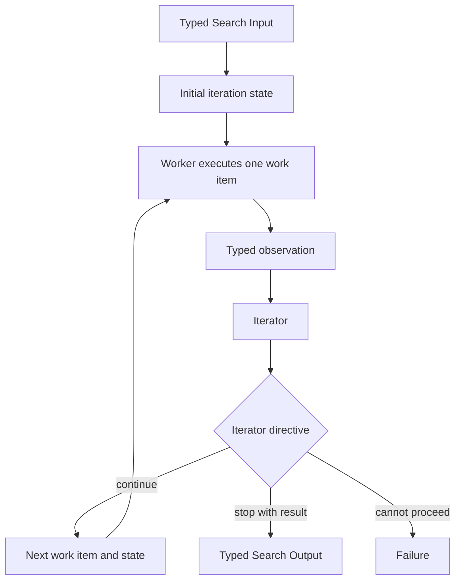

# Worker–Iterator

## Intent

Use Worker–Iterator when the Search should make progress through a sequence of bounded work items, but the correct next item cannot be fixed before the current result is observed.

Apply the [Agent or Program rule](../../../SKILL.md#choose-agent-or-program) to every authored operation in this pattern.

The shape is:

```text
current typed state
→ Worker performs one bounded action
→ Iterator interprets the observation
→ stop, fail, or choose exactly one next work item
→ repeat
```

The pattern is adaptive but primarily serial.

At each iteration, one Worker acts on one declared work item. Then one Iterator decides what should happen next.

The Iterator does not evaluate only whether the same artifact should be revised. It may redirect the Search to a different next action, tool, subproblem, or evidence source.

## Structure



Only one work item is active in the basic pattern.

A tightly bounded parallel Worker step is possible as a hybrid, but if the Iterator routinely emits several independent tasks, the design is moving toward Orchestrator–Workers.

## Core idea

The pattern separates action from progression control:

```text
Worker:
    execute the current bounded work item
    return one typed observation or artifact

Iterator:
    inspect current state and latest observation
    decide whether the objective is complete
    otherwise emit exactly one next work item

Parent Search:
    materialize both operations durably
    carry the typed state between iterations
    enforce maximum iterations and budget
    return the final typed result
```

A Worker is intentionally myopic.

It should not decide the entire remaining workflow.

An Iterator is intentionally controlling.

It should not perform the work itself and then disguise the result as a next-step decision.

The pattern is useful when every observation changes what action is rational next.

Examples include:

```text
inspect one failing test
→ decide which file to inspect next

run one experiment
→ choose the next experiment from the result

retrieve one evidence source
→ decide which unresolved claim to investigate next

execute one tool action
→ update state and select the next tool action
```

## Distinction from adjacent patterns

### Worker–Iterator versus Sequential Chain

```text
Sequential Chain:
    the stages and their order are fixed before execution

Worker–Iterator:
    the next work item depends on the latest observation
```

If the Iterator always emits the same predetermined sequence, replace the loop with ordinary sequential code.

### Worker–Iterator versus Orchestrator–Workers

```text
Worker–Iterator:
    one work item per iteration
    one observation drives one next decision

Orchestrator–Workers:
    one planning step may create several assignments
    results are considered as a wave
```

Use Worker–Iterator when serial dependency is intrinsic.

Use Orchestrator–Workers when useful tasks can run concurrently.

### Worker–Iterator versus Evaluator–Optimizer

```text
Worker–Iterator:
    the next action may change category, target, or tool

Evaluator–Optimizer:
    the loop stays focused on improving one candidate
    under a stable evaluation contract
```

If every Iterator decision means “revise the same candidate using this feedback,” use Evaluator–Optimizer.

### Worker–Iterator versus ReAct inside one Agent

A ReAct-style Agent may internally alternate reasoning and tool actions within one conversation.

Worker–Iterator expresses the loop at the Search level:

```text
one durable Worker execution
→ one durable Iterator execution
→ typed state transition
```

Use Search-level Worker–Iterator when the iterations deserve independent durable identity, different roles, different resource policy, explicit artifacts, or an auditable stopping rule.

Do not externalize every token-level reasoning step as a durable iteration.

### Worker–Iterator versus Selector Group Chat

Worker–Iterator carries an explicit task state and chooses the next work item.

Selector Group Chat carries a shared public conversation and chooses the next speaker.

A participant contribution may suggest work, but a chat turn is not automatically a Worker assignment.

## Search interpretation

| Search concept | Meaning in this pattern |
|---|---|
| State | The objective, current work item, bounded observation history, artifact references, and remaining budget |
| Candidate | A partial result, hypothesis, action, or next work item |
| Action | Execute the current work item |
| Observation | The Worker’s typed Output or Failure |
| Score | Optional progress, utility, confidence, or external metric |
| Aggregation | Iterator updates the state and chooses the next work item |
| Frontier | Exactly one current work item in the basic form |
| Stop condition | Iterator emits a terminal directive or the hard iteration budget is exhausted |
| Result | The terminal directive’s typed result or a finalizer Output |

The iteration state is a business value.

It should contain what future iterations need, not a second copy of runtime lifecycle.

This package's own iteration state is the `observations` tuple of `ObservationSummary` in `search/agents/io.py`, accumulated by `search/search.py` on every round instead of a separate state class.

Avoid storing every raw conversation or full artifact inline.

Use references for large data and bounded summaries for decision context.

## Mapping to the AIBuildAI SDK

Use `ctx.spawn` for each unit of work. Spawn on the same identity object again only when later work needs its state. Put `upstream=` on each Action call, not on the identity constructor. A Handle names the exact spawned Action.

## Complete package

The folder beside this file holds a complete package for this pattern, activated by the repository gate through the real generated-definition loader on every change: `search/` is the authored layout (`search/__init__.py` exports `SEARCH_TYPE`; `search.py`, `io.py`, `agents/`, `prompts/agent/`), and `input_payload.json` is the Input that builds its `SEARCH_TYPE`. Read `search/search.py` for the control flow and `search/agents/io.py` for the typed boundaries. `WorkerAgent` performs one bounded diagnostic action and `IteratorAgent` reads the accumulated observations to continue with one next action, stop with a diagnosis, or fail — one iteration deep, one directive at a time.

## Designing the Worker

One Worker invocation should have one bounded objective.

Good Worker tasks include:

```text
inspect one supplied file for the named hypothesis
run one declared experiment
retrieve evidence for one unresolved claim
apply one bounded code change
score one artifact under one rubric
query one external tool and normalize its result
```

Poor Worker tasks include:

```text
finish the entire project
continue researching until confident
do whatever is necessary
spawn more Workers as needed
```

The Worker Output should distinguish:

```text
what action was attempted
what observation was produced
what artifact was created
what objective facts changed
whether the assigned work completed
```

The Worker does not need to recommend the next action unless that recommendation is part of the declared observation contract. The Iterator remains the authority for progression.

## Designing the Iterator

The Iterator receives:

```text
objective
current typed state
latest typed observation
remaining budget
closed set of available work kinds
```

It returns one of:

```text
continue with exactly one next WorkItem
stop with one typed result
fail with one declared reason
```

The Iterator should answer:

```text
What did the latest observation resolve?
What remains unresolved?
What is the single highest-value next action?
Is the objective already satisfied?
Is further work still justified under the budget?
```

It should not:

```text
return several parallel assignments
import arbitrary code
change the hard iteration limit
perform the Worker action itself
claim success without a terminal result
repeat the same work with unchanged context
```

### Deterministic Iterator

Use ordinary Python when the policy is exact:

```text
process the next unvisited item
follow the next edge in a supplied path
run the next stage selected by a finite-state protocol
binary search the next interval
```

Do not spend an Agent call on a deterministic index increment.

### Agent Iterator

Use an Agent when selecting the next action requires semantic judgment:

```text
which failing test reveals the most about the root cause
which experiment most reduces uncertainty
which source should be inspected next
which hypothesis remains plausible
```

The Agent still selects from a bounded action surface.

## When to use

Use Worker–Iterator when:

- each observation determines one next action;
- work is intrinsically sequential;
- the next action cannot be fixed in advance;
- an adaptive investigation is more efficient than broad fan-out;
- only one expensive operation should run at a time;
- progress can be represented by typed state;
- a bounded action set can be offered;
- the Search needs a clear maximum iteration count;
- each iteration produces an independently meaningful artifact or observation.

Typical examples:

```text
debug one failure
→ inspect the most relevant evidence
→ choose the next diagnostic action

adaptive experiment selection
→ run one experiment
→ update hypotheses
→ choose the next experiment

incremental research
→ investigate one unresolved claim
→ update evidence state
→ choose the next claim or source

tool-driven task completion
→ execute one tool action
→ observe the environment
→ select the next action

interactive data investigation
→ inspect one anomaly
→ decide which slice or statistic to inspect next
```

The pattern maps naturally to tasks where reasoning and action alternate and each external observation changes the plan.

## When not to use

Do not use this pattern when:

- all stages are known in advance;
- several independent tasks should run concurrently;
- the task is one generation followed by repeated critique and revision;
- the state is a shared conversation among several participants;
- one Agent can use its own tools efficiently inside one opaque durable step;
- each iteration adds no new observation;
- the next work item is always the same retry;
- the action surface cannot be bounded;
- the iteration budget cannot be stated.

Choose:

- **Sequential Chain** for fixed steps;
- **Orchestrator–Workers** for dynamic parallel assignments;
- **Evaluator–Optimizer** for revising one candidate;
- **Selector Group Chat** for shared conversational turns;
- a single Agent with tool use when the internal loop does not need separate durable identity;
- **Best-First / A*** when many alternative frontier states must coexist.

## Budget and stopping

Declare:

```text
maximum iterations
available work kinds
maximum cost per Worker
maximum cost per Iterator
artifact and observation size limits
acceptance condition
budget-exhaustion behavior
```

The basic stopping rule is:

```text
Iterator emits StopDirective
and its result satisfies the Search Output contract
```

Other valid stops include:

```text
an external hard criterion is satisfied
Iterator emits FailDirective
maximum iterations is reached
remaining resource budget cannot support another Worker
```

Choose whether budget exhaustion returns:

```text
best-so-far typed result
partial typed result with explicit incompleteness
Failure
```

Do not decide this after the loop runs.

### No-progress handling

The minimum required protection is the hard iteration limit.

A simple additional rule may reject an exact repeated work identity when neither state nor evidence changed:

```text
same work_id
same relevant state
same available evidence
```

Do not build semantic loop detection, vector similarity tracking, or rollback machinery for the initial pattern.

If the Iterator repeatedly selects useless actions in real tasks, improve its Input, action set, or prompt based on those observed failures.

## Worker Failure policy

Choose whether a Worker Failure is:

```text
fatal to the Search
an observation the Iterator may react to
eligible for one different fallback action
```

This package treats a Worker Failure as fatal to the Search: `search/search.py` spawns the worker without `capture_failure`, so a Worker Failure propagates as the Search's own Failure instead of reaching the iterator as an observation.

Do not turn Failure into a fabricated successful observation.

A new action after Failure should differ meaningfully:

```text
inspect a different source
use a different tool
reduce scope
choose another hypothesis
request missing input
```

Do not run the same failing operation indefinitely.

An Iterator Failure is normally fatal because the Search has no valid next directive.

## State and context management

The state should preserve decision-relevant facts, not every implementation detail.

Good state fields include:

```text
resolved hypotheses
unresolved questions
completed work IDs
artifact references
observed metrics
remaining budget
current candidate reference
```

Avoid:

```text
raw hidden chain of thought
full terminal transcripts for every iteration
live Worker instances
Handles
mutable global files as state
entire duplicated artifacts
```

If the Iterator needs details from a prior artifact, pass an artifact reference and let the relevant operation read it.

A bounded `observations` tuple may retain short typed summaries.

## Recursive form

One Worker item may be a child Search when the action itself requires meaningful orchestration:

```text
current action: investigate one subsystem
→ child Search performs bounded parallel inspection
→ returns one typed observation
→ Iterator chooses the next outer action
```

A task-specific Worker Search may be generated by `MetaAgent` when:

```text
no existing Worker or Search fits
internal orchestration is justified
```


The Iterator receives only the child Search Output or Failure.

It does not manage the child’s internal iterations.

A recursive Worker–Iterator over hierarchical state is possible:

```text
outer Iterator selects a subproblem
→ child Worker–Iterator solves that subproblem
→ outer Iterator updates the global state
```

Use this only when the state boundary is clear.

Do not recursively create another identical loop for one trivial action.

## Useful hybrids

Worker–Iterator commonly combines with:

- **Router → Worker–Iterator** for categories requiring adaptive investigation.
- **Orchestrator–Workers with Worker–Iterator assignments**.
- **Worker–Iterator with Evaluator–Optimizer Worker** for one revision-heavy action.
- **Worker–Iterator with child DAG Search** for one structured work item.
- **Worker–Iterator ending in Committee review**.
- **Recursive Divide-and-Conquer where each leaf is solved adaptively**.
- **Best-First Search where expansion of one selected frontier state uses Worker–Iterator**.
- **Selector Group Chat as the Iterator**, only if the next action is explicitly derived from the shared conversation.

## Common mistakes

### Turning a fixed chain into an Iterator loop

If the next work item is predetermined, write the sequence directly.

### Letting the Iterator emit several tasks

That is an Orchestrator plan. Use the appropriate pattern instead of hiding fan-out in one directive.

### Letting the Worker choose the next action

The Worker may report findings, but progression belongs to the Iterator.

### Treating every tool call as a durable iteration

Keep fine-grained internal tool loops inside an Agent call or Program step when separate lifecycle adds no value.

### Carrying the entire transcript

Pass bounded typed state and artifact references.

### Retrying unchanged work

A repeated action with no changed evidence is not adaptive search.

### Omitting a maximum iteration count

A semantic stop condition is not enough for an LLM-controlled loop.

### Using mutable global state

Each iteration should construct the next typed state explicitly.

### Confusing evaluation with iteration

If the loop only asks whether one candidate is good enough and then revises it, use Evaluator–Optimizer.

### Inventing an action DSL

A small typed `WorkItem` union is enough. Do not add a general workflow language.

## Design checklist

Before selecting this pattern, answer:

```text
What is one bounded Worker action?
Why can only one useful action run at a time?
What typed observation does the Worker return?
What state must survive to the next iteration?
Which work kinds may the Iterator select?
What does ContinueDirective contain?
What does StopDirective contain?
How are Worker Failures represented?
What is the maximum iteration count?
What exact condition indicates success?
What happens at budget exhaustion?
Would a single tool-using Agent be simpler?
Would Orchestrator–Workers expose useful parallelism?
Is this really revision of one candidate instead?
Which work items, if any, justify child Searches?
Does each Worker and Iterator Action call name its direct upstream, including the prior round's invocation?
```

If the next action can be written before the current Worker runs, use a simpler fixed workflow.

## References

- Yao et al., **ReAct: Synergizing Reasoning and Acting in Language Models**: interleaves reasoning traces with task-specific actions and uses observations from the environment to update subsequent plans. ([arxiv.org](https://arxiv.org/abs/2210.03629))
- Fourney et al., **Magentic-One: A Generalist Multi-Agent System for Solving Complex Tasks**: separates progress tracking and replanning from specialized execution, illustrating how observations can drive the next bounded action. ([arxiv.org](https://arxiv.org/abs/2411.04468))
