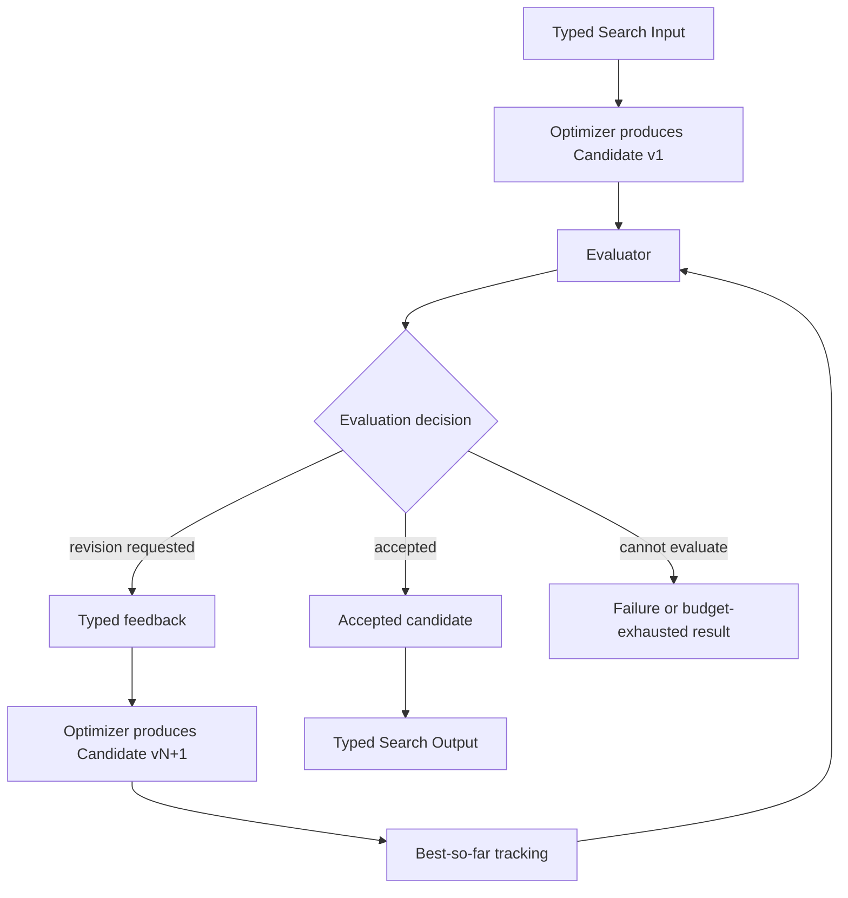

# Evaluator–Optimizer

## Intent

Use Evaluator–Optimizer when one candidate can be improved through repeated, actionable feedback under a stable objective and evaluation contract.

Apply the [Agent or Program rule](../../../SKILL.md#choose-agent-or-program) to every authored operation in this pattern.

The shape is:

```text
produce candidate version
→ evaluate against a declared rubric or test
→ accept or return actionable feedback
→ revise the same candidate lineage
→ repeat within a hard round budget
```

The pattern spends budget on **depth of refinement** rather than breadth of independent alternatives.

It is appropriate when:

- feedback can identify concrete defects;
- a revised candidate can directly address those defects;
- later versions remain comparable to earlier versions;
- one bounded lineage is more useful than generating many unrelated attempts.

## Structure



The Evaluator and Optimizer may each be an Agent, Program, `Composite`, or child Search. Use Program only when the selection guide admits it.

The parent Search owns the loop, round limit, candidate lineage, best-so-far policy, and terminal decision.

## Core idea

The Optimizer and Evaluator have different responsibilities:

```text
Optimizer:
    create the first candidate
    or revise the current candidate using supplied feedback
    return one new typed candidate version

Evaluator:
    assess one candidate against a stable objective
    identify concrete criteria that pass or fail
    return accept, revise, or reject
    provide feedback that another operation can act on

Parent Search:
    preserve the objective and rubric
    materialize every round durably
    track version identity and best-so-far
    enforce maximum rounds
    decide what happens at budget exhaustion
```

The Evaluator does not rewrite the candidate.

The Optimizer does not declare its own revision successful.

The parent does not change the acceptance rule after seeing the candidate.

## Distinction from adjacent patterns

### Evaluator–Optimizer versus Parallel Best-of-N

```text
Best-of-N:
    several independent candidates are generated
    one is selected

Evaluator–Optimizer:
    one candidate lineage is revised
    each version uses feedback from the previous evaluation
```

Use Best-of-N when independent diversity is valuable.

Use Evaluator–Optimizer when defects are diagnosable and revision is likely to help.

A hybrid may select a strong initial candidate with Best-of-N, then refine that winner.

### Evaluator–Optimizer versus Worker–Iterator

```text
Evaluator–Optimizer:
    the state centers on one candidate
    the next action is normally a revision of that candidate

Worker–Iterator:
    the next action may change target, tool, or subproblem
    the Search advances through a broader task state
```

If feedback says “inspect another dataset before deciding,” the workflow may be Worker–Iterator or Orchestrator–Workers rather than pure candidate refinement.

### Evaluator–Optimizer versus Agent output verification

An Agent’s normal output verifier ensures that one Agent invocation returns a valid value under its declared Output contract.

Search-level Evaluator–Optimizer is different:

```text
Agent output verification:
    usually repairs formatting, required fields, or role-specific acceptance
    remains inside one Agent family operation

Evaluator–Optimizer Search:
    creates durable candidate versions
    uses a business evaluator
    may run tests, benchmarks, or independent review
    controls several Search-level rounds
```

Do not externalize ordinary schema repair into a full Search loop.

### Evaluator–Optimizer versus Multi-Agent Debate

The Evaluator provides feedback to an Optimizer, and the Optimizer revises a candidate.

Debate participants exchange arguments or critiques with one another, often maintaining distinct positions.

### Evaluator–Optimizer versus Evolutionary Search

Evaluator–Optimizer follows one primary lineage.

Evolutionary Search maintains a population, selects parents, and generates descendants across generations.

## Search interpretation

| Search concept | Meaning in this pattern |
|---|---|
| State | The objective, stable rubric, candidate versions, evaluations, best-so-far reference, and remaining rounds |
| Candidate | One version in the same revision lineage |
| Action | Produce or revise the candidate |
| Observation | Evaluator verdict, criterion scores, tests, and actionable feedback |
| Score | Optional comparable quality score under the stable rubric |
| Aggregation | Preserve version history and select accepted or best-so-far candidate |
| Frontier | Usually exactly one active candidate version |
| Stop condition | Candidate is accepted, hard failure occurs, or round budget is exhausted |
| Result | Accepted candidate or declared best-so-far outcome |

The candidate lineage should have stable version identity:

```text
candidate-v1
candidate-v2
candidate-v3
```

Do not overwrite the only copy of the prior candidate before the new version has been evaluated.

The parent may keep large candidates as artifact references rather than embedding every version in memory.

## Mapping to the AIBuildAI SDK

Construct a fresh identity for one-shot work. Reuse the same author-side object across repeated `ctx.spawn` calls only when later work needs the same identity state. Put `upstream=` on each `ctx.spawn` call, not on the identity constructor. A Handle names the exact spawned Action.

## Complete package

The folder beside this file holds a complete package for this pattern, activated by the repository gate through the real generated-definition loader on every change: `search/` is the authored layout (`search/__init__.py` exports `SEARCH_TYPE`; `search.py`, `io.py`, `agents/`, `prompts/agent/`), and `input_payload.json` is the Input that builds its `SEARCH_TYPE`. Read `search/search.py` for the control flow and `search/agents/io.py` for the typed boundaries. `ProducerAgent` and `EvaluatorAgent` alternate inside one bounded loop; each producer names the evaluator that judged the previous version.

## Designing the Evaluator

A useful Evaluator has a stable contract.

It should receive:

```text
original objective
hard constraints
rubric
candidate artifact or reference
relevant authoritative evidence
round index only when needed for budget context
```

It should return:

```text
candidate identity
hard-constraint status
criterion-level findings
accept or revise decision
bounded actionable feedback
optional comparable score
terminal rejection only when justified
```

### Actionable feedback

Good feedback identifies:

```text
what is wrong
where the defect appears
why it violates the rubric
what observable change would satisfy the criterion
```

Example:

```text
The data split uses the evaluation labels during filtering.
Rebuild the filter using training-only statistics and report the new split sizes.
```

Poor feedback is:

```text
make it better
be more rigorous
improve quality
try again
```

The Optimizer cannot reliably act on feedback that does not identify an observable defect.

### Stable rubric

The Evaluator should not silently change what “good” means across rounds.

A stable rubric allows the Search to compare versions and detect actual improvement.

The evaluator may use new evidence produced by the revision, but the objective and hard constraints remain fixed.

### Objective checks first

When possible, evaluate in this order:

```text
1. hard validity checks
2. deterministic tests or metrics
3. semantic quality review
4. optional preference judgment
```

Examples:

```text
code compiles
required tests pass
artifact exists
score exceeds threshold
then semantic review
```

Do not ask an LLM evaluator to guess whether a test would pass when the test can be run.

### Independent evaluation

The Evaluator should judge the candidate, not merely echo the Optimizer’s self-assessment.

Use a distinct role, prompt, evidence surface, or external metric.

Do not provide private hidden reasoning from the Optimizer as privileged evidence.

## Designing the Optimizer

The Optimizer should receive a bounded revision brief.

It should preserve correct parts and change the failed parts.

Its typed Output should state:

```text
new candidate ID or version
artifact reference
which feedback items were addressed
which items remain unresolved
short change summary
```

The Optimizer must not:

```text
change the objective
weaken hard constraints
rewrite the evaluator rubric
claim acceptance
reuse the same artifact while pretending it is a new version
```

A revision may use a different method when the feedback shows the current approach is structurally wrong.

That still belongs to one lineage if the candidate solves the same objective and the parent keeps version identity.

If the Optimizer abandons the candidate and generates unrelated alternatives, the design is moving toward Best-of-N or Evolutionary Search.

## When to use

Use Evaluator–Optimizer when:

- one candidate can be revised incrementally;
- defects can be diagnosed;
- feedback can be made actionable;
- the same rubric applies across versions;
- quality matters more than minimum latency;
- the task benefits from an independent critic;
- one lineage is cheaper than broad parallel generation;
- objective tests or reliable review can measure improvement;
- a hard round bound can be stated.

Typical examples:

```text
draft a technical report
→ evaluate claims, evidence, and clarity
→ revise until accepted

implement a patch
→ run tests and review
→ repair failing behavior

construct a training pipeline
→ evaluate score and constraint violations
→ revise data or methodology

produce a plan
→ evaluate completeness and feasibility
→ revise the plan

create a structured artifact
→ verify required properties
→ repair omissions
```

This pattern is effective when feedback can be translated directly into a better next version and the evaluator can articulate why a candidate does or does not meet the target.

## When not to use

Do not use this pattern when:

- no reliable evaluator exists;
- feedback is consistently vague;
- candidate versions are not comparable;
- the task needs several diverse alternatives;
- each observation should redirect the Search to a different kind of action;
- the objective changes during the loop;
- the candidate cannot be revised without starting over;
- every round repeats the same unchanged prompt and evidence;
- the candidate is already accepted by authoritative tests;
- one Agent’s ordinary output verifier is sufficient.

Choose:

- **Parallel Best-of-N** for independent alternatives;
- **Worker–Iterator** for adaptive task progression;
- **Orchestrator–Workers** for dynamic subtask discovery;
- **Committee / Voting** for several independent judges;
- **Multi-Agent Debate** when reciprocal critique is central;
- **Evolutionary Search** for a persistent population;
- a single Agent verifier for schema or formatting repair.

## Budget and stopping

Declare:

```text
maximum refinement rounds
acceptance threshold
hard constraints
minimum acceptable best-so-far quality
whether best-so-far may be returned
per-round Optimizer budget
per-round Evaluator budget
artifact retention policy
optional patience rule
```

The primary stops are:

```text
Evaluator accepts
Evaluator reports terminal rejection
maximum rounds reached
hard resource budget exhausted
Optimizer or Evaluator fails
```

### Maximum rounds

Always use a hard maximum.

An LLM evaluator’s statement that “one more revision may help” is not a budget policy.

### Best-so-far

Choose whether budget exhaustion returns:

```text
best evaluated candidate
last candidate
partial result
Failure
```

Best-so-far is usually safer than last candidate when revisions can regress.

The comparison rule must be stable and declared.

Do not compare candidates using an evaluator score whose scale changed across rounds.

### Patience

A simple patience rule may stop after a declared number of rounds without measurable improvement.

Use it only when the score is comparable.

Do not build complex semantic stagnation detection for the initial implementation.

### Acceptance

Acceptance should require:

```text
all hard constraints pass
and
quality threshold or explicit rubric acceptance is met
```

Do not let an average score hide a hard failure.

## Failure policy

### Optimizer Failure

An Optimizer Failure means no candidate version was produced.

Normally propagate it.

A fallback is justified only when a declared alternative Optimizer uses a meaningfully different method.

### Evaluator Failure

An Evaluator Failure is not candidate rejection.

Do not assign the candidate a low score merely because evaluation failed.

Choose:

```text
propagate Failure
run one declared fallback evaluator
return a previously accepted candidate, if one exists
```

### Invalid evaluation

The parent must validate:

```text
evaluation candidate_id matches
accepted and terminal_rejection are consistent
feedback exists when revision is requested
score lies in the declared range
criterion IDs belong to the rubric
```

### Revision regression

A worse revision is a valid observation, not a runtime error.

Preserve best-so-far and decide whether another round is justified.

Do not automatically revert and rerun with no changed instruction.

## Recursive form

The Optimizer or Evaluator may be a child Search when that operation needs meaningful internal orchestration.

Examples:

```text
Optimizer Search:
    generate several repair plans
    choose one
    implement it
    return one revised candidate

Evaluator Search:
    run tests
    inspect failures
    obtain independent review
    synthesize one EvaluationOutput
```

A task-specific child Search may be generated by `MetaAgent` when:

```text
no existing Optimizer or Evaluator fits
internal orchestration is justified
```


Do not invoke `MetaAgent` on every revision merely to rewrite the same loop. The outer Search structure should remain stable unless the task truly requires a different nested Search.

A recursive refinement hierarchy is possible:

```text
outer candidate contains several components
→ one revision round delegates a defective component to a child Evaluator–Optimizer Search
→ child returns one repaired component
→ outer candidate is re-evaluated
```

Keep the component boundary explicit.

## Useful hybrids

Evaluator–Optimizer commonly combines with:

- **Best-of-N → Evaluator–Optimizer**: select a strong initial candidate, then refine it.
- **Map-Reduce with local refinement** of one failed section.
- **Committee evaluator** for noisy semantic judgments.
- **Tournament match with refinement before comparison**.
- **Sequential Chain containing one refinement stage**.
- **Orchestrator–Workers where one assignment needs iterative repair**.
- **Worker–Iterator whose current work item is an Evaluator–Optimizer Search**.
- **Multi-Agent Debate feeding one final evaluation and revision**.
- **Evolutionary Search with local refinement of selected offspring**.

## Common mistakes

### Using vague feedback

“Improve quality” does not define a revision.

### Letting the Optimizer self-accept

Acceptance belongs to the Evaluator or an external hard rule.

### Letting the Evaluator rewrite the candidate

That merges roles and makes the revision history unclear.

### Changing the rubric mid-loop

A candidate cannot demonstrate improvement against a moving target.

### Returning the last candidate automatically

Later versions can regress. Preserve best-so-far.

### Treating Evaluator Failure as rejection

No valid evaluation occurred.

### Repeating identical revisions

A new version should address specific feedback or change method.

### Externalizing schema repair

Use the Agent’s normal structured-output verifier for malformed Output. Search-level refinement is for business quality.

### Keeping only prose feedback

Use stable criterion IDs, artifact spans, test names, or measurable findings where possible.

### Unbounded rounds

Always impose a hard limit.

### Asking the Evaluator for hidden chain of thought

Require findings, evidence, and actionable instructions, not private reasoning traces.

### Adding a refinement framework

A local loop and typed values are enough. Do not add `RefinementRuntime`, `CandidateSession`, or another interpreter.

## Design checklist

Before selecting this pattern, answer:

```text
What exactly is the candidate?
How is each version identified?
What stable rubric evaluates every version?
Which checks are authoritative and deterministic?
What does accepted mean?
What does terminal rejection mean?
What makes feedback actionable?
Can the Optimizer preserve correct parts?
How is best-so-far selected?
What happens when a revision regresses?
What happens when the Evaluator fails?
What is the maximum round count?
Can budget exhaustion return best-so-far?
Would independent alternatives be more useful?
Is this actually a broader adaptive task loop?
Which role, if any, needs a child Search?
```

If the Evaluator cannot explain a concrete change that would improve the candidate, do not assume another round will help.

## References

- Anthropic, **Building Effective Agents — Evaluator–Optimizer**: one LLM generates a response while another evaluates it and provides feedback in a loop, especially when evaluation criteria are clear and iterative refinement adds measurable value. ([anthropic.com](https://www.anthropic.com/engineering/building-effective-agents))
- Madaan et al., **Self-Refine: Iterative Refinement with Self-Feedback**: generates an initial Output, produces feedback, and iteratively refines the Output without requiring additional training. ([arxiv.org](https://arxiv.org/abs/2303.17651))
- Shinn et al., **Reflexion: Language Agents with Verbal Reinforcement Learning**: uses evaluative feedback and stored reflections to improve behavior across subsequent trials. ([arxiv.org](https://arxiv.org/abs/2303.11366))
