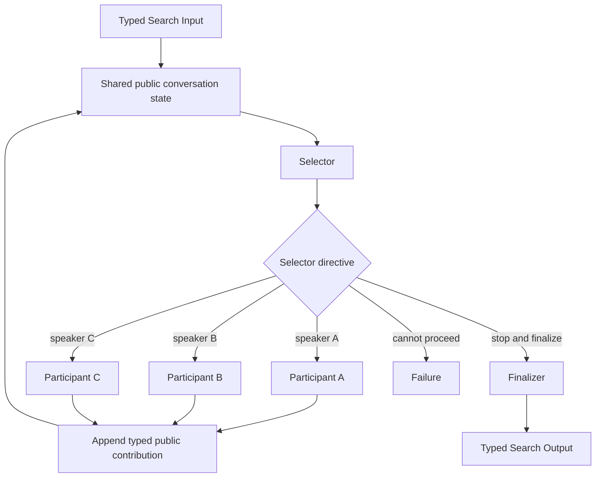

# Selector Group Chat

## Intent

Use Selector Group Chat when a fixed set of specialized participants should contribute to one shared public context, and a central Selector should repeatedly choose which participant speaks next based on the conversation so far.

Apply the [Agent or Program rule](../../../SKILL.md#choose-agent-or-program) to every authored operation in this pattern.

Declare `upstream=` on every Action call, naming the producer Action whose directive or contribution feeds its Input.

The shape is:

```text
shared typed conversation state
→ Selector chooses one next participant
→ selected participant contributes one public message or artifact
→ shared state is updated
→ Selector chooses again or stops
```

The pattern is useful when the value comes from **adaptive turn-taking among specialists** rather than from a fixed sequence, independent ballots, or explicit task delegation.

The Selector chooses the next speaker.

It does not create arbitrary Agent types, modify the durable execution layer, or execute the participant’s work itself.

## Structure



Every turn is selected from a closed participant set.

The basic pattern runs one selected participant at a time.

If several participants should respond independently to the same state, use a Committee, Debate round, or parallel fan-out hybrid instead.

## Core idea

Selector Group Chat separates four responsibilities:

```text
Participant:
    contribute from one declared role
    read the bounded public state
    return one typed public contribution

Selector:
    inspect the public state and role descriptions
    choose exactly one next participant
    or request termination

Parent Search:
    materialize Selector and participant turns
    validate participant identity
    append public contributions
    bound the conversation
    finalize the result

Finalizer:
    convert the completed public state
    into one typed Search Output when needed
```

The shared conversation is a business graph of public messages and artifacts.

It is not a second runtime, hidden Agent-to-Agent channel, or durable ownership graph.

The parent Search remains the single runtime owner of every Selector and participant invocation.

## Distinction from adjacent patterns

### Selector Group Chat versus Router and Specialists

```text
Router:
    usually makes one routing decision
    and selects one or a bounded set of branches

Selector Group Chat:
    makes a new speaker decision after every contribution
    and may select the same participant again later
```

If one classification is sufficient, use Router and Specialists.

### Selector Group Chat versus Handoff / Swarm

```text
Selector Group Chat:
    one central Selector chooses the next speaker

Handoff / Swarm:
    the current participant chooses which participant receives control next
```

Central selection provides one global turn policy.

Local handoff provides more participant autonomy.

### Selector Group Chat versus Committee / Voting

```text
Committee:
    members normally judge independently
    ballots are aggregated after collection

Selector Group Chat:
    later participants see earlier public contributions
    and may respond, extend, or correct them
```

A final Committee vote may follow the chat, but the chat turns themselves are not independent ballots.

### Selector Group Chat versus Multi-Agent Debate

```text
Selector Group Chat:
    general collaborative turn-taking
    roles may analyze, implement, retrieve, or synthesize

Multi-Agent Debate:
    participants maintain or challenge positions
    critique and rebuttal structure is central
```

Debate can use a Selector, but its stronger interaction protocol deserves a separate pattern.

### Selector Group Chat versus Orchestrator–Workers

```text
Orchestrator–Workers:
    creates typed task assignments
    Workers return bounded task results

Selector Group Chat:
    chooses the next participant in a shared public discussion
    contributions update one conversation state
```

If every participant turn can be written as a clear independent assignment, Orchestrator–Workers may be easier to validate and parallelize.

### Selector Group Chat versus Worker–Iterator

Worker–Iterator chooses the next work item.

Selector Group Chat chooses the next role to contribute to shared context.

The chosen speaker may still perform work, but speaker identity is the primary control decision.

## Search interpretation

| Search concept | Meaning in this pattern |
|---|---|
| State | The objective, participant descriptions, bounded public messages, artifact references, turn index, and remaining budget |
| Candidate | A possible next speaker, contribution, partial conclusion, or final answer |
| Action | Select one participant and run one turn |
| Observation | One typed public contribution or participant Failure |
| Score | Optional progress, completion confidence, or external quality measure |
| Aggregation | Append a validated contribution and optionally summarize or finalize |
| Frontier | The closed set of eligible participants for the next turn |
| Stop condition | Selector requests finalization, hard completion rule fires, or turn budget is exhausted |
| Result | Finalizer Output or an explicitly selected terminal contribution |

The public state should be represented with typed values: one public message names its turn index, its participant, one of a closed set of kinds, and its content, exactly as `PublicMessage` does in `search/agents/io.py`.

Do not store private hidden reasoning.

Only information intentionally published to the group belongs in the public state.

## Mapping to the AIBuildAI SDK

Construct a fresh identity for one-shot work. Reuse the same author-side object across repeated `ctx.spawn` calls only when later work needs the same identity state. Put `upstream=` on each `ctx.spawn` call, not on the identity constructor. A Handle names the exact spawned Action.

## Complete package

The folder beside this file holds a complete package for this pattern, activated by the repository gate through the real generated-definition loader on every change: `search/` is the authored layout (`search/__init__.py` exports `SEARCH_TYPE`; `search.py`, `io.py`, `agents/`, `prompts/agent/`), and `input_payload.json` is the Input that builds its `SEARCH_TYPE`. Read `search/search.py` for the control flow and `search/agents/io.py` for the typed boundaries. `SelectorAgent` picks one of `ResearcherAgent`, `EngineerAgent`, or `CriticAgent` each turn from the growing `PublicMessage` tuple, and `FinalizerAgent` closes the chat once the Selector requests it or the turn budget runs out.

## Participant design

Every participant needs a distinct, coherent responsibility.

Good role definitions include:

```text
Researcher:
    add grounded evidence and source references

Analyst:
    examine implications and resolve contradictions

Engineer:
    propose implementable technical actions

Critic:
    identify concrete defects in current proposals

Synthesizer:
    consolidate accepted findings when selected
```

Poor role definitions include:

```text
Agent 1
Agent 2
Agent 3
```

or several roles that differ only in name.

A participant Input should make clear:

```text
what role it owns
what public information is available
what the Selector requested this turn
what message kinds it may return
what it must not decide
```

A participant contribution should contain:

```text
participant identity
message kind
bounded public content
artifact references
optional claims or action proposals
optional completion signal as evidence, not authority
```

The participant may say that it believes the task is complete, but the Selector or a hard Search rule decides whether to finalize.

## Selector design

The Selector receives the shared public state and participant descriptions.

It should answer:

```text
What is missing from the current public state?
Which participant is best positioned to add that information?
Has the task reached a finalizable state?
Is the remaining turn budget worth spending?
```

The Selector returns exactly one of:

```text
select one participant
request finalization
fail because no valid path remains
```

The Selector must not:

```text
select several simultaneous speakers in the basic pattern
invent a participant ID
change role definitions
increase turn budgets
write the final answer itself while returning SpeakDirective
perform hidden work not represented in public state
```

### Deterministic selector

Use ordinary Python when turn choice follows an exact rule:

```text
round robin
fixed role cycle
alternate proposer and critic
select the first participant with remaining mandatory work
```

Do not call an Agent to reproduce a fixed index.

### Agent selector

Use an Agent when choosing the next role requires semantic judgment:

```text
current proposal lacks evidence
→ select Researcher

several findings conflict
→ select Analyst

solution is technically vague
→ select Engineer

candidate appears complete
→ request Finalizer
```

The participant set remains closed.

## Shared context design

The group shares only public, decision-relevant information.

Do not expose:

```text
private hidden chain of thought
backend session internals
raw credentials
Execution records
unbounded tool traces
all historical artifacts inline
```

Prefer:

```text
typed public messages
short evidence summaries
artifact references
explicit open questions
decisions already made
rejected proposals with concise reasons
```

### Bounded transcript

A long conversation can exceed useful context.

Choose one simple policy:

```text
maximum messages
maximum characters or tokens per message
maximum turns per participant
last k messages plus a running public summary
artifact references instead of inline data
```

If a summary is needed, it may be updated by ordinary deterministic compression when possible or by one explicit Summarizer Agent.

Do not add a memory subsystem solely for this pattern.

### Public contribution versus task artifact

A contribution may point to a larger artifact:

```text
message:
    "The benchmark regression is isolated to split B."

artifact_ref:
    detailed evaluation report
```

Later participants read the artifact only when relevant.

This keeps the public state compact while preserving evidence.

## When to use

Use Selector Group Chat when:

- several specialized roles should contribute to one shared context;
- the useful speaking order depends on prior contributions;
- the same role may need to speak more than once;
- one central turn policy is desirable;
- collaboration and correction are more important than independence;
- a fixed chain would choose the wrong role order for some Inputs;
- the task can be completed within a strict turn budget;
- public contributions can be represented with bounded typed values.

Typical examples:

```text
researcher, analyst, engineer, and critic
collaboratively develop one technical plan

planner, implementer, and reviewer
adaptively discuss an implementation strategy

specialists examine an incident
with the next specialist chosen from current evidence

several domain experts build one shared diagnosis
under a central facilitator
```

Selector-based group chat is useful when a model can repeatedly select the most appropriate next participant from role descriptions and the shared conversation state.

## When not to use

Do not use this pattern when:

- one Router decision is sufficient;
- participants should judge independently;
- subtasks can be assigned and run in parallel;
- one candidate should be revised under a stable evaluator;
- the speaking order is fixed;
- one Agent with tools can complete the task;
- the conversation would be mostly duplicated context;
- participant roles are not meaningfully distinct;
- there is no hard turn bound;
- the final decision requires authoritative tests rather than discussion.

Choose:

- **Router and Specialists** for one routing decision;
- **Committee / Voting** for independent judgments;
- **Orchestrator–Workers** for explicit dynamic delegation;
- **Sequential Chain** for fixed role order;
- **Evaluator–Optimizer** for candidate revision;
- **Multi-Agent Debate** for structured adversarial exchange;
- **Handoff / Swarm** when local participants should choose the next owner;
- a single Agent for tightly coupled reasoning and tool use.

## Budget and stopping

Declare:

```text
maximum total turns
maximum turns per participant
maximum contribution size
participant set
selector budget
participant budget
finalizer budget
turn-limit behavior
hard completion conditions
```

The basic stop is:

```text
Selector emits FinalizeDirective
→ Finalizer returns typed Output
```

Other valid stops include:

```text
hard external acceptance criterion is met
Selector emits FailDirective
maximum turns is reached
no eligible participant remains
resource budget cannot support another turn
```

Choose whether turn-limit exhaustion:

```text
runs one finalizer over the bounded state
returns a partial typed result
returns Failure
```

Do not decide this after the conversation ends.

### Participant turn limits

A per-participant bound prevents one role from monopolizing the conversation.

The Selector must see current turn counts.

Do not silently allow an exhausted participant to speak again.

### Early stopping

A participant’s message may include a completion claim, but the parent should stop only when:

```text
the Selector requests finalization
or
a deterministic hard condition is satisfied
```

A single participant does not unilaterally terminate the Search unless the contract explicitly grants that role authority.

## Failure policy

### Participant Failure

A participant Failure is not a public message.

Choose one policy:

```text
propagate Failure immediately
record a typed failed-turn observation and ask the Selector for another eligible participant
run one declared fallback participant
```

If the Selector may react, its next Input should state:

```text
which participant failed
which turn instruction failed
that no valid contribution was produced
```

Do not fabricate a message saying the participant had no opinion.

### Selector Failure

A Selector Failure normally stops the Search because no valid next speaker decision exists.

A deterministic fallback order may be declared in advance, but do not invent one after failure.

### Finalizer Failure

Finalizer Failure is terminal unless one declared alternative finalizer exists.

Do not restart the entire conversation with unchanged state.

### Invalid speaker choice

The parent validates:

```text
participant_id exists
participant remains eligible
participant has remaining turns
instruction is non-empty when required
```

An invalid Selector Output is not a reason to import or create another role.

## Recursive form

A participant may be a child Search when one contribution requires internal orchestration:

```text
ResearchParticipantSearch:
    retrieve several sources
    compare evidence
    return one bounded public contribution
```

The outer group sees one typed contribution.

It does not expose the child’s internal messages as separate outer turns.

A task-specific participant Search may be generated by `MetaAgent` when:

```text
no existing participant role fits
one turn requires meaningful internal search
```


A child Selector Group Chat may solve one clearly separated subproblem, but nested chats should be rare because they multiply context and turn budgets.

Do not recursively create another group chat merely to add one specialist response.

## Useful hybrids

Selector Group Chat commonly combines with:

- **Selector Group Chat → Committee vote** for a final independent decision.
- **Router → Selector Group Chat** only for categories requiring collaboration.
- **Group Chat with a Debate segment** for one contested claim.
- **Group Chat participant implemented as Orchestrator–Workers Search**.
- **Group Chat participant implemented as Worker–Iterator Search**.
- **Sequential preparation → Group Chat → Finalization**.
- **Group Chat producing candidate plans → Tournament or Best-of-N selection**.
- **Group Chat with external Evaluator–Optimizer after finalization**.
- **Recursive child Search for one specialist contribution**.

## Common mistakes

### Building a second chat runtime

Do not add:

```text
GroupChatManager
ConversationRuntime
ChatHandle
BroadcastBus
SpeakerScheduler
```

The Search loop and typed values are sufficient.

### Passing raw Agent session history

Construct a bounded public Input for each turn.

Do not couple participants through backend-private conversation state.

### Letting the Selector instantiate arbitrary Agents

The participant set is declared by the parent Search.

### Using indistinguishable roles

Different names do not create specialization.

### Unbounded transcript growth

Set message, contribution, participant, and total-turn limits.

### Confusing discussion with independent voting

Later speakers see earlier messages. Their judgments are not independent ballots.

### Selecting several speakers without changing the pattern

Parallel responses form a Committee, Debate round, or fan-out wave. Model that explicitly.

### Letting participants terminate implicitly

A statement like “we are done” is evidence for the Selector, not automatic runtime control.

### Using hidden shared files as the conversation

Public state is typed and supplied by the parent. Artifacts are referenced explicitly.

### Having the Selector solve the task

The Selector chooses the next role or finalization. It should not write the full solution inside its directive.

### Repeating the same speaker with no new instruction

A repeated turn should have a reason grounded in the updated public state.

### Omitting a Finalizer contract

If the public messages do not themselves satisfy the Search Output type, one explicit finalization operation is required.

## Design checklist

Before selecting this pattern, answer:

```text
Why is shared conversation necessary?
Who are the fixed participants?
What distinct responsibility does each participant own?
What public information does every participant receive?
What does one typed contribution contain?
How does the Selector choose one next participant?
Can the same participant speak again?
What is the maximum turn count per participant and overall?
How is transcript size bounded?
Who may request finalization?
What does the Finalizer receive and return?
How are participant, Selector, and Finalizer Failures handled?
Would independent parallel work be more efficient?
Would a fixed chain or one Router decision be simpler?
Which participant turns, if any, justify child Searches?
```

If the roles do not need to observe and respond to one another, do not use Group Chat.

## References

- Microsoft AutoGen, **Selector Group Chat**: participants share context while a model-based Selector repeatedly chooses the next speaker from role descriptions and conversation state until a termination condition is reached. ([microsoft.github.io](https://microsoft.github.io/autogen/stable/user-guide/agentchat-user-guide/selector-group-chat.html))
- Microsoft AutoGen, **Multi-Agent Design Patterns**: distinguishes selector-based group chat from sequential workflows, concurrent execution, handoffs, debate, and other coordination structures. ([microsoft.github.io](https://microsoft.github.io/autogen/stable/user-guide/core-user-guide/design-patterns/intro.html))
