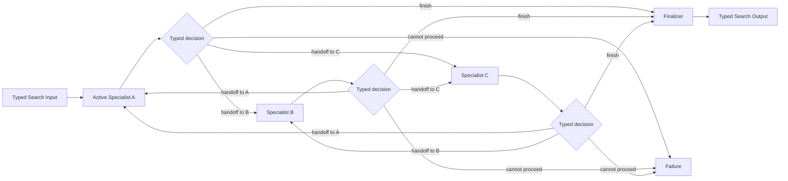

# Handoff / Swarm

## Intent

Use Handoff / Swarm when several peer specialists share one evolving public task context and the **currently active specialist** is best positioned to decide which specialist should take control next.

Apply the [Agent or Program rule](../../../SKILL.md#choose-agent-or-program) to every authored operation in this pattern.

```text
one active specialist
→ contributes bounded work
→ either finishes
→ or hands control to one declared peer
→ the receiving specialist continues from the public context
```

The defining property is **decentralized control transfer**. There is no central Selector choosing every turn and no Orchestrator issuing a batch of assignments.

## Structure



The diagram shows possible business-control transfers, not changes to durable ownership. The parent Search remains the runtime owner of every participant invocation.

## Core idea

Handoff separates:

```text
who currently owns the next business decision
```

from:

```text
who owns the durable workflow
```

The active specialist returns a typed decision. It does not transfer a Python frame, mutate another Agent, or invoke a second runtime. The parent Search validates the decision, constructs a fresh one-shot invocation for the next role, and runs it through `ExecutionContext`.

Every later return to the same role creates a new invocation with a new typed Input.

## Distinction from adjacent patterns

### Router and Specialists

```text
Router:
    normally selects one branch near the beginning

Handoff:
    a specialist may transfer responsibility after doing work
    several transfers may occur as the task changes
```

### Selector Group Chat

```text
Selector Group Chat:
    one central Selector chooses the next participant

Handoff / Swarm:
    the currently active participant chooses the next participant
```

### Orchestrator–Workers

```text
Orchestrator–Workers:
    a central role creates assignments
    results return to that role

Handoff / Swarm:
    one peer transfers ongoing responsibility to another peer
```

### Sequential Chain

```text
Sequential Chain:
    order is fixed before execution

Handoff:
    the next role is selected from current evidence
```

If nearly every run follows the same role sequence, encode the chain directly.

## Search interpretation

| Search concept | Meaning in this pattern |
|---|---|
| State | Original objective, bounded public context, active role, handoff history, remaining turn budget, and optional candidate result |
| Candidate | A specialist contribution, artifact, or proposed final result |
| Action | Run the active specialist once |
| Observation | Its typed contribution and control decision |
| Score | Optional external quality signal; not the sole transfer authority by default |
| Aggregation | Update public state and construct the next specialist Input |
| Frontier | Exactly one active role in the basic form |
| Stop condition | Valid finish, hard acceptance criterion, Failure, or turn-budget exhaustion |
| Result | Final typed result or selected artifact |

A minimal state holds the active role, the bounded public conversation, known artifacts, and the turn index; the swarm never stores live Agents, Handles, DBOS objects, or mutable sessions in it. `search/search.py` keeps this state as plain loop variables rather than a wrapping class.

## Mapping to the AIBuildAI SDK

Construct a fresh identity for one-shot work. Reuse the same author-side object across repeated `ctx.spawn` calls only when later work needs the same identity state. Put `upstream=` on each `ctx.spawn` call, not on the identity constructor. A Handle names the exact spawned Action.

## Complete package

The folder beside this file holds a complete package for this pattern, activated by the repository gate through the real generated-definition loader on every change: `search/` is the authored layout (`search/__init__.py` exports `SEARCH_TYPE`; `search.py`, `io.py`, `agents/`, `prompts/agent/`), and `input_payload.json` is the Input that builds its `SEARCH_TYPE`. Read `search/search.py` for the control flow and `search/agents/io.py` for the typed boundaries. Four peer roles named `triage`, `research`, `implementation`, and `review` each pick the next role from a closed `ALLOWED_HANDOFFS` topology, and `review` alone may finish, which is the one structural idea of decentralized control transfer over a closed edge set.

`SPECIALIST_AGENTS` and `ALLOWED_HANDOFFS` in `search/search.py` are explicit local dispatch tables, not plugin registries or a Swarm framework.

## Handoff topology

Declare which transfers are legal:

```text
triage
    → research
    → implementation
    → review

review
    → implementation
    → finish

research
    → triage
    → implementation
```

A closed topology prevents unknown roles, arbitrary role creation, and unsupported transfers. Do not expose every role to every other role merely because it is easy.

## Public context

Share bounded public task state:

```text
typed public messages
artifact references
decisions already made
open questions
constraints
short handoff reasons
```

Do not require private chain-of-thought, every raw tool call, an unbounded transcript, or hidden mutable files as the only state.

The receiving specialist should know:

```text
what has been established
what remains unresolved
why this role was selected
which artifacts are relevant
what decision it now owns
```

## Local control and global constraints

The specialist owns the local handoff recommendation. The Search owns:

```text
allowed destinations
maximum turns
maximum visits per role
mandatory review
budget
Failure policy
final acceptance
```

A participant cannot increase the budget or skip a mandatory review merely by claiming completion.

## When to use

Use Handoff / Swarm when:

- responsibility naturally changes as evidence appears;
- each specialist can recognize when another role is better suited;
- there is one evolving task rather than independent assignments;
- local context is sufficient to choose the next role;
- the participant set is small and differentiated;
- the topology and hard turn limits can be declared.

Typical flows:

```text
triage → investigation → implementation → review
research → data → experiment → evaluation
requirements → architecture → coding → review
```

## When not to use

Do not use this pattern when:

- routing happens once;
- a neutral central Selector should choose every turn;
- several tasks should run concurrently;
- one Orchestrator should retain assignment authority;
- roles are nearly identical;
- independent judgment is required before interaction;
- the process is a fixed chain;
- transfer history cannot be bounded.

Choose Router, Selector Group Chat, Orchestrator–Workers, Committee, Sequential Chain, or Debate according to the actual control model.

## Budget and stopping

Declare:

```text
maximum total turns
maximum visits per role
allowed handoff edges
maximum consecutive turns by one role
mandatory roles before finish
finalizer policy
budget-exhaustion behavior
```

Use exact guards for self-handoff, repeated two-role ping-pong without new evidence, and role-visit exhaustion. Do not build semantic cycle detection.

## Failure policy

A specialist Execution Failure is not a handoff. Choose one policy:

```text
any specialist Failure stops the Search
a declared fallback role receives a failure summary
a mandatory escalation role handles the failure
best prior candidate may be returned if allowed
```

Do not automatically hand off after every Failure. Preserve the distinction between a completed transfer and a failed role invocation.

## Recursive form

A role may be a child Search when it owns meaningful orchestration:

```text
active role = research
→ ResearchSearch runs several Workers
→ returns one ResearchResult
→ outer Handoff Search transfers to implementation
```

A task-specific role Search may be generated through `MetaAgent` only when no existing Search fits. The outer workflow sees one typed child Search Output, not the child's internal participants.

## Useful hybrids

- **Router → Handoff** for initial specialist selection.
- **Handoff → Evaluator–Optimizer** when review sends work back.
- **Handoff → Committee** before final acceptance.
- **Handoff with child Search** for one complex role.
- **Handoff followed by Finalizer** to separate local finish from global acceptance.
- **A mostly fixed chain with a small number of declared backward handoff edges**.

## Common mistakes

- Adding `SwarmRuntime`, `HandoffContext`, a conversation bus, or peer registry.
- Letting an Agent directly invoke the next Agent.
- Allowing arbitrary destinations.
- Reusing one Agent invocation across turns.
- Sharing private reasoning instead of bounded public conclusions.
- Allowing endless ping-pong.
- Treating handoff as delegation that automatically returns to the sender.
- Confusing a local finish proposal with global acceptance.
- Allowing concurrent handoffs in the basic one-active-role pattern.
- Passing the full transcript forever.

## Design checklist

```text
Why should the active specialist choose the next role?
What are the declared role IDs and legal edges?
What public state crosses a handoff?
What does each role uniquely contribute?
What are the turn and role-visit limits?
Can a role finish directly?
Is final review mandatory?
What happens on specialist Failure?
How is no-progress ping-pong stopped?
Would a central Selector or Orchestrator be clearer?
Which roles, if any, justify child Searches?
```

If the topology cannot be stated clearly, the peer team is not ready.

## References

- OpenAI, **Agents SDK — Handoffs**: delegation to a declared specialist with controlled context transfer. (https://openai.github.io/openai-agents-python/handoffs/)
- OpenAI, **Agents SDK — Agent orchestration**: distinguishes manager-style orchestration from peer handoffs. (https://openai.github.io/openai-agents-python/agents/)
- Microsoft AutoGen, **Swarm**: the active Agent makes local handoff decisions over shared public context until termination. (https://microsoft.github.io/autogen/stable/user-guide/agentchat-user-guide/swarm.html)
