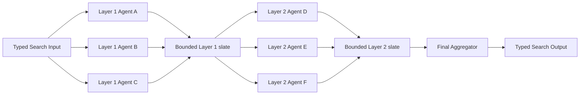

# Mixture-of-Agents

## Intent

Use Mixture-of-Agents when several heterogeneous Agents can independently produce useful candidate responses, and later Agents can improve on those candidates by reading the complete bounded output set from the previous layer.

Apply the [Agent or Program rule](../../../SKILL.md#choose-agent-or-program) to every authored operation in this pattern.

```text
Layer 1:
    several Agents answer independently

Layer 2:
    new Agents read all Layer 1 candidates
    each produces a new synthesis or revision

Optional later layers:
    repeat under a strict depth limit

Final layer:
    one Aggregator or Selector produces the Search Output
```

The defining property is **layered collective refinement**.

## Structure



Agents within one layer do not depend on one another and may run in parallel. Every Agent in layer `k` receives the same declared collection of outputs from layer `k - 1`.

## Core idea

Mixture-of-Agents combines:

```text
diversity within a layer
+
cross-candidate synthesis across layers
```

First-layer Agents preserve independent approaches. Later-layer Agents may:

- combine complementary strengths;
- correct visible mistakes;
- reconcile contradictory evidence;
- choose a stronger argument or plan;
- produce a new coherent candidate rather than merely vote.

The final Aggregator turns the last-layer slate into one typed result.

## Distinction from adjacent patterns

### Parallel Best-of-N

```text
Best-of-N:
    candidates remain independent
    a final selector chooses one

Mixture-of-Agents:
    later Agents read all prior candidates
    and generate new candidates
```

### Committee / Voting

```text
Committee:
    members return ballots or judgments

Mixture-of-Agents:
    later members return substantive new solutions
```

### Multi-Agent Debate

```text
Debate:
    named positions critique and rebut one another over rounds

Mixture-of-Agents:
    each layer independently reads the previous slate
    no within-layer conversational exchange is required
```

### Map-Reduce

```text
Map-Reduce:
    Workers solve different complementary sections

Mixture-of-Agents:
    Agents address the same overall objective
    from different approaches
```

### Evaluator–Optimizer

```text
Evaluator–Optimizer:
    one candidate lineage receives explicit feedback

Mixture-of-Agents:
    several candidate lineages are regenerated from a shared slate
```

## Search interpretation

| Search concept | Meaning in this pattern |
|---|---|
| State | Original objective, layer index, bounded prior-layer slate, and remaining budget |
| Candidate | One Agent Output in one layer |
| Action | Run all declared Agents in the next layer |
| Observation | Typed candidate Outputs and Failures |
| Score | Optional final quality score or layer diagnostics |
| Aggregation | Build a bounded prior-layer context; final Aggregator produces one result |
| Frontier | Every Agent in the current layer |
| Stop condition | Final layer succeeds, hard acceptance is met, or layer budget is exhausted |
| Result | One typed synthesis, selected candidate, or artifact reference |

A candidate value is `CandidateSummary` in `search/agents/io.py`: a `member_id`, its `role`, the candidate's `output_dir` and `score`, and a one-paragraph `summary` the Aggregator reads instead of any member's raw transcript.

Do not create a durable `Layer` runtime object. A layer is ordinary Search-local structure.

## Mapping to the AIBuildAI SDK

Each proposal or synthesis role is usually an `Agent`.

Use:

```text
ctx.spawn(..., capture_failure=True) for Agents in one layer
ctx.wait(...) for the layer barrier
handle.result() for each candidate
ctx.spawn(...) then handle.result() for the final Aggregator
```

A layer member specification is `MemberSpec` in `search/io.py`: a `member_id`, a `role` string, and an `emphasis` string that is the diversity axis between members.

Heterogeneity may come from role, tools, evidence, model configuration already allowed by product policy, risk preference, or independent sampling.

The Search remains the authority for materialization and budget. A generated Agent must not choose arbitrary classes, credentials, models, or unbounded layer width.

## Complete package

The folder beside this file holds a complete package for this pattern, activated by the repository gate through the real generated-definition loader on every change: `search/` is the authored layout (`search/__init__.py` exports `SEARCH_TYPE`; `search.py`, `io.py`, `agents/`, `prompts/agent/`), and `input_payload.json` is the Input that builds its `SEARCH_TYPE`. Read `search/search.py` for the control flow and `search/agents/io.py` for the typed boundaries. `MemberAgent` is the one role every layer-1 proposer runs, `AggregatorAgent` is the one role that reads the whole bounded slate and picks the winner, and the structural idea is a single spawn-all/wait barrier feeding one downstream judge whose `upstream=` names every member that survived.

## Candidate context

Prior-layer context must be bounded. Prefer:

```text
typed candidate summary
key claims or decisions
artifact references
identified strengths and weaknesses
```

Avoid passing every raw transcript, tool call, or private reasoning trace.

Normally only the immediately preceding layer feeds the next. Carrying every historical layer increases context without clear value.

## Diversity

Several identical Agent calls are not a meaningful mixture. At least one diversity axis should be intentional:

```text
different expertise
different decomposition strategy
different evidence subset
different allowed toolset
different risk preference
different objective emphasis
independent sampling
```

Different invocation IDs alone are not diversity.

All members must still return the same typed candidate contract so later layers can consume them uniformly.

## Final aggregation

The final operation must be declared:

### Synthesis

Create one new coherent candidate that preserves well-supported minority insights.

### Selection

Choose one existing candidate according to an objective or typed rubric.

### Structured merge

Combine compatible components from several candidates.

Do not return the last candidate automatically. Do not let one candidate choose itself as winner.

## When to use

Use Mixture-of-Agents when:

- independent candidate diversity is useful;
- no single Agent is consistently dominant;
- prior candidates have complementary strengths;
- a later Agent can meaningfully synthesize several candidates;
- the task justifies one or two costly refinement layers;
- candidate Outputs can be bounded;
- the result should be one coherent answer, plan, or artifact.

Typical examples:

```text
several architecture proposals
→ synthesis layer combines reliability, simplicity, and performance

several research interpretations
→ synthesis reconciles evidence

several implementation plans
→ later layer integrates the strongest sequencing and risk controls
```

## When not to use

Do not use this pattern when:

- one Agent is sufficient;
- a deterministic evaluator can directly choose the best candidate;
- candidates are too large to share;
- members use identical roles and evidence;
- the task decomposes into different sections;
- participants should exchange arguments over rounds;
- the process should revise one candidate under explicit feedback;
- a vote is the desired final operation;
- there is no reason a later layer can improve the slate.

Choose Single-Shot, Best-of-N, Map-Reduce, Debate, Evaluator–Optimizer, or Committee instead.

## Budget and stopping

Declare:

```text
number of proposal or synthesis layers
members per layer
maximum retained candidates
maximum candidate size
minimum successful candidates per layer
final Aggregator budget
Failure policy
```

A minimal design is:

```text
one independent proposal layer
+
one Aggregator
```

A stronger but costlier design is:

```text
proposal layer
+
one synthesis layer
+
final Aggregator
```

Avoid more than two or three layers without measured evidence.

## Failure policy

Choose whether:

```text
all members are required
a minimum number of successful candidates is required
failed members may be omitted
an objective prior candidate may be retained as fallback
final Aggregator Failure stops the Search
```

A failed member contributes no candidate. Do not substitute an error message as if it were a proposal.

## Recursive form

A layer member may be a child Search when producing one candidate requires meaningful orchestration:

```text
Layer 1:
    ResearchSearch
    EngineeringSearch
    RiskSearch

Layer 2:
    Agents synthesize the three typed Search Outputs
```

A task-specific member Search may be generated through `MetaAgent` when no existing Search fits.

The outer layer consumes one typed child Search Output. Do not flatten the child's internal candidates unless the contract explicitly requires it.

## Useful hybrids

- **Mixture → Committee** for final approval.
- **Mixture → Best-of-N Selector** instead of synthesis.
- **Router → Mixture** only for difficult categories.
- **Mixture members implemented as specialized child Searches**.
- **Mixture with Evaluator–Optimizer final refinement**.
- **Map-Reduce → Mixture** when each section receives several candidate analyses.
- **Mixture → Debate** for a small set of unresolved conflicts.

Do not combine every collective pattern at once.

## Common mistakes

- Adding `MixtureRuntime`, `LayerExecution`, or an ensemble manager.
- Passing unbounded prior outputs.
- Claiming diversity from identical calls.
- Letting members in one layer see each other.
- Concatenating candidates instead of synthesizing.
- Carrying every historical layer forever.
- Confusing a vote with synthesis.
- Ignoring well-supported minority evidence.
- Returning the last generated candidate.
- Allowing a candidate to choose the winner.

## Design checklist

```text
Why are multiple independent candidates useful?
What diversity does each first-layer member provide?
What typed value does every candidate contain?
Why can a later layer improve the prior slate?
How many layers are necessary?
How is context bounded?
What is the minimum successful layer width?
What is the final aggregation rule?
What happens when a member fails?
Would Best-of-N or Debate be clearer?
Which members, if any, justify child Searches?
Does every Action call declare its `upstream=` producers?
```

If the second layer would merely restate the first, do not add it.

## References

- Wang et al., **Mixture-of-Agents Enhances Large Language Model Capabilities**: layered collaboration in which Agents consume the previous layer's outputs as auxiliary information. (https://arxiv.org/abs/2406.04692)
- OpenAI, **Agents SDK — Agent orchestration**: recommends Python-first composition rather than a second Agent runtime. (https://openai.github.io/openai-agents-python/)
