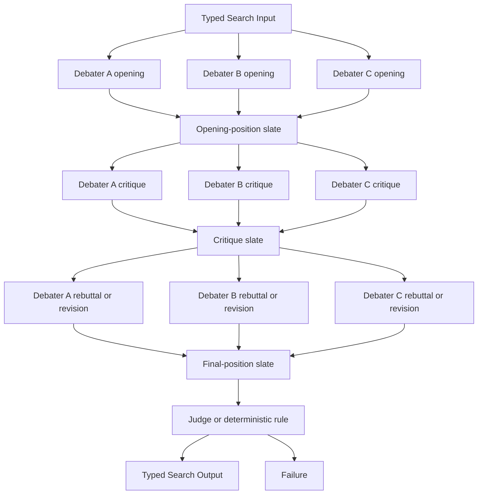

# Multi-Agent Debate

## Intent

Use Multi-Agent Debate when several independent positions should be proposed, exposed to one another, challenged through a bounded protocol, and then judged or resolved according to an explicit decision rule.

Apply the [Agent or Program rule](../../../SKILL.md#choose-agent-or-program) to every authored operation in this pattern.

```text
independent opening positions
→ public critique round
→ rebuttal or revision round
→ optional additional bounded rounds
→ Judge or declared consensus rule
```

The defining property is **structured adversarial interaction**. Participants do not merely vote and do not freely chat without a protocol.

## Structure



Every participant in one round receives the same completed prior-round slate. Completion order must not change the evidence available to later participants in that same round.

## Core idea

Debate separates four responsibilities:

1. **Position formation** — independent initial answers or proposals.
2. **Critique** — identify concrete errors, unsupported assumptions, contradictions, or risks.
3. **Rebuttal or revision** — defend, concede, or improve a position in response to public critique.
4. **Decision** — a Judge, objective test, or declared consensus rule determines the result.

The purpose is not to maximize argument volume. Debate is useful when interaction can expose flaws that independent generation and voting would miss.

## Distinction from adjacent patterns

### Committee / Voting

```text
Committee:
    members normally remain independent
    members return ballots or scores

Debate:
    participants read other public positions
    and respond to them over rounds
```

### Selector Group Chat

```text
Selector Group Chat:
    general collaboration
    a Selector decides who speaks next

Debate:
    position, critique, rebuttal, and decision
    follow an explicit protocol
```

### Mixture-of-Agents

```text
Mixture-of-Agents:
    later layers synthesize a prior candidate slate

Debate:
    named positions challenge and defend claims
```

### Evaluator–Optimizer

```text
Evaluator–Optimizer:
    one candidate lineage receives feedback and revision

Debate:
    several relatively independent positions coexist
    and challenge one another
```

### Tournament

```text
Tournament:
    local matches eliminate candidates

Debate:
    positions exchange evidence and may revise before judgment
```

## Search interpretation

| Search concept | Meaning in this pattern |
|---|---|
| State | Objective, round index, public positions, critiques, evidence references, remaining budget, and optional incumbent |
| Candidate | One debater position or revised position |
| Action | Run one complete synchronized debate round |
| Observation | Typed position, critique, rebuttal, revision, or Failure |
| Score | Optional Judge score, objective test result, or rubric outcome |
| Aggregation | Build a completed round slate and pass it to the next round or Judge |
| Frontier | All participants in the current synchronized round |
| Stop condition | Judge decision, objective verification, consensus rule, round limit, or Failure |
| Result | Typed winning position, synthesis, ranked slate, or no-decision result |

A public position is `PositionOutput` in `search/agents/io.py`: a `participant_id`, a `claim`, checkable `evidence`, and the `proposal_dir` holding its write-up.

A critique is `CritiqueOutput` in `search/agents/io.py`: a `critic_id`, the `target_id` it critiques, the `issue` found, and a `minor`, `major`, or `fatal` `severity`.

Store public claims, evidence, and revisions. Do not request or persist private chain-of-thought.

## Mapping to the AIBuildAI SDK

Construct a fresh identity for one-shot work. Reuse the same author-side object across repeated `ctx.spawn` calls only when later work needs the same identity state. Put `upstream=` on each `ctx.spawn` call, not on the identity constructor. A Handle names the exact spawned Action.

## Complete package

The folder beside this file holds a complete package for this pattern, activated by the repository gate through the real generated-definition loader on every change: `search/` is the authored layout (`search/__init__.py` exports `SEARCH_TYPE`; `search.py`, `io.py`, `agents/`, `prompts/agent/`), and `input_payload.json` is the Input that builds its `SEARCH_TYPE`. Read `search/search.py` for the control flow and `search/agents/io.py` for the typed boundaries. Four roles run the protocol — `OpeningAgent`, `CriticAgent`, `RebuttalAgent`, `JudgeAgent` — and each round's spawned agents become the next round's `upstream=` fan-in tuple, ending in the judge naming every rebuttal agent.

## Round synchronization

A fair synchronized round requires:

```text
all participants receive the same prior slate
no participant sees same-round outputs before submitting
all valid same-round outputs are collected before the next phase
```

Otherwise completion order can create asymmetric context.

A deliberately asynchronous debate is possible, but it is closer to Selector Group Chat and should use that pattern's control rules.

## Participant roles

Participants may differ by:

```text
hypothesis
methodology
risk preference
evidence subset
domain expertise
optimistic or skeptical stance
implementation strategy
```

A role should encourage a real alternative, not theatrical disagreement.

Do not instruct a participant to defend a position it knows is false. A participant may revise or concede when evidence changes.

## Judge design

The Judge must use a declared decision contract:

```text
hard correctness first
evidence quality
constraint satisfaction
objective metric
risk or cost
stable tie-break
```

Prefer objective tests before language judgment.

If code can be compiled, tests can run, metrics can be measured, or constraints can be checked, those results should enter the Judge Input.

The Judge Output is `JudgeOutput` in `search/agents/io.py`: a nullable `winner_id`, the full `ranking`, and the `unresolved_issues` the winner still leaves open; a null `winner_id` is the no-decision case.

A tie or no-decision may be truthful. Do not force a winner when the evidence is insufficient.

## Public debate record

The public record should be bounded:

```text
positions
claims
evidence references
critiques
concessions
revisions
objective test outcomes
```

Avoid:

```text
private chain-of-thought
unbounded transcripts
repeated restatements
raw tool logs
unsupported confidence statements
```

A later round should receive a structured summary or typed slate, not an accidental chat dump.

## When to use

Use Multi-Agent Debate when:

- several plausible but conflicting positions exist;
- independent openings preserve useful diversity;
- critique can expose errors or hidden assumptions;
- participants can cite evidence or testable claims;
- a bounded number of rounds is enough;
- a Judge or objective decision rule exists;
- the task justifies interaction cost.

Typical examples:

```text
competing architecture proposals
conflicting research hypotheses
security versus performance tradeoffs
alternative mathematical derivations
implementation plans with different risks
```

## When not to use

Do not use Debate when:

- one objective test can decide cheaply;
- participants should remain independent;
- the task is simple;
- all positions are nearly identical;
- no evidence or Judge rule exists;
- the result should be a direct synthesis rather than argument;
- one candidate simply needs iterative feedback;
- conversation cost exceeds expected benefit.

Choose Committee, Best-of-N, Mixture-of-Agents, Evaluator–Optimizer, or Single-Shot as appropriate.

## Budget and stopping

Declare:

```text
participant count
opening-position minimum
maximum critique/rebuttal rounds
maximum public-record size
maximum evidence references
Judge budget
objective early-stop rule
Failure policy
```

A minimal useful debate is often:

```text
independent opening
+
one critique/rebuttal round
+
Judge
```

More rounds frequently increase repetition and anchoring without adding evidence.

Stop when:

```text
objective verification identifies a winner
Judge returns a valid decision
consensus rule is satisfied
round budget is exhausted
no viable positions remain
```

## Failure policy

Choose whether:

```text
all participants are required
a minimum number of positions is required
one failed participant may be omitted
Judge Failure stops the Search
objective test Failure is retried only by its owning family policy
no-decision is a valid result
```

A participant Failure is not a concession and not a vote against its position.

Do not fill a missing contribution with an invented argument.

## Recursive form

A participant may be a child Search when one position requires substantial orchestration:

```text
SecuritySearch produces one position
PerformanceSearch produces another
OperationsSearch produces a third
outer Debate compares their typed Outputs
```

A task-specific participant Search may be generated through `MetaAgent` only when no existing Search fits.

The outer debate consumes one typed child Output. It does not expose the child's internal participants as additional debaters.

## Useful hybrids

- **Best-of-N → Debate** over the strongest candidates.
- **Debate → Committee** for final approval.
- **Debate → Evaluator–Optimizer** to revise the winning candidate.
- **Router → Debate** only for ambiguous categories.
- **Debaters implemented as child Searches**.
- **Debate with objective Program tests**.
- **Debate → Finalizer** for product output.

## Common mistakes

- Adding `DebateRuntime`, `DebateContext`, or a message bus.
- Letting same-round completion order change context.
- Requiring private chain-of-thought.
- Treating verbosity as evidence.
- Asking participants to disagree without distinct positions.
- Allowing unlimited rounds.
- Using Debate instead of an executable test.
- Letting the Judge apply an unstated rubric.
- Treating participant Failure as losing the argument.
- Forcing consensus or a winner when evidence is insufficient.
- Passing every raw message forever.

## Design checklist

```text
What are the independent opening positions?
Why can critique improve the result?
What public evidence may be shared?
What is one synchronized round?
How many rounds are allowed?
May participants revise or concede?
What objective tests can run?
What rubric does the Judge use?
Can no-decision be valid?
What happens when a participant or Judge fails?
Would Committee or Evaluator–Optimizer be cheaper?
Which positions, if any, justify child Searches?
```

If the debate cannot produce new evidence or identifiable corrections, do not run it.

## References

- Du et al., **Improving Factuality and Reasoning in Language Models through Multiagent Debate**: multiple model instances exchange arguments over bounded rounds and revise answers. (https://arxiv.org/abs/2305.14325)
- OpenAI, **Agents SDK — Agent orchestration**: recommends explicit Python orchestration rather than a second conversation runtime. (https://openai.github.io/openai-agents-python/)
