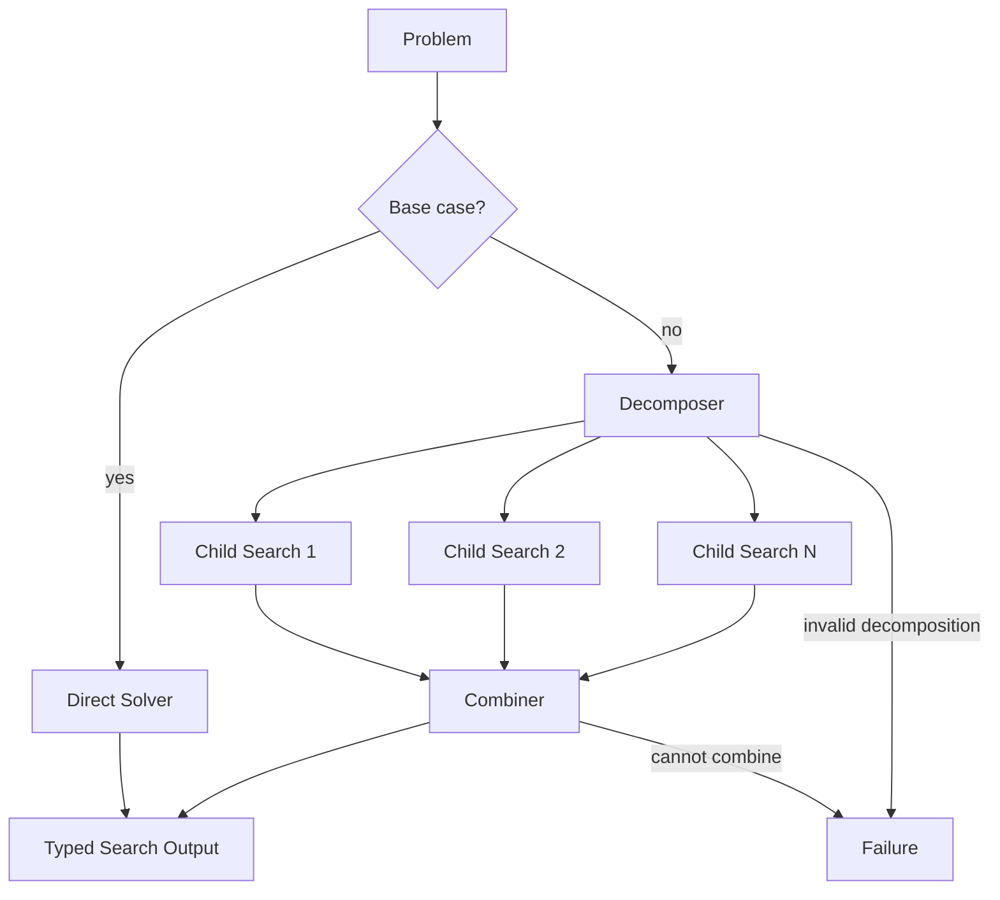

# Recursive Divide-and-Conquer

## Intent

Use Recursive Divide-and-Conquer when a problem can be split into smaller subproblems of the same general family, the subproblems can be solved independently or with limited coordination, and their typed results can be merged into a solution for the parent problem.

Apply the [Agent or Program rule](../../../SKILL.md#choose-agent-or-program) to every authored operation in this pattern.

```text
problem
→ base case?

if yes:
    solve directly

if no:
    decompose into smaller subproblems
    recursively solve each subproblem
    combine child Outputs
```

The defining property is a **strictly decreasing problem measure**. Every recursive child must be smaller according to a declared rule.

## Structure



Each child Search has one durable owner: the parent Search. The recursive business tree is expressed through normal Search-to-Search composition.

## Core idea

A correct recursive design specifies five contracts:

1. **Problem measure** — what gets strictly smaller.
2. **Base case** — when direct solving is sufficient.
3. **Decomposition** — how child problems are produced.
4. **Child result** — the typed Output returned by each child Search.
5. **Combination** — how child Outputs become the parent Output.

Without a decreasing measure and base case, recursion is only repeated delegation and may never terminate.

Valid decreasing measures include:

```text
input interval length
remaining document sections
unresolved component count
problem-tree depth
remaining hierarchy level
remaining search scope
```

For every child:

```text
measure(child) < measure(parent)
```

Do not rely only on an Agent saying that the child “looks smaller.”

## Two kinds of recursion

### Algorithm recursion

Run the same Search definition with a smaller Input: `search/search.py` constructs `RecursiveDivideSearch(input=RecursiveDivideSearchInput(...))`, then spawns it with `ctx.spawn(child.run, upstream=(decomposer_handle,))` and awaits `handle.result()`. The child Input carries a smaller `section_start`/`section_end` range and a decremented `depth_remaining`.

Use this when the same decomposition and solving structure applies at every level.

### Meta generation recursion

Run `MetaAgent`, load a newly generated Search definition, and run that Search:

```text
current Search
→ MetaAgent
→ task-specific child Search definition
→ ctx.spawn(child Search) then handle.result()
```

Use this only when a child problem needs a substantially different workflow shape that no existing Search provides.

Do not regenerate a Python program for every ordinary recursive call.

## Distinction from adjacent patterns

### Map-Reduce

```text
Map-Reduce:
    one known sectioning step
    Workers process sections
    one reduction

Recursive Divide-and-Conquer:
    a child may itself decompose again
    depth is part of the algorithm
```

### Tree Search

```text
Tree Search:
    child states are alternative paths
    Search may choose one best branch

Divide-and-Conquer:
    child subproblems are usually complementary
    parent often requires several child Outputs
```

### Dependency Graph

```text
DAG:
    known non-recursive dependencies and joins

Recursive Divide-and-Conquer:
    the same decomposition relation may repeat at arbitrary bounded depth
```

### Orchestrator–Workers

```text
Orchestrator–Workers:
    dynamically discovers assignments from evolving evidence

Divide-and-Conquer:
    decomposes according to a recursive smaller-problem contract
```

### Beam / Best-First / MCTS

Those patterns explore alternative solution states. Divide-and-Conquer solves a set of smaller required subproblems and combines their results.

## Search interpretation

| Search concept | Meaning in this pattern |
|---|---|
| State | Current problem, problem measure, depth, child budget, and relevant artifacts |
| Candidate | A child subproblem, child Output, or combined parent result |
| Action | Solve directly, decompose, run child Searches, or combine results |
| Observation | Typed decomposition, child Outputs, direct-solver result, or Failure |
| Score | Optional quality or completeness signal for child and combined results |
| Aggregation | Combiner transforms required child Outputs into the parent Output |
| Frontier | Current child subproblems at one parent invocation |
| Stop condition | Base case, maximum depth, minimum problem size, budget exhaustion, or Failure |
| Result | One typed result for the current problem |

A subproblem description is `Subsection` in `search/agents/io.py`: a stable `subsection_id`, the `section_start`/`section_end` range it covers, whether it is `required`, and an `order_key` that restores reading order.

The decomposer's typed Output is `DecomposerOutput` in `search/agents/io.py`: the tuple of `Subsection` values it produced and a `combination_plan` string the combiner follows.

The parent validates measure decrease, identity, fan-out, and required/optional status before spawning children.

## Mapping to the AIBuildAI SDK

The current operation is a `Search`. The base case may use:

- one `Agent`;
- a `Composite` or `Program`;
- deterministic Python;
- an existing child Search that represents the terminal solver.

The recursive case uses:

```text
ctx.spawn(...) then handle.result() for sequential recursion
ctx.spawn(..., capture_failure=True) for independent child Searches
ctx.wait(...) for the child barrier
handle.result()
ctx.spawn(...) then handle.result() for a substantial Combiner Agent
```

The recursive call is an ordinary Search invocation. Do not add a recursion runtime, call-stack object, or second interpreter.

## Complete package

The folder beside this file holds a complete package for this pattern, activated by the repository gate through the real generated-definition loader on every change: `search/` is the authored layout (`search/__init__.py` exports `SEARCH_TYPE`; `search.py`, `io.py`, `agents/`, `prompts/agent/`), and `input_payload.json` is the Input that builds its `SEARCH_TYPE`. Read `search/search.py` for the control flow and `search/agents/io.py` for the typed boundaries. The three roles are `SectionSolverAgent` (the base-case direct solver), `DecomposerAgent` (splits one section range into strictly smaller subsections), and `CombinerAgent` (joins the recursive children's summaries); the one structural idea is that each recursive child is an ordinary `RecursiveDivideSearch` invocation with a smaller range and a decremented `depth_remaining`, spawned and awaited like any other execution.

## Base-case contract

A base case should be objective and cheap to evaluate.

Examples:

```text
problem size <= threshold
depth_remaining == 0
one unresolved component remains
one document section remains
all required evidence is already present
direct solver's declared domain applies
```

Avoid a base-case prompt that simply asks:

```text
“Do you feel this is simple enough?”
```

If learned judgment is needed, keep a hard depth or size cap as the final guarantee.

## Decomposition contract

A valid decomposition must satisfy:

```text
bounded child count
unique child IDs
strictly smaller measure
children collectively cover the required parent scope
no child is identical to the parent
required and optional children are explicit
combination order or keys are declared
```

Overlapping child scopes are allowed only when the Combiner knows how to reconcile duplication.

Do not create a child for deterministic formatting or field renaming.

## Sequential versus parallel recursion

Use parallel recursion when child problems are independent:

```text
spawn all children
wait for required children
combine
```

Use sequential recursion when:

```text
one child's result determines the next child problem
children share a strict resource bottleneck
the combination plan requires ordered accumulation
```

Do not parallelize simply because recursion exists.

## Combination contract

The Combiner must know:

```text
which parent scope each child covers
which children are mandatory
how ordering is restored
how overlap is resolved
how contradictory results are handled
what constitutes a complete parent result
```

For deterministic combinations, use ordinary Python.

Use a Combiner Agent only when semantic synthesis is required.

The Combiner must not invent results for missing required children.

## Budget growth

Recursive fan-out grows rapidly.

With branching factor `b` and depth `d`, the theoretical invocation count is approximately:

```text
1 + b + b^2 + ... + b^d
```

Therefore declare:

```text
maximum recursion depth
maximum children per parent
maximum total child Searches
minimum child problem size
maximum concurrent children
time and cost budget
```

A depth limit alone may still permit excessive width. Use both depth and total-child bounds where needed.

## When to use

Use Recursive Divide-and-Conquer when:

- the problem has a natural hierarchy;
- child problems are strictly smaller;
- the same solving structure can repeat;
- child Outputs can be combined explicitly;
- recursion depth and fan-out can be bounded;
- decomposition materially reduces complexity;
- independent children may benefit from parallelism.

Typical examples:

```text
large document → sections → subsections → summaries → final synthesis
codebase → packages → modules → findings → repository report
dataset → shards → local statistics → global aggregation
research question → subquestions → evidence → combined conclusion
system design → components → subcomponents → integrated design
```

## When not to use

Do not use this pattern when:

- no strictly decreasing measure exists;
- child problems are alternatives rather than required parts;
- the workflow is one fixed level of sectioning;
- dependencies form a known DAG instead of a recursive hierarchy;
- the next tasks are discovered from evolving evidence rather than size reduction;
- the Combiner cannot explain how child results solve the parent;
- recursion is being added only to appear sophisticated;
- budget cannot bound exponential growth.

Choose Map-Reduce, Tree Search, DAG, Orchestrator–Workers, Beam, or Best-First according to the actual structure.

## Budget and stopping

Declare:

```text
problem measure
base-case rule
maximum depth
maximum children per parent
maximum total recursive children
maximum parallel children
required-child policy
combination policy
budget-exhaustion behavior
```

Stop recursion when the base case holds, depth reaches zero, minimum size is reached, the global child budget is exhausted, or a required Failure propagates.

Do not let a child increase `depth_remaining`.

## Failure policy

Choose whether:

```text
all children are required
optional child Failures may be omitted
one fallback direct solver handles a failed decomposition
best partial aggregate may be returned
any required child Failure stops the parent
Combiner Failure stops the parent
```

A failed child is not an empty successful result.

The Combiner Input must preserve which children failed or were omitted if partial combination is allowed.

## Meta-generated recursive form

Use `MetaAgent` only when a child requires a custom Search shape:

```text
if existing Search fits:
    run it
else if a custom child shape is justified:
    run MetaAgent
    load_meta_search(...)
    run the generated child Search
else:
    use declared fallback or return Failure
```

Meta generation itself has no depth counter. `depth_remaining` here is this algorithm's own problem measure and belongs to the child Search's business Input.

Do not confuse:

```text
algorithm recursion depth
Meta program-generation depth
```

They control different things.

## Useful hybrids

- **Divide-and-Conquer + Map-Reduce** at each recursion level.
- **Divide-and-Conquer + Router** to select a solver for each child type.
- **Divide-and-Conquer + Best-of-N** for difficult leaf solving.
- **Divide-and-Conquer + Committee** for high-stakes combination.
- **Divide-and-Conquer with generated child Searches** for heterogeneous subproblems.
- **Sequential decomposition followed by parallel child solving**.
- **Recursive aggregation followed by Finalizer**.

## Common mistakes

- Adding `RecursiveRuntime`, a custom call stack, or another interpreter.
- No strict decreasing measure.
- A child identical to its parent.
- Regenerating a Search definition for every normal recursive call.
- Confusing alternative branches with complementary subproblems.
- Unbounded fan-out.
- Treating child Failure as an empty result.
- Asking an Agent to combine results that ordinary Python can merge exactly.
- Losing parent-scope or order metadata.
- Flattening child internal candidates into the outer level without a contract.
- Using only depth limits while width explodes.

## Design checklist

```text
What is the problem measure?
Why is every child strictly smaller?
What is the objective base case?
What does the Decomposer return?
How are child IDs and required status represented?
Can children run independently?
How are child Outputs combined?
How are overlap and ordering handled?
What are the depth, width, and total-child limits?
What happens when a required or optional child fails?
Is algorithm recursion sufficient?
When is Meta-generated recursion genuinely needed?
Would one-level Map-Reduce or a DAG be simpler?
```

If the decreasing measure or Combiner cannot be stated, the recursion is not well founded.

## References

- Khot et al., **Decomposed Prompting: A Modular Approach for Solving Complex Tasks**: decomposes complex tasks into smaller subproblems and delegates them to specialized handlers. (https://arxiv.org/abs/2210.02406)
- Wu et al., **Recursively Summarizing Books with Human Feedback**: demonstrates hierarchical decomposition and recursive aggregation for long inputs. (https://arxiv.org/abs/2109.10862)
