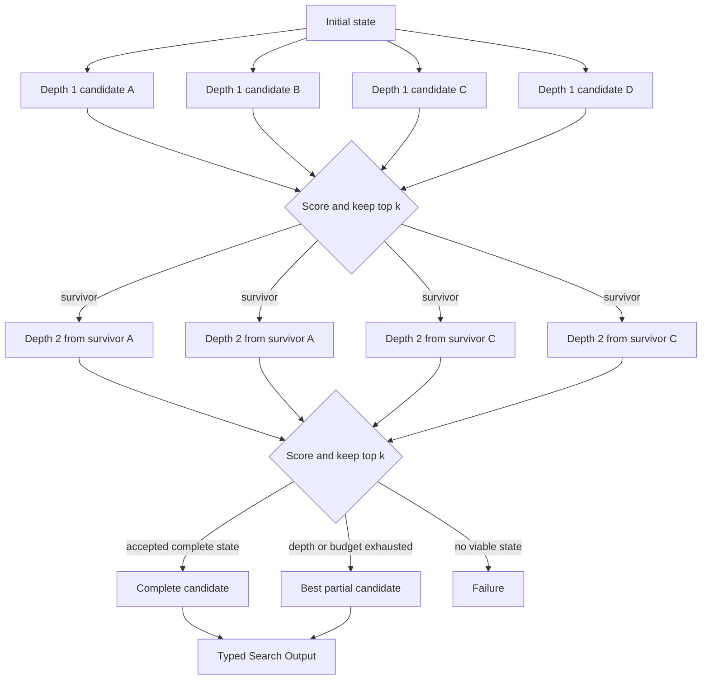

# Beam Search

## Intent

Use Beam Search when a solution is built through a sequence of bounded decisions, many partial states can be proposed at each depth, and the Search should preserve only the best `beam_width` partial states before expanding the next level.

Apply the [Agent or Program rule](../../../SKILL.md#choose-agent-or-program) to every authored operation in this pattern.

The shape is:

```text
one initial partial state
→ generate several one-step continuations
→ score all continuations at the same depth
→ keep the best k
→ expand only those survivors
→ repeat until a complete result or depth limit
```

Beam Search is a width-bounded tree search.

It trades completeness and optimality for a predictable frontier size. It is useful when exhaustive tree search is too expensive but committing to one greedy path is too brittle.

## Structure



The graph is level-synchronous:

```text
all candidates at depth d are scored
before survivors at depth d + 1 are expanded
```

That property distinguishes ordinary Beam Search from global Best-First Search.

## Core idea

Greedy search keeps one state:

```text
beam_width = 1
```

Exhaustive breadth-first search keeps every state at a depth:

```text
beam_width = all viable states
```

Beam Search keeps a fixed number between those extremes:

```text
1 < beam_width << all viable states
```

The Search repeatedly performs four business operations:

1. **Expand** each current beam state into bounded child proposals.
2. **Evaluate** the child proposals with a score comparable at the current depth.
3. **Prune** all but the best `beam_width` viable children.
4. **Stop or continue** according to completeness, acceptance, depth, and budget.

The beam is ordinary Search-local state. It is not a second durable scheduler.

## Distinction from adjacent patterns

### Beam Search versus Parallel Best-of-N

```text
Parallel Best-of-N:
    generate N complete, independent candidates
    score them once
    select a winner

Beam Search:
    repeatedly generate partial continuations
    prune after every depth
    later candidates descend from earlier survivors
```

Use Best-of-N when complete attempts are affordable and independent diversity is the main goal.

Use Beam Search when partial decisions must be made sequentially and early pruning saves substantial work.

### Beam Search versus Tree Search

```text
General Tree Search:
    may preserve every node, backtrack, or use arbitrary expansion policy

Beam Search:
    uses a fixed-width level frontier
    permanently discards non-survivors at each depth
```

Beam Search is a specific pruning policy over a tree.

### Beam Search versus Best-First / A*

```text
Beam Search:
    compares candidates within one depth
    keeps at most k survivors
    does not revisit pruned states

Best-First / A*:
    maintains one global priority queue across depths
    expands the globally best frontier state next
    may keep many frontier states
```

Beam Search provides a direct memory bound. Best-First provides a more flexible priority policy.

### Beam Search versus Tournament

```text
Tournament:
    selects among candidates through local matches

Beam Search:
    ranks a whole depth frontier by a declared score
```

A tournament may be used as the pruning mechanism when absolute scores are unreliable, but it changes the evaluation cost and semantics.

### Beam Search versus Mixture-of-Agents

```text
Mixture-of-Agents:
    later layers synthesize information from all previous-layer outputs

Beam Search:
    later states descend from selected parent states
    non-survivors are discarded rather than collectively synthesized
```

## Search interpretation

| Search concept | Meaning in this pattern |
|---|---|
| State | One immutable partial solution plus depth, lineage, accumulated cost, and relevant artifacts |
| Candidate | One child state generated by extending a parent state |
| Action | Apply one declared expansion operator |
| Observation | Child state, evaluator score, completion status, or Failure |
| Score | A depth-comparable estimate of current quality or future promise |
| Aggregation | Group children, rank them, and select at most `beam_width` survivors |
| Frontier | The current beam: a bounded tuple of partial states at the same depth |
| Stop condition | Accepted complete state, maximum depth, expansion budget, no viable survivors, or time budget |
| Result | Best accepted complete state, or a declared best-so-far fallback |

The partial state is `BeamState` in `search/agents/io.py`: a `state_id`, `depth`, the ordered `steps` tuple, and `dataset_dir`.

Score tracking is a plain `(score, state)` tuple built and sorted in `search/search.py`; the Search does not declare a separate scored-state type.

The Search should not persist live Handles, Agent objects, or a mutable priority queue inside the business state.

## Mapping to the AIBuildAI SDK

An expansion may be performed by:

- an `Agent` that proposes bounded next actions;
- a `Composite` that creates and evaluates one candidate state;
- a `Program` admitted by the selection guide;
- a child `Search` that solves one meaningful continuation;
- ordinary deterministic Python when the next states are mechanically derived.

At one depth:

```text
ctx.spawn(..., capture_failure=True) for independent expansions or evaluations
ctx.wait(...) for the level barrier
handle.result() for each terminal child
ordinary Python sort and prune for the beam
```

Use `ctx.spawn(...)` then `handle.result()` for a single expansion or evaluator when parallel fan-out is unnecessary.

Do not add:

```text
BeamRuntime
BeamExecutionContext
BeamHandle
FrontierScheduler
PruningEvent
```

The parent Search already owns the loop, durable children, and stopping policy.

## Candidate contract

Every expansion result should identify:

```text
parent state
action or mutation applied
new partial state
whether the state is complete
artifact references
optional measured cost
```

The expansion Output is `ExpanderOutput` in `search/agents/io.py`: a `children` tuple of `ExpansionChild`, each holding one `step_name` and the `dataset_dir` it produced.

An expansion Agent should return a bounded child tuple.

The Search, not the Agent, enforces:

```text
maximum children per parent
maximum total child states per depth
valid parent identity
depth increment
state uniqueness policy
```

## Evaluation contract

The evaluator must return a score with clear semantics.

The evaluation Output is `EvaluatorOutput` in `search/agents/io.py`: `score`, `viable`, `complete`, and a one-sentence `reason`.

The score may represent:

```text
predicted final metric
validated partial metric
constraint satisfaction
estimated probability of success
negative estimated remaining cost
a weighted business rubric
```

Avoid a score whose scale changes unpredictably by depth.

If shallow states naturally score higher or lower than deeper states, compare only within a depth or normalize explicitly.

## Complete package

The folder beside this file holds a complete package for this pattern, activated by the repository gate through the real generated-definition loader on every change: `search/` is the authored layout (`search/__init__.py` exports `SEARCH_TYPE`; `search.py`, `io.py`, `agents/`, `prompts/agent/`), and `input_payload.json` is the Input that builds its `SEARCH_TYPE`. Read `search/search.py` for the control flow and `search/agents/io.py` for the typed boundaries. `ExpanderAgent` and `EvaluatorAgent` are the two roles; the Search itself owns the depth loop, the level barrier, and the top-`beam_width` prune.

## Ranking and tie-breaking

The ranking rule must be deterministic for recorded Inputs and Outputs.

Use:

```text
primary score
secondary measured cost or constraint score
stable state ID as final tie-break
```

Do not rely on:

```text
set iteration order
completion order
dictionary insertion from concurrent callbacks
unrecorded random choice
```

The ranking rule is the `sorted(...)` call in `search/search.py`: primary score descending, then `state_id` as the stable tie-break.

The exact tuple depends on the metric semantics. The principle is stable ordering.

## Beam width

`beam_width` controls breadth.

```text
beam_width = 1
    greedy search

small beam
    cheap but prone to premature convergence

large beam
    more diversity and recall
    higher cost and context pressure
```

Choose beam width from observable constraints:

```text
available parallel slots
expansion cost
evaluator reliability
branching factor
expected depth
diversity of plausible approaches
```

Do not set width solely because more candidates feel safer.

The rough candidate count per depth is bounded by:

```text
beam_width × branching_factor
```

before deduplication and viability filtering.

## Diversity-preserving beam variants

A pure top-`k` score rule may collapse the beam into near-duplicates.

A lightweight diversity rule may be justified when:

```text
many high-scoring states share one strategy
the evaluator rewards superficial similarity
different approaches are valuable
```

Examples:

```text
at most m survivors per strategy label
reserve one slot per declared family
penalize exact duplicate state signatures
select top candidates after clustering by a cheap declared key
```

Do not add semantic vector clustering by default.

A simple typed `strategy_id` or operation family is often sufficient.

Diversity constraints are secondary to viability and hard correctness.

## Complete and partial states

A beam may contain both partial and complete states.

Define one policy:

### Stop at first accepted complete state

Use when:

```text
the evaluator has a reliable acceptance threshold
continued search has low expected value
```

### Keep complete states outside the beam

Use when:

```text
complete candidates should compete globally
partial states should continue exploring
```

Maintain:

```text
best_complete
current partial beam
```

Do not force a complete state to consume a partial-beam slot unless the design intends that.

### Continue until depth or budget

Use when:

```text
relative ranking among complete candidates matters
the first completion may be weak
```

The stopping rule must be explicit.

## Score calibration

Beam Search is only as useful as its pruning signal.

A poor early score may permanently discard the path that would have produced the best final result.

Prefer:

```text
objective intermediate metrics
constraint checks
executable partial artifacts
domain-specific progress measures
evaluator rubrics tied to final success
```

Use caution with:

```text
unstructured self-confidence
one Agent's vague quality score
scores produced under changing prompts
scores that reward length
```

When early scores are weak, use:

```text
a wider beam
more diversity slots
delayed pruning
a small amount of random or exploratory retention
```

Do not claim optimality.

## When to use

Use Beam Search when:

- the task is naturally sequential;
- each partial state can be extended in several ways;
- full exhaustive search is unaffordable;
- a useful intermediate evaluator exists;
- a hard width bound is desirable;
- early choices matter but one greedy choice is too risky;
- all states at one depth have comparable semantics;
- the maximum depth is bounded;
- pruned branches need not be revisited.

Typical examples:

```text
construct a multi-stage training pipeline
choose data recipe
→ choose SFT method
→ choose RL method
→ choose final calibration

build an architecture one component at a time

plan a sequence of experiments

incrementally repair a program through bounded edits

construct a research methodology through ordered design decisions
```

## When not to use

Do not use Beam Search when:

- complete independent attempts are cheap;
- there is no meaningful partial-state evaluator;
- high-quality paths often look weak early;
- states at different depths must compete globally;
- actions have highly variable costs requiring cost-aware priority;
- backtracking to pruned states is important;
- the problem has stochastic outcomes that require repeated sampling;
- the solution is better modeled as population mutation over complete candidates;
- the process is a fixed chain with no real branching.

Choose:

- **Parallel Best-of-N** for complete independent candidates;
- **Best-First / A*** for global priority across depths;
- **MCTS** for stochastic sampling and visit-based exploration;
- **Evolutionary Search** for population-level mutation and recombination;
- **Sequential Chain** when the decisions are already fixed.

## Budget and stopping

Declare:

```text
beam width
maximum branching factor
maximum depth
maximum total generated states
maximum evaluator calls
maximum parallel children
acceptance threshold
complete-state policy
failure policy
```

A hard upper bound is approximately:

```text
1
+
max_depth
× beam_width
× branching_factor
```

generated states, ignoring the first level and optional evaluations.

The actual durable child count may be larger if expansion and evaluation are separate.

Stop when one of these occurs:

```text
accepted complete state
maximum depth
maximum total states
time or cost budget
no viable survivors
all beam states are complete
```

Do not continue merely because the loop has remaining iterations when acceptance is already satisfied.

## Failure policy

Choose before execution:

```text
one failed expansion removes that parent's children
one failed evaluator removes that child
all parents failing stops the Search
a mandatory state failure stops the Search
best complete state may be returned after later failures
```

A Failure is not a low score.

Do not insert a failed state into the beam with `-infinity` and later treat it as a candidate.

If all proposed states fail evaluation:

```text
return best_complete if the contract allows it
otherwise return Failure
```

## Recursive form

A beam state may be expanded by a child Search when one continuation contains meaningful orchestration.

Example:

```text
partial pipeline state
→ child Search explores data preparation
→ returns one typed data-stage result
→ parent creates later pipeline states
```

A task-specific child Search may be generated through `MetaAgent` when:

```text
the continuation needs a custom workflow
no existing Search fits
```

The generated child returns one typed result to one beam state.

Do not expose every internal child state as a separate outer beam candidate unless the Output contract explicitly does so.

Algorithm recursion is usually unnecessary for ordinary Beam Search: the parent loop already represents depth. Use recursive Search only when a state itself contains a nested problem with its own orchestration boundary.

## Useful hybrids

Beam Search commonly combines with:

- **Beam + Best-of-N expansion**: each parent generates several diverse continuations.
- **Beam + Tournament pruning** when pairwise comparison is more reliable than absolute score.
- **Beam + Committee evaluator** for high-stakes pruning.
- **Beam + Evaluator–Optimizer** to refine each surviving state before the next depth.
- **Router → Beam** only for categories that need sequential exploration.
- **Beam states implemented by child Searches**.
- **Beam + diversity quotas** to prevent strategy collapse.
- **Beam followed by Finalizer** to convert the best complete state into product Output.

Keep the outer beam semantics visible. A hybrid should not obscure which states survive and why.

## Common mistakes

### Creating a Beam runtime

Do not add:

```text
BeamManager
FrontierExecution
BeamContext
BeamHandle
SearchLayerEvent
```

Ordinary Search-local values and `ExecutionContext` operations are enough.

### Comparing incompatible depths

A score for a one-step partial plan may not be comparable to a nearly complete candidate.

Use level-synchronous pruning or explicit normalization.

### Pruning before all level results are known

If completion order affects selection, the same durable facts may produce different beams.

Wait for the level barrier before ranking.

### No stable tie-break

Equal scores require a deterministic final key.

### Beam width larger than the useful frontier

Keeping many duplicates does not improve exploration.

### One state generating unbounded children

The branching factor must be part of the Input or Search contract.

### Treating evaluator Failure as a poor score

Failure means the evaluation did not produce a valid judgment.

### Returning the last survivor automatically

Track accepted complete states separately. The final partial survivor may not be a valid result.

### Recomputing parent artifacts

Pass artifact references into child Inputs rather than repeating expensive work.

### Claiming A* properties

Beam Search is not complete or optimal in general because it permanently discards states.

### Using raw mutable dictionaries as the authoritative beam

Use immutable typed states and local tuples. The durable authority remains child Outputs and the journal.

## Design checklist

Before selecting this pattern, answer:

```text
What exactly is one partial state?
What is one expansion action?
What is the maximum children per parent?
Why are scores comparable within a depth?
What is the beam width?
How are ties broken?
How is diversity preserved, if needed?
What makes a state viable?
What makes a state complete?
Are complete states kept outside the partial beam?
What is the acceptance threshold?
What happens when expansion or evaluation fails?
What is the hard maximum generated-state count?
Why is Beam Search better than Best-of-N or Best-First here?
Which expansions, if any, justify child Searches?
```

If the intermediate score cannot be explained, do not prune with it.

## References

- Yao et al., **Tree of Thoughts: Deliberate Problem Solving with Large Language Models**: explores coherent intermediate states with breadth-first or depth-first search, generation, evaluation, and pruning rather than committing to one left-to-right path. (https://arxiv.org/abs/2305.10601)
- Freitag and Al-Onaizan, **Beam Search Strategies for Neural Machine Translation**: studies width-bounded hypothesis retention and the quality/cost consequences of beam size in sequence generation. (https://arxiv.org/abs/1702.01806)
