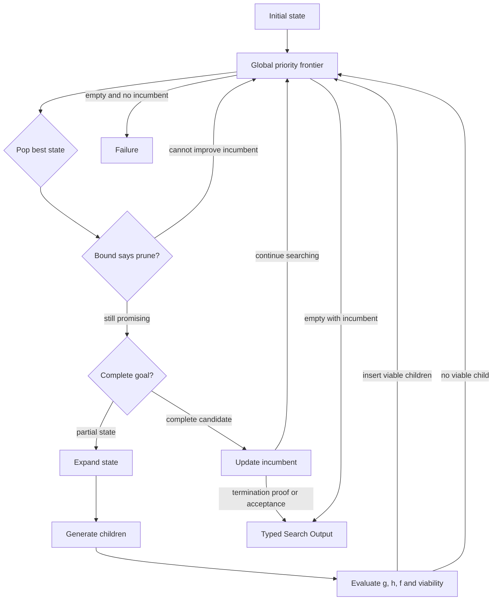

# Best-First / A* / Branch-and-Bound

## Intent

Use Best-First Search when many partial states exist at different depths and the Search should repeatedly expand the **globally most promising frontier state**, rather than processing one complete depth at a time.

Apply the [Agent or Program rule](../../../SKILL.md#choose-agent-or-program) to every authored operation in this pattern.

Use the A* form when each state has:

```text
g(state)
    accumulated cost already paid

h(state)
    estimated remaining cost to reach a goal

f(state) = g(state) + h(state)
    priority for expansion
```

Use Branch-and-Bound when the Search also maintains an incumbent complete solution and a bound that can prove some frontier states cannot improve it.

The common shape is:

```text
priority frontier
→ remove best-priority state
→ test goal / bound
→ expand it
→ evaluate children
→ insert viable children
→ update incumbent
→ repeat
```

This pattern is appropriate when the Search needs global, cross-depth prioritization and has a meaningful heuristic or bound.

## Structure



The frontier may contain states from different depths.

That is the defining distinction from level-synchronous Beam Search.

## Core idea

Best-First Search makes one policy explicit:

```text
Which currently known partial state deserves the next expansion?
```

The Search maintains a priority queue of immutable frontier entries.

At each iteration it:

1. removes the state with best priority;
2. checks whether it is complete;
3. optionally checks whether a bound can prune it;
4. expands it into bounded children;
5. computes priority for each viable child;
6. inserts those children;
7. updates the best complete incumbent when appropriate.

The priority may be:

```text
predicted final metric
estimated remaining work
risk-adjusted expected value
cost plus heuristic
upper confidence bound
a lexicographic business tuple
```

But the semantics must be stated.

A priority number with no interpretation is not a search policy.

## The A* interpretation

For minimization:

```text
g(n)
    known accumulated path cost from the root to n

h(n)
    estimated cost from n to a goal

f(n) = g(n) + h(n)
```

A* expands the frontier state with minimum `f`.

For maximization tasks, do not mechanically negate values without defining the bound. It may be clearer to use:

```text
value_so_far
optimistic_remaining_value
upper_bound
```

and expand the largest optimistic upper bound.

Classical A* optimality statements require specific assumptions such as an admissible heuristic and, for common graph-search implementations, consistency conditions. LLM-generated scores, learned evaluators, and business rubrics usually do **not** satisfy those assumptions.

Therefore:

> An Agent workflow that resembles A* should normally be called heuristic Best-First Search unless the heuristic properties are actually established.

Do not claim optimality from the formula alone.

## The Branch-and-Bound interpretation

Branch-and-Bound maintains:

```text
incumbent
    best complete solution found so far

bound(state)
    optimistic best result any descendant of state could achieve
```

For maximization:

```text
if bound(state) <= incumbent.score:
    prune state
```

For minimization:

```text
if bound(state) >= incumbent.cost:
    prune state
```

A bound is useful only when its semantics justify the comparison.

A vague evaluator score is not automatically an upper or lower bound.

Branch-and-Bound is powerful when objective measurements or domain constraints provide a real bound.

## Distinction from adjacent patterns

### Best-First versus Beam Search

```text
Beam Search:
    process one depth at a time
    keep at most k states from that depth
    hard memory/frontier-width bound

Best-First:
    one global frontier across depths
    expand the best-priority state next
    frontier size may grow unless separately bounded
```

Choose Beam Search when fixed width and level comparability matter.

Choose Best-First when a strong shallow state should be allowed to wait while a promising deeper state continues.

### Best-First versus Greedy Search

```text
Greedy:
    commit to one current path or choose only minimum h

Best-First:
    retain alternative frontier states
    may return to them later
```

Greedy search can be seen as an extreme frontier policy that discards alternatives.

### Best-First versus A*

```text
Best-First:
    general priority-driven expansion

A*:
    a specific best-first policy using g + h
    with formal properties only under stated assumptions
```

Every A* search is best-first; not every best-first search is A*.

### Best-First versus MCTS

```text
Best-First:
    explicit frontier priority
    usually one evaluation per generated state
    no visit-count backup is required

MCTS:
    repeatedly traverses an existing tree
    balances visits, value estimates, and exploration
    backs sampled returns up through ancestors
```

Use MCTS when repeated sampling and uncertainty estimates are central.

### Best-First versus Evolutionary Search

```text
Best-First:
    expand descendants from a priority frontier
    lineage is a search graph or tree

Evolutionary:
    maintain generations or a population
    apply mutation/crossover and replacement
```

### Best-First versus Worker–Iterator

```text
Worker–Iterator:
    Iterator chooses one next work item from current state

Best-First:
    priority policy chooses among a persistent set of frontier states
```

A Worker–Iterator may internally implement Best-First, but the frontier and scoring semantics should be explicit.

## Search interpretation

| Search concept | Meaning in this pattern |
|---|---|
| State | One immutable partial solution with lineage, accumulated cost/value, depth, and artifacts |
| Candidate | A frontier state or complete incumbent |
| Action | Expand one selected frontier state |
| Observation | Generated children, measured cost, heuristic estimate, completion, or Failure |
| Score | Priority, often `g + h`, optimistic value, or a lexicographic tuple |
| Aggregation | Insert children, deduplicate, update incumbent, and reorder the frontier |
| Frontier | A global priority queue containing states from possibly different depths |
| Stop condition | Proven bound, accepted incumbent, empty frontier, time/cost/state budget, or maximum depth |
| Result | Best valid complete incumbent |

A frontier entry is `FrontierEntry` in `search/search.py`: a `state_id` that encodes lineage, the state's `config_json`, its `path_cost` and `heuristic_cost`, and the `priority` they sum to.

The priority queue itself may remain an ordinary local Python heap.

Do not persist a second `FrontierState` authority merely because a heap exists.

Durable facts are already represented by Inputs, Outputs, and child Execution records.

## Mapping to the AIBuildAI SDK

A state expansion may be:

- an `Agent` proposing next actions;
- a `Composite` representing one domain candidate;
- a `Program` admitted by the selection guide;
- a child `Search` solving one continuation;
- deterministic Python for mechanical transitions.

The basic loop commonly uses:

```text
ctx.spawn(expander, ..., capture_failure=True) then handle.result() for one selected state
ctx.spawn(...) and ctx.wait(...) if one expansion has parallel child evaluations
handle.result()
ordinary heapq or sorted list for the local frontier
```

Only one frontier state is selected per best-first iteration in the basic form.

The children of that state may be evaluated concurrently.

Do not add:

```text
AStarRuntime
PriorityExecutionContext
FrontierRecord
BranchAndBoundManager
HeuristicScheduler
```

The Search owns the queue. The durable execution layer owns execution.

## Priority contract

The priority function should be a pure ordinary function over recorded business values.

For minimization, `search/search.py` computes priority as the plain sum `path_cost + heuristic_cost` when it builds each `FrontierEntry`.

For more complex business decisions, a lexicographic tuple of `(hard_constraint_violations, estimated_total_cost, negative_quality, state_id)` is often clearer than inventing one weighted scalar.

The final tie-break must be deterministic.

Do not use:

```text
completion order
unrecorded randomness
Python object identity
set iteration order
current wall-clock time
```

unless the nondeterministic decision is explicitly checkpointed through the existing step mechanism.

## Complete package

The folder beside this file holds a complete package for this pattern, activated by the repository gate through the real generated-definition loader on every change: `search/` is the authored layout (`search/__init__.py` exports `SEARCH_TYPE`; `search.py`, `io.py`, `agents/`, `programs/`, `prompts/agent/`), and `input_payload.json` is the Input that builds its `SEARCH_TYPE`. Read `search/search.py` for the control flow and `search/agents/io.py` for the typed boundaries. `ExpanderAgent` proposes children and `HeuristicAgent` estimates `h`; the mechanical `programs/trial.py` runs a child once and measures its real `g`; the frontier itself is one local `heapq` pruned only on the real, monotonically growing `g`.

## Frontier ordering

Python's `heapq` is sufficient for an in-memory Search-local frontier.

A heap item is `(entry.priority, entry.state_id, entry)` in `search/search.py`; `state_id` is unique per generated state, so it serves as the deterministic tie-break and the `FrontierEntry` itself is never compared.

This package always minimizes accumulated compute cost, so `search/search.py` never negates a value before pushing it onto the heap.

Do not scatter sign inversions across the code.

`search/search.py` builds each heap tuple inline, at the point where a `FrontierEntry` is pushed, rather than through a separate `heap_item` helper, and it documents that lower is better throughout.

## Heuristic design

A useful heuristic is:

```text
cheap enough to evaluate many times
correlated with final success
stable across similar states
defined for every viable partial state
not merely a restatement of current score
```

Possible heuristic sources:

```text
remaining unsatisfied constraints
estimated experiments remaining
predicted metric improvement
lower bound on remaining cost
upper bound on achievable quality
distance to a required schema or test pass
domain-specific progress count
```

An LLM evaluator may provide a heuristic, but then it should be treated as an approximate priority, not a formal admissible heuristic.

Prefer objective measures when available.

## Admissibility and consistency

For classical minimization A*:

```text
admissible:
    h(n) never overestimates the true remaining optimal cost

consistent:
    h(n) <= cost(n, n') + h(n')
```

Under suitable assumptions, these properties support optimality and efficient graph-search behavior.

In Agent workflows:

- the true remaining cost may be unknown;
- state transitions may be stochastic;
- evaluator scores may be noisy;
- the state representation may omit relevant information;
- actions may change the objective or environment.

Therefore do not write:

```text
"This workflow is optimal because it uses A*."
```

unless the application proves the required assumptions.

Use the more honest label:

```text
heuristic best-first search
```

when the evaluator is approximate.

## Deduplication and graph search

Different paths may reach equivalent business states.

A cheap deterministic signature can prevent repeated work. This package skips that step: `search/search.py` bounds the frontier only through the accumulated-cost prune and the `max_frontier_size` trim in `search/io.py`, so a design that expects many equivalent states should add a signature function before reusing this package as-is.

The signature should derive from business-relevant state, not from:

```text
execution path
random UID
timestamp
artifact directory
```

Do not add semantic equivalence detection by default.

Exact business keys are preferable.

If two paths reach the same state with different accumulated cost, the Search may need to retain the cheaper path. That rule must be explicit.

## Frontier bounds

A global best-first frontier may grow rapidly.

Declare:

```text
maximum frontier entries
maximum expansions
maximum branching factor
maximum depth
maximum evaluator calls
time and cost budget
```

A frontier-size cap changes the algorithm into a memory-bounded approximation.

That is acceptable, but do not continue claiming classical A* completeness or optimality.

Possible trimming policies:

```text
drop worst-priority states
reserve diversity slots
keep one state per exact signature
keep incumbent-relevant states
```

Use the simplest policy justified by the task.

## Incumbent and stopping

The incumbent is the best complete valid candidate found so far.

Possible stopping rules:

### Acceptance threshold

```text
incumbent reaches a product-defined quality
```

### Empty frontier

```text
no unexplored viable state remains
```

### Bound proof

```text
best possible frontier bound
cannot improve incumbent
```

### Budget

```text
maximum expansions, time, or cost reached
```

### First goal

```text
stop when the first complete state is popped
```

First-goal stopping is only justified by the priority semantics. It is not automatically correct for arbitrary learned heuristics.

When in doubt, keep the incumbent and continue until a declared budget or acceptance condition.

## Branch-and-Bound details

For maximization, each state may carry:

```text
lower_bound
    quality already guaranteed

upper_bound
    optimistic best quality reachable
```

Prune if:

```text
upper_bound <= incumbent.quality
```

For minimization, prune if:

```text
lower_bound >= incumbent.cost
```

A bound must be comparable to the final objective.

Examples of real bounds:

```text
remaining maximum possible points
unavoidable resource cost
hard capacity constraints
known benchmark ceiling
best possible score from unresolved sections
```

Examples that are not automatically bounds:

```text
LLM confidence
vague "potential" score
current partial quality
average historical improvement
```

## When to use

Use Best-First / A* / Branch-and-Bound when:

- partial states exist at different depths;
- one global priority can compare them meaningfully;
- a promising deep state should continue before weaker shallow states;
- expansion cost is substantial;
- a useful heuristic or bound exists;
- alternative paths should remain available;
- the solution space is too large for breadth-first exploration;
- the maximum expansions and frontier size can be bounded;
- an incumbent complete result can improve pruning.

Typical examples:

```text
choose the next experiment with highest expected information gain

search architecture modifications by predicted final metric

construct a training pipeline while accounting for accumulated compute cost

explore code-repair states prioritized by failing tests and estimated remaining work

search a configuration graph with hard resource bounds
```

## When not to use

Do not use this pattern when:

- no cross-depth priority is meaningful;
- every expansion score is highly noisy;
- complete independent attempts are cheaper;
- the task naturally proceeds by fixed stages;
- strict memory bounds require a small fixed beam;
- repeated stochastic rollouts are needed to estimate value;
- recombination across unrelated candidates is important;
- the state graph cannot be represented by bounded immutable values;
- a priority queue would only wrap one current state.

Choose:

- **Beam Search** for fixed-width level pruning;
- **Parallel Best-of-N** for independent complete candidates;
- **MCTS** for visit-based stochastic exploration;
- **Evolutionary Search** for population mutation and crossover;
- **Worker–Iterator** for one adaptive action without a persistent frontier.

## Budget and stopping

Declare:

```text
maximum expansions
maximum frontier size
maximum branching factor
maximum depth
maximum child evaluations
acceptance threshold
incumbent policy
bound semantics
deduplication key
failure policy
```

The Search stops on:

```text
accepted incumbent
valid bound proof
empty frontier
time or cost budget
expansion budget
```

A state remaining in the frontier is unfinished business, not a running durable child.

The Search may return with frontier entries still present because those entries are ordinary values. It may not return with open direct child Executions.

## Failure policy

A failed expansion means:

```text
that state produced no child set
```

It does not automatically invalidate the state itself unless the contract says so.

A failed heuristic evaluation means:

```text
no valid priority was produced
```

Choose one policy:

```text
drop the child
use a declared deterministic fallback priority
stop the Search if the evaluator is mandatory
```

Do not assign an arbitrary excellent priority to missing evaluations.

Do not treat Failure as a complete candidate.

If all frontier states fail expansion and no incumbent exists, return Failure.

If an incumbent exists, the contract may return it as best-so-far.

## Recursive form

A frontier state may represent a child Search problem.

Example:

```text
state = partially designed training pipeline

expansion action:
    run a DataSearch child
    receive one typed dataset result
    create later pipeline frontier entries
```

A custom child Search may be generated through `MetaAgent` when:

```text
the state requires a workflow not represented by existing Search types
```

The outer priority queue treats the child Search Output as one transition result.

Do not merge the child Search's internal frontier into the outer frontier unless the contract explicitly exposes compatible states.

Best-First itself is usually iterative rather than recursively implemented. Avoid a recursive Python call per expansion when the ordinary loop is clearer.

## Useful hybrids

Best-First commonly combines with:

- **Best-First + Branch-and-Bound** using an incumbent.
- **Best-First + Committee heuristic** when one evaluator is unreliable.
- **Best-First + child Search expansions** for complex transitions.
- **Router → Best-First** for task categories with meaningful heuristics.
- **Best-First + Evaluator–Optimizer** to improve the incumbent.
- **Best-First + diversity reserve** to avoid one strategy monopolizing the frontier.
- **Best-First with Beam cap** as a memory-bounded approximation.
- **Best-First → Finalizer** for product delivery.

State the governing priority rule even when adding a hybrid.

## Common mistakes

### Calling any priority queue A*

A* requires meaningful `g` and `h`; formal claims require stronger assumptions.

### Using one vague LLM score as a bound

A quality guess is not an admissible cost estimate or optimistic bound.

### No deterministic tie-break

Equal priorities must not be resolved by completion order.

### Storing live Handles in the frontier

Frontier entries are immutable business values. Handles are used only while direct children are active.

### Adding a second scheduler

Do not build a generic frontier runtime around the durable execution layer.

### Pruning with the current score instead of a bound

A weak current state may have strong descendants. Branch-and-Bound needs an optimistic reachable bound.

### Returning the most recently expanded state

Return the best complete incumbent.

### Unbounded frontier growth

Declare a frontier limit or expansion budget.

### Deduplicating by runtime path

Two equivalent business states reached through different paths should share a business signature.

### Ignoring state transition cost

If actions have different cost, priority based only on estimated quality may waste the budget.

### First-goal stopping with an arbitrary heuristic

The first complete state discovered or popped is not necessarily best.

### Re-expanding an unchanged failed state

Without new evidence or a different operator, retry is not search.

## Design checklist

Before selecting this pattern, answer:

```text
What is one frontier state?
What is one expansion?
What is the accumulated cost or value g?
What is the heuristic h?
Are g and h truly comparable?
Is this honestly A*, or only heuristic Best-First?
What is the incumbent?
Is there a real upper or lower bound?
How are ties broken?
How are duplicate states recognized?
What is the maximum frontier size?
What is the maximum expansion count?
When may the first goal terminate the Search?
What happens when expansion or heuristic evaluation fails?
Why is this better than Beam Search or MCTS?
Which transitions justify child Searches?
```

If the heuristic cannot be explained in operational terms, use a simpler pattern.

## References

- Hart, Nilsson, and Raphael, **A Formal Basis for the Heuristic Determination of Minimum Cost Paths**: develops heuristic graph search and the A* evaluation framework, with optimality properties under stated assumptions. (https://doi.org/10.1109/TSSC.1968.300136)
- Yao et al., **Tree of Thoughts: Deliberate Problem Solving with Large Language Models**: frames language-model reasoning as explicit state generation, evaluation, search, lookahead, and backtracking rather than one greedy trajectory. (https://arxiv.org/abs/2305.10601)
