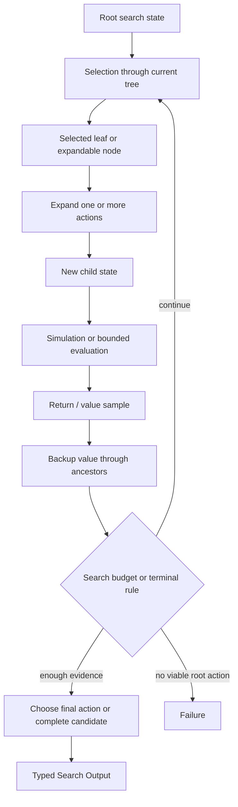
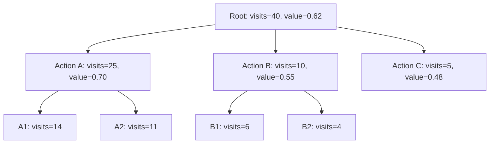

# Monte Carlo Tree Search

## Intent

Use Monte Carlo Tree Search (MCTS) when the Search must make a sequence of decisions, the branching space is large, exact exhaustive evaluation is impossible, and the value of a partial state can be estimated through repeated simulations, environment interactions, tests, or bounded rollouts.

Apply the [Agent or Program rule](../../../SKILL.md#choose-agent-or-program) to every authored operation in this pattern.

The canonical cycle is:

```text
Selection
→ Expansion
→ Simulation / Evaluation
→ Backup
→ repeat
```

MCTS does not simply generate a large tree once.

It repeatedly revisits a growing tree, using accumulated visit statistics to balance:

```text
exploitation
    revisit actions that have produced strong outcomes

exploration
    sample actions that remain uncertain or under-visited
```

This pattern is appropriate only when repeated sampling or repeated evaluation has real meaning.

## Structure



A more concrete tree view:



The statistics are ordinary Search-local values derived from completed iterations.

They are not a second event system.

## Core idea

MCTS incrementally allocates evaluation budget.

It does not spend equal effort on every branch.

A strong branch receives more visits because it has high estimated value.

An uncertain branch may still receive visits because its low visit count creates an exploration bonus.

A typical selection rule is UCT:

```text
UCT(child)
    =
mean_value(child)
+
exploration_constant
× sqrt(
    log(parent_visits)
    / child_visits
)
```

for maximization.

The first term exploits observed value.

The second term explores uncertainty represented by low visit count.

The exact rule may differ, but the Search must state:

```text
what one visit means
what value is backed up
how unvisited actions are handled
what exploration constant or policy is used
```

## Four phases

### 1. Selection

Start at the root and repeatedly choose a child according to the tree policy until reaching:

```text
a terminal state
an unexpanded action
a node selected for further widening
```

Selection reads existing statistics. It does not run an Agent merely to traverse a known tree unless the tree policy itself genuinely requires learned judgment.

### 2. Expansion

Choose one or more legal actions from the selected state and create child state values.

Expansion may involve:

```text
an Agent proposing actions
a deterministic action generator
an Agent with the task environment executing one action
a child Search solving one transition
```

Expansion must be bounded.

### 3. Simulation / Evaluation

Estimate the selected child state's downstream value.

Possible forms:

```text
execute a bounded rollout to a terminal state
run tests or an environment episode
use a value-model Agent
run a cheaper approximate child Search
combine objective reward and evaluator judgment
```

A simulation result is one sample, not automatically ground truth.

### 4. Backup

Propagate the sample through the selected path:

```text
visit_count += 1
value_sum += sample_value
mean_value = value_sum / visit_count
```

The backup rule may include discounting or alternating-player signs when the domain requires it.

The Search updates ordinary in-memory tree statistics after the durable simulation child has returned.

## Distinction from adjacent patterns

### MCTS versus ordinary Tree Search

```text
Tree Search:
    may expand nodes once according to fixed breadth/depth policy

MCTS:
    repeatedly traverses and samples the same growing tree
    maintains visit and value statistics
    uses those statistics to allocate future simulations
```

A tree diagram alone does not make an algorithm MCTS.

### MCTS versus Best-First / A*

```text
Best-First / A*:
    one explicit priority per frontier state
    usually expands each popped state based on heuristic estimate

MCTS:
    tree policy depends on repeated visit counts and backed-up samples
    may revisit the same branch many times
```

Use Best-First when a strong deterministic heuristic exists.

Use MCTS when values are uncertain and repeated sampling improves the estimate.

### MCTS versus Beam Search

```text
Beam Search:
    level-synchronous
    permanently keeps top k states per depth

MCTS:
    asynchronous across depths at the algorithmic level
    one iteration follows one path
    no fixed top-k frontier is required
```

### MCTS versus Parallel Best-of-N

```text
Best-of-N:
    independent complete candidates
    one final selection

MCTS:
    later simulations depend on earlier tree statistics
    budget is adaptively concentrated
```

### MCTS versus Evolutionary Search

```text
MCTS:
    parent-child decision tree
    visit-based tree policy
    backup through ancestors

Evolutionary:
    population
    mutation / crossover
    generation or steady-state replacement
```

### MCTS versus Evaluator–Optimizer

```text
Evaluator–Optimizer:
    one candidate lineage receives explicit feedback and revision

MCTS:
    many state-action paths compete through repeated sampled value
```

## Search interpretation

| Search concept | Meaning in this pattern |
|---|---|
| State | One decision state or partial solution |
| Candidate | One tree node, action edge, rollout result, or complete solution |
| Action | One legal transition from a state |
| Observation | Child state, reward sample, evaluator value, environment response, or Failure |
| Score | Backed-up mean value plus exploration term used by the tree policy |
| Aggregation | Update visit count and value statistics along the selected path |
| Frontier | Implicit expandable leaves and untried actions in the current tree |
| Stop condition | Simulation budget, accepted complete solution, root confidence, time/cost budget, or no legal action |
| Result | Best complete candidate or root action according to a declared final policy |

A minimal node value is `TreeNode` in `search/search.py`: a parent link, its depth and decisions, a `result` that is `None` until an `evaluate` action scores it, whether it is still worth expanding, its producers, its untried actions and child ids, and its visit count and value sum.

In ordinary Python, the Search uses a mutable local tree dictionary for efficient statistic updates: `search/search.py` keeps `tree: dict[str, TreeNode]` as a plain local variable, not a durable structure.

This local structure is not the journal authority.

The durable authority for expensive or nondeterministic work remains the child Execution Outputs.

## Mapping to the AIBuildAI SDK

Typical phase mapping:

```text
Selection:
    ordinary deterministic Python over local tree statistics

Expansion:
    ctx.spawn(ExpanderAgent) then handle.result(), or deterministic action generation

Simulation:
    ctx.spawn(RolloutAgent / TrialAgent / child Search) then handle.result()
    or ctx.spawn several independent simulations

Backup:
    ordinary Python after results are terminal
```

Use `ctx.spawn(...)` and `ctx.wait(...)` for a batch of independent simulations from the same selected node when parallel resources permit.

Use `capture_failure=True` when one failed simulation may be omitted under the declared sample policy.

Do not add:

```text
MCTSRuntime
TreePolicyContext
SimulationScheduler
BackupEventStore
VisitRecord Execution
RolloutHandle subclass
```

The Search loop is the MCTS controller.

`ExecutionContext` is the only API for durable execution.

## State, action, and reward contracts

MCTS requires a clear state transition model.

### State

A state should include the minimum business facts needed to:

```text
enumerate or propose legal actions
determine terminality
evaluate or simulate descendants
construct the final result
```

### Action

An action should be an immutable typed value. The package's action is `ActionSpec` in `search/agents/io.py`: a stable `action_id`, a `kind` of `"set_hyperparameter"` or `"evaluate"`, and the one `detail` that names the change.

Do not use arbitrary Python callables or module names as actions.

### Reward or value sample

A sample must have declared direction and range when possible. The package's value sample is `value` on `RolloutOutput` in `search/agents/io.py`: one float in `[0, 1]`, higher is better.

If higher is better, normalize all rollout values to that convention before backup.

A reward may combine:

```text
measured task metric
hard-constraint penalties
resource cost
test pass rate
external environment reward
typed evaluator score
```

Do not mix scales without a documented function.

## UCT-style selection

A simple maximization rule: `_uct_score` in `search/search.py` takes the parent and child visit counts, the child's value sum, and the exploration constant, and returns infinity for an unvisited child, otherwise the mean value plus the exploration bonus.

Tie-break with stable child identity.

The exploration constant controls:

```text
small value:
    exploit current strong branches

large value:
    explore under-visited branches
```

Do not tune it through an unbounded meta-loop inside the same Search.

Use a declared default or Input value.

## Complete package

The folder beside this file holds a complete package for this pattern, activated by the repository gate through the real generated-definition loader on every change: `search/` is the authored layout (`search/__init__.py` exports `SEARCH_TYPE`; `search.py`, `io.py`, `agents/`, `prompts/agent/`), and `input_payload.json` is the Input that builds its `SEARCH_TYPE`. Read `search/search.py` for the control flow and `search/agents/io.py` for the typed boundaries. `ExpanderAgent` proposes untried actions and `RolloutAgent` estimates a non-terminal leaf's value; a decision that keeps the path open is applied in the Search itself (the child state is the parent's decisions plus one more, no execution needed), and the terminal `evaluate` action is one `TrialAgent`, which declares `task_environment=True` and is granted the card, running the fixed `train.py` under the path's decisions. The tree itself is a plain local dict of `TreeNode` records kept in `search.py`.

This package runs one simulation per iteration.

A batched variant may spawn several rollouts after selecting several leaf paths, but the statistics used for those selections must be well defined.

## Parallel simulations

Parallel MCTS introduces stale statistics:

```text
several simulations are selected
before earlier simulations have backed up their values
```

For a minimal implementation, prefer sequential MCTS.

If simulations are expensive and parallelism is necessary, use one simple declared policy:

### Batch selection without virtual loss

```text
select up to p paths from one tree snapshot
run them concurrently
backup all results after the barrier
```

This is simple but may select the same branch repeatedly.

### Reserve one path per batch

Temporarily mark selected actions in ordinary local state so the batch uses distinct paths.

Do not introduce a distributed tree service or locking protocol for the initial design.

The Search runs in one workflow and owns the tree updates.

## Expansion policies

### One-child expansion

Expand one untried action per iteration.

This is the simplest classical form.

### Bounded multi-child expansion

An Expander Agent proposes up to `branching_factor` actions.

Add them as unvisited children, then future selection chooses among them.

### Progressive widening

When the action space is enormous, allow the number of expanded children to grow with visits:

```text
allowed_children(node)
    ≈ c × visits(node)^alpha
```

Progressive widening is an optional advanced policy.

Do not add it unless the action space genuinely cannot be enumerated or bounded.

## Rollout policies

A rollout may be:

### Random or rule-based

Cheap and diverse, but potentially weak.

### Greedy heuristic

Cheap and stronger, but may bias every sample similarly.

### Agent-guided

Flexible, but expensive and noisy.

### Child Search

Appropriate when simulation itself is a meaningful bounded workflow.

### Value-only evaluation

No multi-step rollout; one evaluator predicts downstream value.

This is closer to value-guided tree search than literal Monte Carlo simulation, but it may still use visit-based allocation.

State honestly which form is used.

## Backup semantics

For single-agent maximization: `_backup` in `search/search.py` walks the selected path and adds one visit and the (optionally discounted) reward to every node on it.

For discounted reward:

```text
ancestor reward = discount^distance × reward
```

For adversarial alternating players, value sign or perspective may alternate.

Do not copy two-player backup rules into a cooperative Agent workflow.

The value must always be interpreted from a declared perspective.

## Final selection

The tree policy used during exploration need not be the final decision policy.

Common final root policies:

### Highest visit count

```text
choose the root child sampled most often
```

Often robust to noisy value estimates.

### Highest mean value

```text
choose the child with best backed-up average
```

May overvalue low-visit outliers.

### Best complete candidate

Track complete artifacts independently and return the best measured result.

### Acceptance threshold

Return as soon as a verified candidate meets the product criterion.

The final policy must be explicit.

Do not return the child with highest UCT score: the exploration bonus is for data collection, not final choice.

## Value normalization

UCT assumes values are on a reasonably stable scale.

If rewards vary widely, normalize or clip according to a declared contract.

Examples:

```text
task accuracy in [0, 1]
normalized negative cost
binary success reward
rubric score mapped to [0, 1]
```

Do not silently combine:

```text
accuracy percentage
dollar cost
LLM confidence
number of passed tests
```

without a documented objective.

## When to use

Use MCTS when:

- decisions are sequential;
- the branching factor is large;
- the same branch can be sampled repeatedly;
- outcomes are stochastic or uncertain;
- a rollout or value estimate is available;
- repeated samples improve confidence;
- the Search should adaptively allocate budget;
- one global frontier heuristic is insufficient;
- the maximum simulations, depth, and rollout cost are bounded.

Typical examples:

```text
interactive environment planning
tool-use trajectories
web navigation
program repair with executable tests
multi-step experiment planning under uncertain outcomes
reasoning problems with several action paths
training-pipeline decisions with noisy evaluation
```

Language Agent Tree Search applies MCTS-style selection, expansion, evaluation, environment feedback, and reflection to language-model reasoning and acting. That is a useful example of the pattern, but an AIBuildAI implementation should still remain ordinary Search code over `ExecutionContext` operations.

## When not to use

Do not use MCTS when:

- one rollout is nearly deterministic and expensive;
- repeated sampling adds little information;
- a strong admissible or business heuristic supports Best-First Search;
- complete Best-of-N attempts are cheaper;
- a fixed-width Beam is enough;
- the action sequence is already known;
- there is no coherent state/action/reward contract;
- a single evaluator score is being relabeled as Monte Carlo;
- the simulation budget is too small for visit statistics to matter;
- population mutation and recombination are the main operations.

Choose:

- **Beam Search** for width-bounded level exploration;
- **Best-First / A*** for heuristic priority;
- **Parallel Best-of-N** for independent complete attempts;
- **Evolutionary Search** for population-level variation;
- **Worker–Iterator** for one adaptive trajectory without a tree.

## Budget and stopping

Declare:

```text
maximum simulations
maximum depth
maximum rollout steps
maximum branching factor
maximum expanded nodes
maximum parallel simulations
exploration constant
discount
acceptance threshold
final selection policy
failure policy
```

MCTS cost is driven primarily by:

```text
number of simulations
×
average rollout cost
```

A small tree can still be expensive if rollouts are large.

Stop when:

```text
simulation budget exhausted
accepted complete candidate found
root decision confidence meets a declared rule
time or cost budget reached
no viable action remains
```

Avoid elaborate statistical stopping tests unless the product needs them.

A simple simulation cap is usually sufficient.

## Failure policy

Distinguish:

```text
transition Failure
rollout Failure
evaluator Failure
terminal negative reward
invalid action
```

A Failure is not automatically a reward of zero.

Choose one policy:

```text
failed action is marked unavailable
failed rollout contributes no sample
mandatory environment Failure stops the Search
declared penalty reward is used only when semantically correct
```

If failed rollouts are omitted, visit counts should reflect only backed-up valid samples unless the algorithm explicitly counts attempted visits separately.

Do not repeatedly select an action known to fail without new evidence.

## Recursive form

A transition or rollout may be a child Search.

Example:

```text
MCTS state chooses "explore data recipe"
→ DataSearch child runs a bounded workflow
→ returns one dataset artifact and measured reward
→ outer MCTS backs up the result
```

A task-specific child Search may be generated through `MetaAgent` when:

```text
the selected action needs custom orchestration
no existing Search fits
```

The outer MCTS receives one typed child Search Output.

It does not merge the child's internal tree statistics into the outer tree unless a deliberate compatible contract exists.

Do not recursively implement every MCTS iteration as another Meta-generated Search.

## Useful hybrids

MCTS commonly combines with:

- **MCTS + objective environment tests**.
- **MCTS + reflection** after failed or low-reward rollouts.
- **MCTS + child Search transitions**.
- **MCTS + Committee value evaluator**.
- **Router → MCTS** only for tasks requiring uncertain sequential planning.
- **MCTS + progressive widening** for large action spaces.
- **MCTS + Best-of-N rollout policy**.
- **MCTS → Finalizer** for product output.
- **MCTS with branch constraints** to exclude invalid actions before sampling.

Keep the tree policy and reward semantics visible.

## Common mistakes

### Calling one tree expansion MCTS

MCTS requires repeated selection, sampling, and backup.

### No visit counts

Without visits and backed-up values, the policy is ordinary tree search.

### Returning highest UCT score

UCT includes an exploration bonus. Use a declared final selection rule.

### One vague reward

Reward must be tied to observable business success.

### Counting Failure as neutral reward without justification

Failure and poor outcome are different facts.

### Unbounded rollouts

Declare rollout depth and cost.

### Adding a second MCTS runtime

Do not create a tree service, rollout scheduler, or backup event system.

### Storing private chain-of-thought

Store actions, public observations, artifacts, rewards, and concise reflections, not hidden reasoning.

### Parallel updates with locks

A minimal Search owns its tree in one workflow. Do not invent distributed synchronization.

### Using adversarial backup in a cooperative task

Value perspective must match the domain.

### No terminal-state contract

The Search must know when a state is complete and how to produce a result.

### Re-expanding invalid actions

Track tried or invalid actions in the local tree.

### Treating one value-model call as a Monte Carlo rollout

Call the method value-guided tree search if no simulation or repeated sampling occurs.

## Design checklist

Before selecting this pattern, answer:

```text
What is one state?
What is one legal action?
What transition produces the next state?
What is terminal?
What is one simulation or value sample?
What is the reward range and direction?
Why does repeated sampling improve the estimate?
What selection formula is used?
How are unvisited actions handled?
How many actions may be expanded?
How are values backed up?
What is the final root policy?
What is the maximum simulation and rollout budget?
What happens when a transition or rollout fails?
Why is MCTS better than Best-First or Beam Search here?
Which transitions, if any, justify child Searches?
```

If visits and backup have no meaningful interpretation, do not use MCTS.

## References

- Kocsis and Szepesvári, **Bandit Based Monte-Carlo Planning**: introduces UCT, combining Monte Carlo planning with bandit-based exploration and providing consistency and finite-sample analysis under the paper's assumptions. (https://doi.org/10.1007/11871842_29)
- Browne et al., **A Survey of Monte Carlo Tree Search Methods**: surveys selection, expansion, simulation, backup, UCT variants, parallelization, and application patterns. (https://doi.org/10.1109/TCIAIG.2012.2186810)
- Zhou et al., **Language Agent Tree Search Unifies Reasoning Acting and Planning in Language Models**: integrates MCTS-style search, language-model value functions, environment feedback, and reflection for Agent decision-making. (https://arxiv.org/abs/2310.04406)
