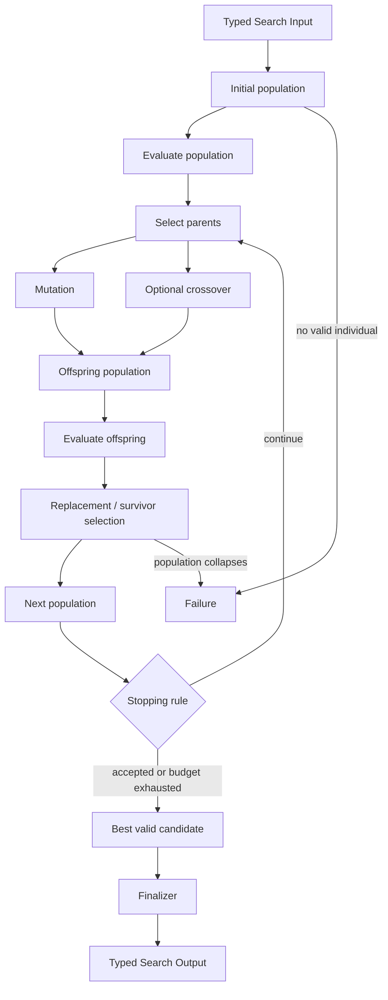

# Evolutionary / Population Search

## Intent

Use Evolutionary / Population Search when the Search should maintain several complete or partially complete candidates, repeatedly create variations of those candidates, evaluate the resulting population, and preserve a balance between quality and diversity over multiple generations.

Apply the [Agent or Program rule](../../../SKILL.md#choose-agent-or-program) to every authored operation in this pattern.

The canonical shape is:

```text
initialize population
→ evaluate
→ select parents
→ mutate and optionally crossover
→ evaluate offspring
→ choose survivors
→ repeat
```

The defining property is **population-level variation and replacement**.

Evolutionary Search is useful when:

- the design space is large or discrete;
- local gradients are unavailable;
- many qualitatively different candidates may work;
- mutation can produce useful neighboring candidates;
- recombination can sometimes merge complementary traits;
- one greedy lineage is likely to become trapped.

It is not simply “run many Agents in parallel.” The population must persist across generations, and later candidates must derive from earlier candidates through declared variation operators.

## Structure



A generation is a business-level barrier:

```text
all offspring required by the generation policy
are evaluated before survivor selection
```

A steady-state evolutionary variant may replace individuals one at a time, but the replacement policy must still be explicit.

## Core idea

Evolutionary Search maintains a set of candidate lineages.

Each generation applies four kinds of policy:

1. **Variation** — how new candidates are produced.
2. **Evaluation** — how candidate quality and feasibility are measured.
3. **Selection** — which candidates become parents.
4. **Replacement** — which candidates survive into the next population.

A minimal evolutionary loop can use mutation only:

```text
select one or more parents
→ generate bounded revisions
→ evaluate them
→ keep the best and some diversity
```

Crossover is optional.

Do not add crossover merely because the algorithm is called evolutionary. Recombination is useful only when candidate components can be combined coherently.

## Distinction from adjacent patterns

### Evolutionary Search versus Parallel Best-of-N

```text
Parallel Best-of-N:
    generate independent complete candidates once
    evaluate once
    select a winner

Evolutionary Search:
    candidates persist across generations
    offspring derive from selected parents
    evaluation guides repeated variation
```

Best-of-N is often a good generation-zero initializer.

### Evolutionary Search versus Evaluator–Optimizer

```text
Evaluator–Optimizer:
    one main candidate lineage
    explicit feedback produces the next revision

Evolutionary Search:
    several lineages coexist
    parent selection and replacement operate on a population
```

Use Evaluator–Optimizer when one candidate should be deeply revised.

Use Evolutionary Search when diversity across several lineages is valuable.

### Evolutionary Search versus Beam Search

```text
Beam Search:
    partial states advance one depth
    children extend parent decisions
    top k survive each level

Evolutionary Search:
    candidates may be complete designs
    mutation can change earlier components
    crossover may combine parents
    generations need not correspond to solution depth
```

### Evolutionary Search versus MCTS

```text
MCTS:
    decision tree
    visit counts and backed-up rollout values
    parent-child action paths

Evolutionary Search:
    population
    mutation / crossover
    fitness and replacement
```

### Evolutionary Search versus Mixture-of-Agents

```text
Mixture-of-Agents:
    fixed layers synthesize all prior-layer outputs

Evolutionary Search:
    selected parents generate offspring through variation
    the population is filtered and iterated
```

### Evolutionary Search versus Tournament

Tournament may be one **selection operator** inside Evolutionary Search.

It is not the whole evolutionary algorithm.

## Search interpretation

| Search concept | Meaning in this pattern |
|---|---|
| State | Current generation, population, fitness records, lineage, diversity data, incumbent, and remaining budget |
| Candidate | One individual: a plan, prompt, program, pipeline, configuration, artifact, or child Search result |
| Action | Initialize, mutate, crossover, evaluate, select, or replace |
| Observation | Offspring candidate, measured fitness, constraint result, novelty signal, or Failure |
| Score | Fitness plus optional feasibility, cost, novelty, or diversity terms |
| Aggregation | Build the evaluated population and choose survivors |
| Frontier | The current population and pending offspring |
| Stop condition | Acceptance threshold, generation limit, evaluation budget, no improvement, population collapse, or time/cost budget |
| Result | Best valid incumbent according to the declared final objective |

The candidate record is `Individual` in `search/agents/io.py`: `individual_id`, `generation`, `parent_id`, and the `config_json` genome. The evaluation record is `EvaluateIndividualOutput` in `search/programs/evaluate_individual.py`: `individual_id`, `output_dir`, `checkpoint_path`, and the one `score`.

The term `genome` means the declared mutable business representation of a candidate. It does not imply biological fidelity.

## What may be an individual

Examples:

```text
a training pipeline design
a data preparation recipe
a prompt
an Agent role configuration
a software patch
a model architecture
a set of hyperparameters
a research hypothesis
a complete Search-generated artifact
```

An individual should be representable as a typed immutable value plus artifact references.

Do not define an individual only as:

```text
a mutable directory
the current contents of shared workspace
an Agent conversation session
an arbitrary Python object
```

The candidate identity and lineage should remain explicit.

## Mapping to the AIBuildAI SDK

Typical mapping:

```text
Initializer Agent / child Search
    creates initial individuals

Mutation Agent
    creates one or more offspring from one parent

Crossover Agent
    creates offspring from two or more parents

Evaluator Composite / Program admitted by the selection guide / Agent for judgment
    measures fitness

Search
    owns generation loop, parent selection,
    survivor replacement, budget, and incumbent
```

At one generation:

```text
ctx.spawn(..., capture_failure=True) for independent mutation, crossover, and evaluation work
ctx.wait(...) for the required generation barrier
handle.result()
ordinary Python for selection and replacement
ctx.spawn(...) then handle.result() for finalizer
```

Do not add:

```text
EvolutionRuntime
PopulationExecutionContext
GenomeRegistry
GenerationEventStore
MutationScheduler
```

The durable execution layer owns execution. The Search owns the evolutionary algorithm.

## Genome and operator contracts

### Genome

The genome should expose components that operators may change. In this package the genome is the single `config_json` field on `Individual` in `search/agents/io.py`: one opaque JSON document, so mutation changes its content rather than a set of separately named components.

### Mutation

A mutation Output should state what changed; the real Output is `MutationOutput` in `search/agents/io.py`, carrying the `offspring` individuals and a `mutation_summary` sentence naming what changed.

The Search validates:

```text
parent identity
maximum offspring count
generation number
candidate schema
allowed mutation scope
```

### Crossover

A crossover Output should identify all parents. This package's Search uses mutation only: the genome is one opaque `config_json` document with no composable substructure to combine, so `search/agents/mutation.py` has no crossover counterpart.

Crossover is appropriate only when candidate substructures are composable.

For a monolithic prose answer, naive paragraph splicing is not meaningful crossover.

## Initialization

Possible initial population sources:

### Independent generation

Run diverse Agent roles or seeds.

### Existing candidates

Start from known baselines, previous artifacts, or supplied designs.

### Best-of-N

Generate and evaluate a broad first population.

### Hand-designed seeds plus variants

Preserve trusted baselines while exploring nearby designs.

### Recursive child Searches

Use several specialized child Searches to create initial individuals.

The initialization policy should intentionally create diversity.

Ten identical invocations with the same role and context are not a useful population.

## Parent selection

Common selection policies:

### Top-k / truncation

```text
choose the best k individuals
```

Simple but prone to rapid diversity collapse.

### Tournament selection

```text
sample a small group
choose its best member
repeat
```

Controls selection pressure without sorting the whole population every time.

### Rank-based selection

Use rank rather than raw fitness magnitude.

Helpful when score scales are unstable.

### Fitness-proportionate selection

Sample proportional to transformed fitness.

Use caution with negative values, extreme outliers, and arbitrary score scales.

### Elitism

Copy a small number of best individuals unchanged into the next generation.

Useful for preserving progress, but too much elitism freezes exploration.

### Novelty-aware selection

Reserve some parent slots for individuals that differ along declared business dimensions.

Do not use semantic embedding novelty by default. A typed strategy or component signature may be sufficient.

## Selection pressure

Selection pressure controls how strongly high-fitness candidates dominate parent choice.

Too little pressure:

```text
search behaves nearly randomly
```

Too much pressure:

```text
population converges early
diversity disappears
one evaluator error dominates all later generations
```

A simple design might use:

```text
one or two elites
tournament-selected parents
one diversity-reserved parent
```

State the rule explicitly.

## Mutation

Mutation should be bounded and intelligible.

Examples:

```text
replace one data source
change one training method
adjust one hyperparameter region
add or remove one pipeline stage
change one prompt instruction
rewrite one module
swap one tool strategy
revise one hypothesis assumption
```

A mutation Agent should receive:

```text
parent candidate
fitness diagnostics
allowed mutation scope
remaining generation budget
```

It should not receive permission to redesign the entire runtime.

Useful mutation policies:

### Blind mutation

Creates diversity without using evaluator feedback.

### Fitness-guided mutation

Uses diagnostics from the parent evaluation.

### Targeted mutation

Changes one declared weak component.

### Large mutation / restart

Creates a more distant candidate when the population stagnates.

Do not let every mutation rewrite every field; lineage then becomes meaningless.

## Crossover

Crossover combines components from multiple parents.

Example:

```text
Parent A:
    strong data recipe
    weak RL recipe

Parent B:
    weak data recipe
    strong RL recipe

Child:
    data recipe from A
    RL recipe from B
```

Crossover is justified when:

```text
candidate components are modular
parent strengths are identifiable
compatibility constraints can be checked
```

Crossover is risky when:

```text
components are tightly coupled
the candidate is one opaque artifact
combining parts breaks hidden assumptions
```

The child must be re-evaluated. Parent fitness does not transfer automatically.

## Fitness

Fitness should separate:

```text
feasibility
primary objective
secondary cost or risk
optional diversity / novelty
```

Prefer a lexicographic policy:

```text
feasible before infeasible
then primary objective
then cost
then stable ID
```

rather than one opaque weighted sum. This package's task metric is defined as higher-is-better, so `search.py` ranks individuals directly with `sorted(evaluated.items(), key=lambda item: item[1].score, reverse=True)`: one centralized ordering rule, with no separate feasibility or cost term.

## Objective fitness versus novelty

Novelty is not a substitute for task quality.

Possible policies:

### Quality-first with diversity reserve

Keep top-quality individuals plus a small number of diverse individuals.

### Multi-objective Pareto set

Retain individuals not dominated on quality, cost, and novelty.

More principled but more complex.

### Novelty only after feasibility

Reject invalid individuals before diversity selection.

### Stagnation-triggered diversity

Increase mutation distance only when improvement stalls.

For a minimal implementation, use:

```text
elitism
+
one declared diversity quota
```

Do not build a full quality-diversity archive unless the task requires it.

## Complete package

The folder beside this file holds a complete package for this pattern, activated by the repository gate through the real generated-definition loader on every change: `search/` is the authored layout (`search/__init__.py` exports `SEARCH_TYPE`; `search.py`, `io.py`, `agents/`, `programs/`, `prompts/agent/`), and `input_payload.json` is the Input that builds its `SEARCH_TYPE`. Read `search/search.py` for the control flow and `search/agents/io.py` for the typed boundaries. `InitializerAgent` and `MutationAgent` are the two roles that reason; `search/programs/evaluate_individual.py` is the authored fitness Program, since scoring one frozen configuration is mechanical, and the Search itself owns the population, the ranking, and the `producers` map that threads `upstream=` across generations.

## Evaluation pseudocode

Evaluating one generation spawns one `EvaluateIndividualProgram` per individual with `capture_failure=True` before waiting on any of them, then reads each result; the real helper is `_evaluate` in `search/search.py`, and every individual's `producers` entry is always a concrete Handle, never `None`, since the initial population and every offspring both have one.

The Search must define what happens to individuals whose evaluation fails.

## Generational versus steady-state

### Generational

```text
create a batch of offspring
evaluate the batch
replace the population at one barrier
```

Advantages:

```text
simple
deterministic generation boundaries
natural parallelism
easy reporting
```

### Steady-state

```text
create one or a few offspring
evaluate immediately
replace one or a few population members
```

Advantages:

```text
faster feedback
less idle capacity
```

But it makes replacement more sensitive to completion order and current population state.

For the first implementation, prefer generational evolution.

## Replacement

Replacement decides the next population.

A simple policy:

```text
1. keep elite_count best current/offspring individuals
2. fill most slots by fitness rank
3. reserve diversity_slots for distinct strategy signatures
4. use stable ID for final ties
```

Do not automatically replace the entire parent population with offspring.

A failed generation should not erase a valid incumbent.

## Lineage

Track:

```text
individual ID
parent IDs
generation
operator
mutation or crossover summary
artifact references
```

Lineage helps answer:

```text
which change improved the result
which parents produced the child
whether the population collapsed to clones
which operator is productive
```

Lineage is business metadata, not another ownership graph.

Every mutation/evaluation Execution still has one runtime owner: the Search.

## Diversity

Useful diversity dimensions may be:

```text
pipeline stage choices
method family
data source
model family
prompt strategy
architecture components
tool strategy
risk profile
```

Use exact typed signatures when possible. This package does not track one: `Individual` in `search/agents/io.py` carries one opaque `config_json` genome with no named components to sign, so `search.py` ranks purely by `score`; a diversity-aware variant would add a typed signature field to `Individual` and reserve some replacement slots for it.

This is cheaper and more interpretable than embedding every candidate.

## Stagnation

Stagnation means the incumbent has not improved for a declared number of generations.

Possible responses:

```text
increase mutation scale
inject one fresh random or baseline seed
reduce selection pressure
reserve more diversity slots
stop and return incumbent
```

Use at most one or two simple responses.

Do not build an adaptive evolutionary controller before the basic loop is proven useful.

## When to use

Use Evolutionary / Population Search when:

- several lineages should coexist;
- the candidate is naturally mutable;
- useful variation operators can be defined;
- objective or reliable evaluator fitness exists;
- exhaustive search is impossible;
- local search may become trapped;
- diversity has measurable value;
- candidates can be evaluated independently;
- several generations fit the budget;
- one candidate may combine modular strengths from others.

Typical examples:

```text
optimize prompts
search training-pipeline recipes
evolve model architectures
generate and refine research hypotheses
search software patches
evolve Agent role configurations
explore data/SFT/RL combinations
```

EvoPrompt connects LLM generation with evolutionary operators to optimize discrete prompts. EvoAgent applies mutation, crossover, and selection to evolve multi-Agent configurations. These illustrate how LLMs can implement variation operators, but the AIBuildAI Search remains responsible for population, budget, evaluation, and replacement.

## When not to use

Do not use this pattern when:

- one good candidate should simply receive iterative feedback;
- complete candidates are independent and one generation is enough;
- mutation cannot preserve useful structure;
- crossover has no coherent interpretation;
- fitness is unavailable or extremely noisy;
- the population is too expensive to evaluate;
- candidate identity exists only in mutable shared files;
- the task is naturally a decision tree;
- a fixed Beam or Best-First frontier is clearer;
- diversity is being added without a reason.

Choose:

- **Evaluator–Optimizer** for one revision lineage;
- **Parallel Best-of-N** for one generation of independent candidates;
- **Beam Search** for level-wise partial-state pruning;
- **MCTS** for visit-based decision trees;
- **Tournament** when the only problem is selecting among existing candidates.

## Budget and stopping

Declare:

```text
population size
initialization width
maximum generations
parents per generation
mutations per parent
crossover pairs
elite count
diversity slots
maximum total evaluations
maximum parallel children
acceptance threshold
stagnation limit
failure policy
```

A rough evaluation bound:

```text
initial_population
+
max_generations
× offspring_per_generation
```

excluding finalization and possible re-evaluation.

Stop when:

```text
acceptance threshold met
maximum generations
maximum evaluations
time or cost budget
stagnation limit
population has no feasible individual
variation produces no valid offspring
```

Keep the best valid incumbent throughout the run.

Do not return the last generation's first member.

## Failure policy

Distinguish:

```text
mutation Failure
crossover Failure
candidate evaluation Failure
infeasible candidate
valid low-fitness candidate
```

Possible policies:

```text
omit failed offspring
require a minimum offspring count
stop if the evaluator itself is mandatory and unavailable
preserve prior population after a failed generation
return incumbent if later generations fail
```

A Failure is not a mutation with low fitness.

An infeasible candidate may receive a declared feasibility penalty or be excluded before ranking.

Do not let failed evaluations silently become elite individuals.

## Recursive form

An individual may be produced or evaluated by a child Search.

Example:

```text
individual = one data/SFT/RL pipeline

mutation chooses to redesign the data stage
→ child DataSearch runs
→ returns one typed data recipe artifact
→ new individual incorporates that result
```

A task-specific child Search may be generated through `MetaAgent` when:

```text
one operator requires custom orchestration
no existing Search fits
```

The outer population treats the child Search Output as one candidate component or complete individual.

Do not generate a new Search definition for every ordinary mutation.

Do not expose a child Search's internal candidates as separate population members unless the contract explicitly flattens them.

## Useful hybrids

Evolutionary Search commonly combines with:

- **Best-of-N initialization**.
- **Tournament parent selection**.
- **Evaluator–Optimizer local improvement** for selected offspring.
- **Committee fitness evaluation**.
- **Router → different mutation operators**.
- **Map-Reduce evaluation** over benchmark sections.
- **child Search mutation operators**.
- **elitism + diversity reserve**.
- **Evolutionary Search followed by Finalizer**.
- **Island populations** only when there is a real reason to preserve separated subpopulations.

Avoid stacking every evolutionary variation at once.

## Common mistakes

### Calling repeated Best-of-N evolutionary

Without parent-derived variation and population replacement, it is repeated sampling.

### No persistent population

The next generation must depend on selected prior individuals.

### Mutation rewrites everything

Bound the mutation scope so lineage remains meaningful.

### Crossover by text concatenation

Combine declared candidate components, not arbitrary prose fragments.

### No diversity source

Different IDs are not diversity.

### Diversity replacing quality

Novel invalid candidates are still invalid.

### One opaque weighted fitness score

Prefer feasibility plus clear objective ordering.

### Evaluator drift across generations

Keep the fitness contract stable unless a planned curriculum is part of the Search.

### Excessive elitism

If most of the population is copied unchanged, exploration stops.

### No incumbent

Always preserve the best valid result found so far.

### Population stored only in directories

Use typed candidate and evaluation values with artifact references.

### Creating an Evolution runtime

Do not add a second scheduler, event store, or population manager.

### Completion-order replacement

Use a generation barrier and stable ranking in the basic form.

### Treating failed evaluation as poor fitness

Failure means no valid fitness record.

### Unbounded generations

Declare a hard generation and evaluation cap.

## Design checklist

Before selecting this pattern, answer:

```text
What exactly is one individual?
What typed fields form its genome?
How is the initial population made diverse?
What mutation operators are legal?
Is crossover meaningful?
What is fitness?
How is feasibility separated from quality?
How are parents selected?
How are survivors selected?
How much elitism is used?
How is diversity represented?
What is the population size?
What is the maximum generation and evaluation budget?
What is the stagnation policy?
What happens when variation or evaluation fails?
Why is this better than Best-of-N or Evaluator–Optimizer?
Which operators, if any, justify child Searches?
```

If useful mutation cannot be defined, do not use Evolutionary Search.

## References

- Guo et al., **Connecting Large Language Models with Evolutionary Algorithms Yields Powerful Prompt Optimizers (EvoPrompt)**: begins from a prompt population and iteratively applies LLM-enabled evolutionary operators and development-set selection. (https://arxiv.org/abs/2309.08532)
- Yuan et al., **EvoAgent: Towards Automatic Multi-Agent Generation via Evolutionary Algorithms**: applies mutation, crossover, and selection to extend expert Agents into diverse multi-Agent configurations. (https://arxiv.org/abs/2406.14228)
- Holland, **Adaptation in Natural and Artificial Systems**: foundational treatment of adaptation through populations, selection, and recombination. (https://mitpress.mit.edu/9780262581110/adaptation-in-natural-and-artificial-systems/)
