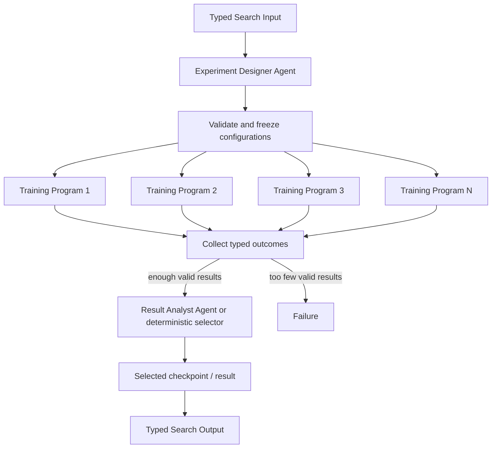

# Batch Training Configurations

## Intent

Use Batch Training Configurations when an Agent can define a bounded set of complete training specifications before execution, several Programs can run those specifications independently, and a later Agent or deterministic rule can compare the resulting checkpoints and metrics.

The shape is:

```text
one training objective
→ Designer Agent proposes N frozen configurations
→ N Training Programs execute independently
→ Analyst Agent or deterministic selector compares results
→ one selected result or a declared summary
```

This is an Agent–Program specialization of Parallel Best-of-N.

The important boundary is not that training uses code. It is that each training attempt has a closed procedure before launch:

```text
fixed source
fixed data contract
fixed configuration
fixed entry point
fixed artifact contract
fixed terminal classification
```

If a training attempt must interpret an unfamiliar failure, redesign the method, edit code, or choose a new experiment while it is running, that adaptive work belongs to an Agent outside the Program.

## Structure



The Designer finishes before any Training Program starts.

A Training Program does not revise its own configuration after reading metrics. A new configuration requires another Search-level decision, normally another Agent invocation or a later bounded round.

## Core idea

The pattern separates three responsibilities:

```text
Designer Agent:
    reason about the task
    choose meaningfully different configurations
    define what should be measured

Training Program:
    execute exactly one frozen configuration
    produce a checkpoint and structured metrics
    classify known terminal outcomes mechanically

Analyst Agent or deterministic selector:
    compare successful attempts
    interpret tradeoffs
    decide whether a result is scientifically or operationally preferable
```

Program is appropriate because training is expensive and resource-governed, but its control policy can be settled in advance.

The Program may contain ordinary branches for known outcomes:

```text
clean exit + checkpoint
nonzero exit + usable partial checkpoint
timeout + usable partial checkpoint
missing checkpoint
invalid metrics
```

It may not contain an open-ended policy such as:

```text
if loss looks strange:
    inspect the repository
    guess a new architecture
    edit the code
    restart with a different method
```

That is a new Agent decision, not error handling inside the Program.

## Distinction from adjacent patterns

### Batch Training versus generic Parallel Best-of-N

Parallel Best-of-N defines the topology:

```text
N substitutable candidates
→ one comparison
→ one winner
```

Batch Training fixes the execution-family split:

```text
Agent designs candidates
Programs execute them
Agent or deterministic code interprets them
```

Use the generic Best-of-N reference when candidates may be Agents, Composites, Programs, or child Searches.

Use this pattern when the candidate body is specifically a settled training execution and the Agent–Program boundary is the design question.

### Batch Training versus hyperparameter optimization inside one Program

A Program may execute a predeclared finite grid or a fully specified optimization algorithm.

It should not be given an open-ended mandate such as:

```text
keep trying configurations until the result looks good
```

Use one Program for the whole optimizer only when all of the following are fixed before launch:

```text
search space
proposal algorithm
evaluation contract
maximum trials
stopping rule
artifact retention rule
failure handling
```

When the next training idea depends on semantic interpretation of prior runs, keep the outer loop in Search and Agent.

### Batch Training versus Evolutionary Search

Batch Training normally has one frozen generation of independent configurations.

Evolutionary Search preserves a population across generations and creates descendants from selected parents.

A later Agent may use this batch as generation zero of an evolutionary design, but that is a hybrid.

### Batch Training versus one Agent running shell commands

An Agent may create source files, inspect the task, and run short investigative commands.

It should not remain alive merely to:

```text
launch one long fixed training command
poll it
read a checkpoint path
return the mechanically available metrics
```

Once the command and terminal contract are settled, that body is a Program.

## Search interpretation

| Search concept | Meaning in this pattern |
|---|---|
| State | Objective, frozen configuration set, terminal training outcomes, comparison evidence, and remaining budget |
| Candidate | One complete frozen training configuration and its resulting artifact |
| Action | Design configurations, launch one Training Program, or compare completed attempts |
| Observation | Training Output, Failure, checkpoint reference, metrics, resource use, or partial-result fact |
| Score | Shared validation metric or a typed multi-metric comparison |
| Aggregation | Collect attempts and select or summarize; do not merge checkpoints implicitly |
| Frontier | Training configurations not yet terminal |
| Stop condition | Required Programs are terminal and selection is complete, or the success floor cannot be met |
| Result | Selected checkpoint/result plus comparison evidence |

Candidate identity must be stable and independent of completion order.

The configuration record is `TrainingSpec` in `search/agents/io.py`: a stable `name`, the complete `config_json`, and a `rationale`.

The Program Output is `TrainConfigOutput` in `search/programs/train_config.py`: `spec_name`, `output_dir`, `checkpoint_path`, and the one `metric`.

The exact fields depend on the task. The invariant is one typed, comparable terminal contract.

## Mapping to the AIBuildAI SDK

Every Input, Output, and record type below is frozen and forbids extra fields; the listings omit the `model_config = ConfigDict(frozen=True, extra="forbid")` line.

Typical mapping:

```text
ExperimentDesignerAgent
    returns bounded TrainingSpec values

ConfigurationTrainingProgram
    Program[ConfigurationTrainingInput]
    implements the Program Action
    runs one frozen specification

ResultAnalystAgent
    compares successful typed results

Search
    owns fan-out, fan-in, success floor,
    selection, budget, and cancellation
```

Each Training Program receives an explicit `ExecutionCapability`.

The parent Search normally uses:

```text
ctx.spawn(Designer Agent) then handle.result()
ctx.spawn(each Training Program, capture_failure=True)
ctx.wait(all required Program Handles)
handle.result()
ctx.spawn(Analyst Agent) then handle.result()
```

Use `capture_failure=True` because one failed training attempt may be tolerated while other candidates remain valid.

Do not expose private evaluation data to the Designer or Training Programs merely because the parent later uses it for selection.

## Complete package

The folder beside this file holds a complete package for this pattern, activated by the repository gate through the real generated-definition loader on every change: `search/` is the authored layout (`search/__init__.py` exports `SEARCH_TYPE`; `search.py`, `io.py`, `agents/`, `programs/`, `prompts/agent/`), and `input_payload.json` is the Input that builds its `SEARCH_TYPE`. Read `search/search.py` for the control flow and `search/agents/io.py` for the typed boundaries. `search/programs/train_config.py` is the authored training Program with its frozen `TrainConfigInput`; `DesignerAgent` is the only role that reasons.

## Training Program contract

A Training Program should know before launch:

```text
which source to execute
which data to read
which configuration to apply
where artifacts must be written
which checkpoint forms are valid
which metrics must exist
how timeout and partial artifacts are classified
```

`search/programs/train_config.py` is the complete Program: it copies the fixed source, writes the frozen configuration, runs `train.py` once, and classifies a stop, a crash, and a missing artifact mechanically.

It does not diagnose why an arbitrary training method failed.

## Configuration diversity

The Designer should vary dimensions that plausibly affect the result:

```text
training recipe
data recipe
optimizer family
learning-rate region
schedule
regularization
seed
model component
objective weighting
```

Do not create nominal diversity by changing only IDs or formatting.

Every configuration must remain within:

```text
shared data boundary
shared final artifact contract
declared resource ceiling
shared comparison rule
```

The Agent should explain why each configuration differs.

The Program should not decide whether that difference is scientifically interesting.

## Selection and interpretation

Use deterministic selection when:

```text
one metric is authoritative
all hard constraints are machine-checkable
ties have a declared stable rule
```

Use an Analyst Agent when preference depends on:

```text
several metrics
quality versus cost tradeoffs
failure patterns
robustness concerns
scientific interpretation
whether another round is justified
```

The Analyst receives only terminal typed facts and allowed artifacts.

It does not rewrite the completed runs.

If it proposes another batch, the Search creates new Training Program invocations with new frozen Inputs.

## When to use

Use Batch Training Configurations when:

- training attempts are long-running or resource-heavy;
- each attempt can be fully specified before launch;
- attempts are independent within the batch;
- every valid result follows one comparable artifact and metric contract;
- several meaningfully different configurations are worth trying;
- failed attempts may be tolerated;
- design and interpretation require semantic judgment;
- the candidate count and total budget are bounded;
- Programs benefit from independent retry, cancellation, and resource isolation.

Typical examples:

```text
compare several SFT recipes
compare data mixtures under one model
run a fixed ablation set
evaluate several optimizer schedules
compare multiple seeds for a selected recipe
test several frozen post-training pipelines
```

## When not to use

Do not use this pattern when:

- the next configuration cannot be chosen until the previous result is interpreted;
- the training code is still being debugged;
- each attempt needs live human-like diagnosis;
- configurations depend on one another during execution;
- no shared evaluator or metric exists;
- one deterministic configuration is already sufficient;
- the candidate count cannot be bounded;
- training is trivial and does not deserve an independent Program boundary;
- one Program would internally invent and run arbitrary experiments.

Choose:

- **Worker–Iterator** when each result determines one next experiment;
- **Evaluator–Optimizer** when one primary configuration is revised using feedback;
- **Evolutionary Search** when a population persists across generations;
- **Sequential Chain** when training is one fixed stage of a larger pipeline;
- one Agent with tools when the work is still exploratory and short.

## Budget and stopping

Declare before execution:

```text
maximum configurations
minimum successful configurations
per-Program wall-clock budget
per-Program GPU/CPU/memory capability
total batch budget
shared metric and direction
hard artifact requirements
selection rule
budget-exhaustion behavior
```

The normal stopping rule is:

```text
all required Training Programs are terminal
and enough valid results exist
and selection is terminal
```

An early stop is valid only under a declared mechanical rule, for example:

```text
a result exceeds a fixed acceptance threshold
and remaining candidates cannot change the business decision
```

If the Search stops early, it must cancel every no-longer-needed direct child and wait for terminal cancellation records.

Do not cancel expensive Programs merely because an Agent informally prefers the current leader.

## Failure behavior

Distinguish:

```text
Program Failure
valid low-scoring result
valid partial result under a declared partial-artifact policy
invalid or missing artifact
Analyst failure
```

A nonzero training command may still produce an accepted partial artifact if the Program’s predeclared contract permits it.

An unexpected compiler error, dependency problem, or unfamiliar traceback is not something the Program should repair.

It returns a typed Failure or a typed partial result. A later Agent may diagnose it.

If the Analyst fails and deterministic selection is impossible, the Search normally fails rather than silently selecting by completion order.

## Recursive form

A Designer Agent may ask a child Search to produce one candidate specification when that design itself requires meaningful orchestration.

A Training Program remains a leaf.

Do not recursively create a Search inside the Program Action.

A batch may also appear inside a larger recursive Search:

```text
decompose objective
→ for one subproblem, design training candidates
→ run bounded batch
→ return one selected artifact
```

The parent sees one typed selected result, not the batch’s internal handles.

## Useful hybrids

Batch Training commonly combines with:

- **Sequential Chain**: data preparation → batch training → evaluation.
- **Best-of-N**: this pattern is a concrete Agent–Program form of it.
- **Evaluator–Optimizer**: select a batch winner, then refine it.
- **Evolutionary Search**: use the batch as generation zero or as one fitness wave.
- **Tournament**: compare checkpoints through staged evaluations.
- **Committee**: use several judges when semantic comparison is noisy.
- **Worker–Iterator**: an Agent chooses the next batch from prior evidence.
- **Ablation analysis**: the Designer freezes the ablation matrix before launch.

## Common mistakes

### Letting the Program tune itself semantically

A Program may follow a fixed optimizer.

It may not read arbitrary evidence and invent a different training strategy.

### Keeping an Agent alive to supervise training

If the Agent only launches, polls, and reports a fixed command, replace that body with a Program.

### Comparing incomparable metrics

Every candidate must use the same final evaluation contract.

### Treating Failure as a low score

Execution Failure and valid poor performance are different states.

### Selecting by completion order

Faster is better only when latency is the declared objective.

### Hiding configuration differences

Every candidate should have a typed specification and a meaningful declared distinction.

### Exposing held-out information

The Designer and Programs receive only the data permitted for candidate work.

### Returning while Programs remain active

All direct children must be terminal or explicitly cancelled before Search returns.

## Design checklist

Before selecting this pattern, answer:

```text
Why are the proposed configurations meaningfully different?
Can every attempt be completely specified before launch?
What exact artifact and metric contract makes results comparable?
Which terminal outcomes are mechanically classified by the Program?
Which failures return to an Agent for diagnosis?
What is the maximum batch size?
What is the minimum success count?
What resources does each Program receive?
What selects the winner?
When is another Agent-designed batch justified?
How are pending Programs handled at early stop?
```

If the training body still needs open-ended debugging or method selection, do not use this pattern yet.

## References

- [Parallel Best-of-N](../06-parallel-best-of-n/06-parallel-best-of-n.md)
- [Sequential Chain](../02-sequential-chain/02-sequential-chain.md)
- [Worker–Iterator](../10-worker-iterator/10-worker-iterator.md)
- [Evaluator–Optimizer](../11-evaluator-optimizer/11-evaluator-optimizer.md)
- [Evolutionary / Population Search](../20-evolutionary-population/20-evolutionary-population.md)
