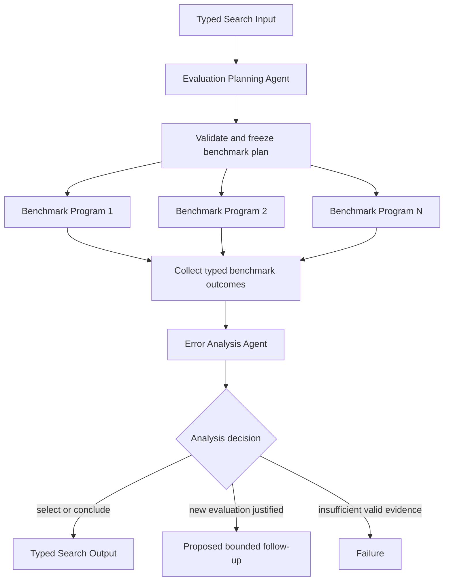

# Benchmark Evaluation and Error Analysis

## Intent

Use Benchmark Evaluation and Error Analysis when one or more candidate artifacts already exist, an Agent can settle a bounded evaluation plan, a Program can execute the fixed benchmark contract, and a later Agent must interpret the metrics, error slices, and operational tradeoffs.

The shape is:

```text
Evaluation Planning Agent
→ frozen benchmark plan
→ one or more Benchmark Programs
→ typed scores, predictions, and error artifacts
→ Error Analysis Agent
→ selected candidate, diagnosis, or follow-up proposal
```

The benchmark may be deterministic or stochastic.

The admission rule for Program is that the evaluation policy is closed before launch:

```text
candidate identity is fixed
benchmark dataset and split are fixed
metric implementation is fixed
decoding or runtime settings are fixed
seeds and repetitions are fixed
artifact schema is fixed
terminal outcomes are mechanically classified
```

The Program may compute sophisticated metrics and write large prediction artifacts.

It must not change the benchmark, reveal hidden labels to upstream Agents, weaken acceptance criteria, or invent a new evaluation after seeing the result.

## Structure



A follow-up evaluation is a new Search-level round with a newly validated plan.

A running Benchmark Program never edits its own plan.

## Core idea

This pattern separates three responsibilities:

```text
Evaluation Planning Agent:
    decide what evidence is relevant
    choose among offered benchmark profiles
    define candidate comparisons and requested slices
    explain why the plan answers the objective

Benchmark Program:
    run one frozen evaluation contract
    produce predictions and machine-computed metrics
    validate coverage and artifact integrity
    return typed evidence or Failure

Error Analysis Agent:
    interpret metric differences and failure modes
    connect slices to the original objective
    distinguish quality, robustness, and cost tradeoffs
    select a candidate or propose a bounded next evaluation
```

A low score is normally a valid observation.

It is not a Program `Failure` merely because the candidate performed poorly.

Program `Failure` means the evaluation operation could not produce the declared evidence, for example:

```text
benchmark process crashed
required prediction artifact is missing
coverage is incomplete beyond the allowed threshold
metric report is structurally invalid
candidate artifact cannot be loaded under the fixed profile
```

This distinction prevents result quality from being confused with execution health.

## Distinction from adjacent patterns

### Benchmark Evaluation versus Batch Training Configurations

Batch Training creates candidate checkpoints.

Benchmark Evaluation consumes already-produced candidates and measures them under a frozen evaluation contract.

A common composition is:

```text
Batch Training Configurations
→ selected or surviving checkpoints
→ Benchmark Evaluation and Error Analysis
```

Do not rerun training inside the Benchmark Program unless the benchmark contract explicitly defines training as part of evaluation.

### Benchmark Evaluation versus Parallel Best-of-N

Parallel Best-of-N defines a substitutable-candidate topology and normally chooses one winner.

This pattern specializes the evidence boundary:

```text
Program computes benchmark evidence
Agent interprets the evidence
```

The final decision may be a winner, but it may instead be:

```text
candidate A is strongest overall
candidate B is safer on a critical slice
neither candidate meets the acceptance floor
another targeted benchmark is required
```

Use deterministic selection when one authoritative scalar and stable tie rule fully determine preference.

Use an Analysis Agent when several metrics or semantic error categories matter.

### Benchmark Evaluation versus Agent Debugging with a Test Program

A test contract often has a hard acceptance rule:

```text
pass or fail
```

A benchmark usually produces graded evidence:

```text
accuracy
loss
latency
calibration
slice metrics
resource use
```

A benchmark result can motivate revision, but it should not silently become a repair loop. A new candidate version requires an Agent decision and a new child invocation.

### Benchmark Evaluation versus Simulation Parameter Sweep

Simulation Sweep studies a parameterized system and interprets jointly generated observations.

Benchmark Evaluation measures candidate artifacts against a reference task or evaluator.

A simulator may itself be benchmarked, but the business meaning differs:

```text
simulation:
    what behavior emerges under these parameters?

benchmark:
    how well does this candidate satisfy this fixed evaluation contract?
```

### Benchmark Evaluation versus one Agent using tools

One Agent is sufficient when evaluation is short, exploratory, and tightly coupled to immediate inspection.

Use a Benchmark Program when evaluation is:

```text
long-running
resource-governed
repeated across candidates
blind or access-controlled
artifact-heavy
independently retryable or cancellable
```

The Agent should not remain alive merely to poll a settled benchmark command and copy numeric results.

## Search interpretation

| Search concept | Meaning in this pattern |
|---|---|
| State | Objective, candidate references, frozen benchmark plan, terminal outcomes, analysis, and remaining budget |
| Candidate | One artifact evaluated under one benchmark profile |
| Action | Plan evaluation, run one Benchmark Program, aggregate evidence, or analyze errors |
| Observation | Metric report, prediction artifact, slice table, runtime facts, or Program Failure |
| Score | One declared primary metric plus optional typed components |
| Aggregation | Join outcomes by stable candidate and benchmark IDs; never by completion order |
| Frontier | Candidate/profile pairs not yet terminal |
| Stop condition | Required evaluations are terminal and analysis is complete, or the evidence floor cannot be met |
| Result | Selected candidate or synthesized evaluation artifact with supporting evidence |

Candidate identity and benchmark identity must both be stable.

A useful key is:

```text
(candidate_id, benchmark_id, repetition_id)
```

The Search must reject duplicate keys before spawning work.

## Mapping to the AIBuildAI SDK

Every Input, Output, and record type below is frozen and forbids extra fields; the listings omit the `model_config = ConfigDict(frozen=True, extra="forbid")` line.

The frozen plan is `EvaluationPlanOutput` in `search/agents/io.py`: a tuple of `BenchmarkTarget` values (`evaluation_id`, `candidate_id`, `candidate_path`, `benchmark_id`, `seed`, `repetitions`), a `primary_metric`, a `metric_direction`, `requested_slices`, and a `rationale`.

The Agent chooses only from benchmark IDs and slice IDs offered by Search Input.

It must not return:

```text
arbitrary evaluator source
arbitrary shell command
hidden-label path
unbounded repetitions
undeclared metric implementation
new capability outside the Search grant
```

The Program Output is `BenchmarkOutput` in `search/programs/benchmark.py`: `evaluation_id`, `candidate_id`, `benchmark_id`, `primary_score`, `metric_components`, a tuple of `SliceMetric` values, `artifact_dir`, `predictions_path`, `report_path`, `evaluated_examples`, `expected_examples`, and `wall_clock_seconds`.

Large predictions, confusion tables, and per-example diagnostics stay in artifacts.

The Output contains bounded summaries and explicit paths.

Typical Search mapping:

```text
EvaluationPlanningAgent
    returns a bounded BenchmarkPlan

BenchmarkProgram
    Program[BenchmarkInput]
    executes one target

ErrorAnalysisAgent
    receives successful outcomes and explicit failures

Search
    validates plan, owns fan-out/fan-in,
    enforces the evidence floor, and returns SearchOutput
```

The parent normally uses:

```text
ctx.spawn(Evaluation Planning Agent) then handle.result()
ctx.spawn(each Benchmark Program, capture_failure=True)
ctx.wait(required Program Handles)
handle.result()
ctx.spawn(Error Analysis Agent) then handle.result()
```

Use `capture_failure=True` when some candidate evaluations may fail without invalidating the entire comparison.

## Complete package

The folder beside this file holds a complete package for this pattern, activated by the repository gate through the real generated-definition loader on every change: `search/` is the authored layout (`search/__init__.py` exports `SEARCH_TYPE`; `search.py`, `io.py`, `agents/`, `programs/`, `prompts/agent/`), and `input_payload.json` is the Input that builds its `SEARCH_TYPE`. Read `search/search.py` for the control flow and `search/agents/io.py` for the typed boundaries. `EvaluationPlanningAgent` freezes the benchmark plan and `ErrorAnalysisAgent` interprets the terminal evidence; `search/programs/benchmark.py` is the authored evaluation Program that runs one frozen target and never revises it.

Deterministic selection remains preferable whenever one scalar metric is authoritative; `search/search.py` uses `ErrorAnalysisAgent` because several metrics, slices, and failure patterns can matter to the choice. Reverse the numeric direction for a minimized metric, and do not spend an Agent call to rediscover an exact ordering already defined by policy.

## Benchmark Program contract

Before launch, the Program must know:

```text
candidate artifact and immutable identity
benchmark dataset or evaluator profile
allowed data visibility
metric implementation and version
requested slices
seed and repetitions
time and resource ceilings
prediction and report locations
coverage and validity requirements
```

The Program is `BenchmarkProgram` in `search/programs/benchmark.py`: it runs the fixed benchmark evaluator as a subprocess, classifies a stop, a crash, or a missing report mechanically, rejects coverage below the declared requirement, and only then reads the report into a typed `BenchmarkOutput`.

The Program may parse known evaluator outputs.

It does not semantically explain why the candidate failed on a slice.

## Benchmark integrity

The Search must preserve evaluation integrity.

### Hidden data boundary

If labels or private test data are hidden from candidate-producing Agents, keep them hidden from:

```text
Planning Agent
candidate artifact
candidate-generating Search
```

The parent Search puts the private path only in the Benchmark Program's Input, never in any Agent Input. Capability carries resource grants only.

Return only allowed aggregate evidence.

### Fixed metric version

Record the evaluator version or digest in the report.

Do not compare candidates evaluated by silently different metric implementations.

### Stable coverage

Every result should state:

```text
expected examples
evaluated examples
skipped examples
known rejection reasons
```

A high score on an incomplete subset must not be treated as a complete benchmark.

### Stochastic evaluation

When decoding or runtime behavior is stochastic, freeze:

```text
seed policy
repetitions
aggregation rule
confidence or dispersion summary
```

Do not let an Agent rerun only unfavorable candidates until a preferred result appears.

## Error analysis

The Analysis Agent should receive enough evidence to reason without receiving unbounded raw output in its initial prompt.

A useful bounded view includes:

```text
primary and component metrics
largest positive and negative slice differences
coverage facts
latency and resource facts
paths to prediction and error artifacts
explicit failed evaluations
```

The Agent may inspect selected artifact paths when needed.

It should distinguish:

```text
statistically weak difference
material regression on a critical slice
metric improvement caused by lower coverage
quality versus latency tradeoff
candidate defect versus evaluator defect
```

A follow-up proposal is not self-authorizing.

The Search validates it and starts a new bounded round.

## When to use

Use Benchmark Evaluation and Error Analysis when:

- candidate artifacts already exist;
- evaluation is long-running or resource-heavy;
- a fixed benchmark contract can be declared before launch;
- blind or access-controlled evaluation matters;
- several candidates or profiles should be compared consistently;
- large prediction and diagnostic artifacts are produced;
- partial evaluation failures can be represented explicitly;
- semantic interpretation of multiple metrics or error slices is useful;
- evaluation count, repetitions, and total budget are bounded.

Typical examples:

```text
compare trained checkpoints on a blind holdout
measure quality and latency across serving profiles
evaluate a code candidate with a fixed benchmark suite
compare decoding policies under one model artifact
analyze robustness across declared dataset slices
```

## When not to use

Do not use this pattern when:

- the benchmark itself is still being invented interactively;
- the Agent must choose every next probe from the previous example-level result;
- evaluation is a trivial deterministic function already present in Search;
- the candidate changes while the Program is running;
- no shared metric or evidence contract exists;
- private evaluation data would leak through Agent Inputs;
- one Agent can complete a short exploratory check more simply;
- the Program would silently modify the candidate to improve its score.

Choose:

- **Agent Debugging with a Test Program** when hard checks drive iterative repair;
- **Batch Training Configurations** when the missing work is candidate creation;
- **Simulation Parameter Sweep** when runs jointly study a system rather than score artifacts;
- **Worker–Iterator** when evaluation targets must be selected one at a time;
- deterministic Python when the final decision is an exact numeric ordering.

## Budget and stopping

Declare before execution:

```text
maximum evaluations
maximum repetitions per evaluation
minimum successful evaluations
per-Program resource limits
total evaluation budget
primary metric and direction
coverage requirement
allowed slices
final selection or synthesis rule
budget-exhaustion behavior
```

The normal stop is:

```text
all required Benchmark Programs are terminal
and the evidence floor is met
and analysis or deterministic selection is terminal
```

An early stop is valid only under a predeclared mechanical rule.

If early stopping makes remaining Programs irrelevant, cancel them and wait for terminal cancellation records.

## Failure behavior

Distinguish:

```text
valid low score
valid partial report permitted by policy
candidate load incompatibility
benchmark process Failure
invalid report
coverage failure
Analysis Agent failure
```

Never convert a poor metric into infrastructure Failure.

Never hide failed candidate evaluations from the Analysis Agent.

If analysis fails and deterministic selection is not defined, return Failure rather than selecting by completion order.

## Recursive form

A child Search may produce one candidate or one benchmark plan when that subproblem requires meaningful orchestration.

The Benchmark Program remains a leaf.

Do not start a recursive Search from `Program.run()`.

A larger Search may use this pattern as a promotion gate:

```text
produce candidates
→ benchmark survivors
→ promote one result
→ recurse on the promoted artifact
```

The parent receives one typed result and explicit evidence references.

## Useful hybrids

Benchmark Evaluation commonly combines with:

- **Sequential Chain**: prepare candidate → benchmark → report.
- **Batch Training Configurations**: train several checkpoints, then benchmark them.
- **Tournament**: run increasingly expensive benchmark stages.
- **Committee**: interpret subjective or noisy error artifacts with several judges.
- **Evaluator–Optimizer**: use benchmark evidence to revise a candidate.
- **Worker–Iterator**: choose later benchmark profiles from earlier evidence.
- **Map-Reduce**: evaluate a very large benchmark through independent shards.

## Common mistakes

### Letting the planner choose arbitrary evaluator code

The Agent should select from offered benchmark profiles and bounded parameters.

The parent owns the mapping to executable code.

### Treating low quality as Program Failure

A completed benchmark with a low score is valid evidence.

### Comparing incomplete coverage

Always preserve coverage facts and reject or label partial evidence according to policy.

### Leaking hidden labels

Do not place private paths or example-level labels in upstream Agent Inputs.

### Selecting by completion order

Join and sort by stable IDs.

### Repeating until the preferred candidate wins

Freeze repetitions and seed policy before execution.

### Asking an Agent to reproduce exact arithmetic

Compute metrics and deterministic order in code. Use the Agent for interpretation.

## Implementation checklist

Before implementing, verify:

```text
[ ] candidate IDs and paths are immutable
[ ] benchmark profiles are a closed offered set
[ ] private evaluation data stays behind the Program boundary
[ ] metric version and direction are declared
[ ] seeds and repetitions are frozen
[ ] every evaluation has a stable ID
[ ] every Action call declares `upstream=` with its direct producers
[ ] Program Outputs include coverage and artifact paths
[ ] low scores remain successful observations
[ ] partial failures have an explicit evidence floor
[ ] analysis receives failed evaluations explicitly
[ ] deterministic selection replaces Agent selection when sufficient
[ ] cancellation and budget exhaustion are defined
[ ] final output is adapted to SearchOutput
```

## Compact design template

```text
Pattern:
    Benchmark Evaluation and Error Analysis

Planning Agent:
    chooses bounded benchmark profiles and requested slices

Program:
    evaluates one immutable candidate/profile pair

Analysis Agent:
    interprets metrics, slices, failures, and tradeoffs

State:
    plan + benchmark outcomes + analysis

Fan-out:
    one Program per validated evaluation target

Fan-in:
    collect by stable evaluation ID

Failure policy:
    tolerate declared partial failures;
    never confuse low score with execution Failure

Stop:
    evidence floor met and selection/analysis terminal

Result:
    selected candidate or synthesized report adapted to SearchOutput
```

## Key invariant

The benchmark policy is frozen before execution, the Program reports what happened, and only an Agent or predeclared deterministic rule decides what the evidence means.

## References

- [Sequential Chain](../02-sequential-chain/02-sequential-chain.md)
- [Map-Reduce](../05-map-reduce/05-map-reduce.md)
- [Tournament](../07-tournament/07-tournament.md)
- [Committee / Voting](../08-committee-voting/08-committee-voting.md)
- [Worker–Iterator](../10-worker-iterator/10-worker-iterator.md)
- [Evaluator–Optimizer](../11-evaluator-optimizer/11-evaluator-optimizer.md)
- [Batch Training Configurations](../21-batch-training-configurations/21-batch-training-configurations.md)
