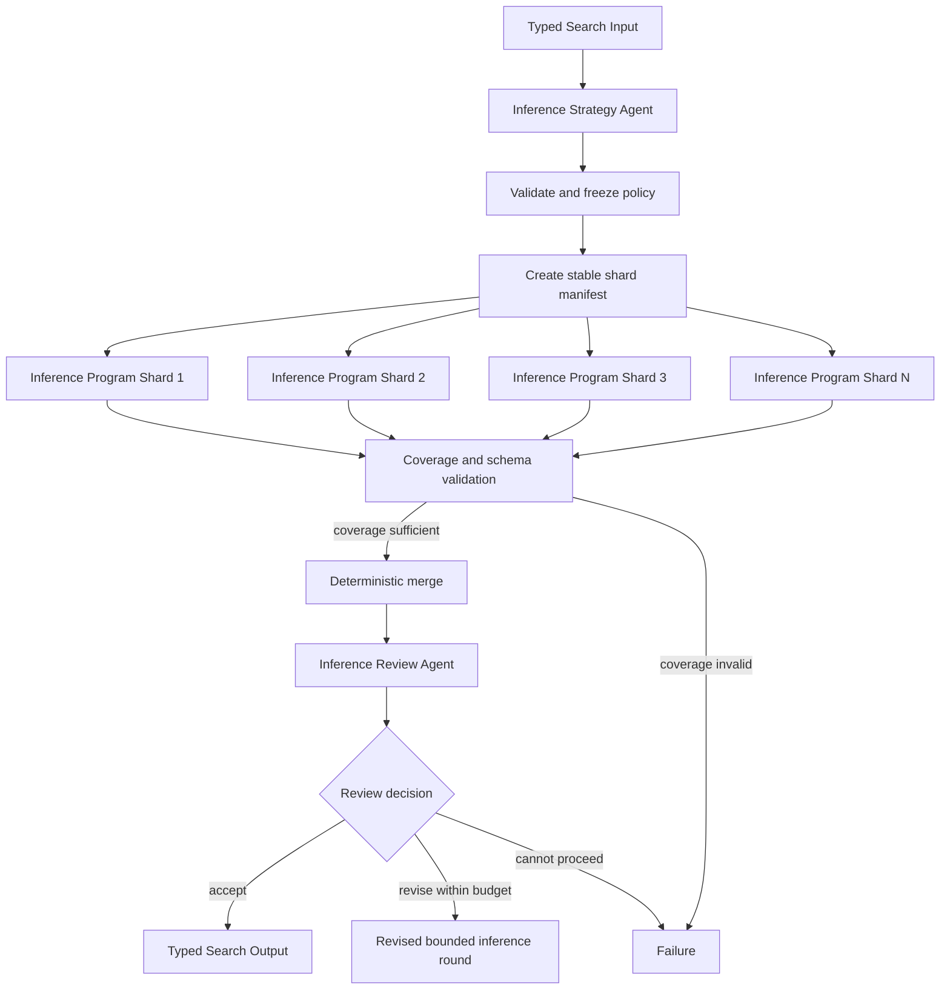

# Sharded Batch Inference and Review

## Intent

Use Sharded Batch Inference and Review when an Agent can settle one bounded inference policy, a large input collection can be partitioned into stable shards, several Programs can apply the policy independently, and a later Agent must interpret aggregate quality, failures, uncertainty, or coverage.

The shape is:

```text
Inference Strategy Agent
→ frozen model, prompt, decoding, and shard policy
→ N Inference Programs process disjoint shards
→ deterministic coverage and merge step
→ Inference Review Agent
→ accept, revise the policy, or stop
```

This is an Agent–Program specialization of Map-Reduce.

The map body is mechanical because every inference Program knows before launch:

```text
which immutable model or endpoint to use
which exact prompt/template or preprocessing policy to apply
which records belong to its shard
which decoding parameters and seeds apply
which output schema is required
which retry and terminal rules are allowed
```

The Program may execute stochastic model inference.

It must not reinterpret the objective, rewrite the prompt after seeing outputs, move records between shards opportunistically, or choose a new model while the Program Action is running.

## Structure



The shard manifest is fixed before any Program starts.

A revised prompt, model, decoding policy, or shard definition creates a new Search-level round with new Program Inputs.

## Core idea

The pattern separates:

```text
semantic inference design
from
large-scale repetitive execution
from
semantic review
```

The Strategy Agent decides:

```text
which offered model or endpoint fits the objective
which prompt/template or preprocessing profile should be used
which output fields are required
which decoding settings are justified
which uncertainty or confidence facts should be recorded
whether the input should be sampled or fully covered
```

The parent Search decides or validates:

```text
stable record IDs
shard count and membership
resource allocation
maximum attempts
coverage floor
merge ordering
```

Each Inference Program:

```text
reads only its assigned records
applies the frozen policy uniformly
writes one shard output artifact
reports record-level terminal categories mechanically
returns bounded coverage and quality facts
```

The Review Agent interprets:

```text
whether output quality is adequate
which error categories dominate
whether failures are systematic or isolated
whether confidence or disagreement requires another round
whether a different bounded policy should be tried
```

The Program is not a hidden autonomous Agent.

It executes a fixed inference contract at scale.

## Distinction from adjacent patterns

### Sharded Batch Inference versus generic Map-Reduce

Map-Reduce provides the topology:

```text
partition
→ map independently
→ reduce
```

This pattern fixes the execution-family boundary:

```text
Agent freezes semantic inference policy
Programs apply it to shards
code verifies and merges coverage
Agent interprets the aggregate
```

Use generic Map-Reduce when map and reduce stages may be any WorkUnit family.

Use this reference when the main design question is whether a large inference pass is sufficiently settled to become Program work.

### Sharded Batch Inference versus Dataset Materialization and Review

Dataset Materialization transforms source records into a new dataset under fixed cleaning or normalization rules.

Batch Inference applies a model or scoring procedure and produces predictions, generations, embeddings, rankings, or annotations.

The output may later become a dataset, but the primary contract here is model execution:

```text
record
→ fixed model policy
→ typed inference result
```

### Sharded Batch Inference versus Simulation Parameter Sweep

A simulation sweep varies parameters across runs to study a response surface.

Batch inference normally keeps one policy fixed and varies only the assigned input records.

If each shard uses a different model or decoding policy, the design is no longer a pure shard map. It may be a Program batch, Best-of-N comparison, or experiment sweep.

### Sharded Batch Inference versus Parallel Best-of-N

Shards are complementary coverage, not competing candidates.

Every valid shard is normally required to construct the complete output.

Do not select the "best shard."

### Sharded Batch Inference versus one Agent using tools

An Agent may inspect samples, design a prompt, and run short probes.

It should not remain alive merely to:

```text
apply the same settled policy to millions of records
poll a long inference process
copy shard paths
count machine-classifiable failures
```

Use Programs when scale, isolation, independent retry, or durable shard artifacts matter.

### Sharded Batch Inference versus an adaptive inference Program

A Program may apply fixed retry logic for known transient failures.

It should not:

```text
inspect generations semantically
rewrite the prompt
switch models
change temperature for difficult examples
invent a new output schema
ask an Agent for help from inside the Program Action
```

Return typed outcomes. The parent Search and Review Agent decide what happens next.

## Search interpretation

| Search concept | Meaning in this pattern |
|---|---|
| State | Objective, frozen inference policy, shard manifest, shard outcomes, merged artifact, review, and remaining rounds |
| Candidate | One policy version or one record-level inference result |
| Action | Design policy, execute one shard, validate coverage, merge, or review |
| Observation | Shard artifact, coverage facts, category counts, latency, Program Failure, or review decision |
| Score | Optional quality proxy, agreement, confidence, latency, or downstream metric |
| Aggregation | Validate unique record coverage, then merge in stable record order |
| Frontier | Shards not yet terminal |
| Stop condition | Required coverage is merged and review accepts, or round/budget limits are reached |
| Result | Complete inference artifact plus policy and review evidence |

The shard identity and record identity are both business values.

Do not use completion order as output order.

## Mapping to the AIBuildAI SDK

Every Input, Output, and record type below is frozen and forbids extra fields; the listings omit the `model_config = ConfigDict(frozen=True, extra="forbid")` line.

The frozen policy is `InferencePolicy` in `search/agents/io.py`: a `policy_id`, the chosen `model_id`, `prompt_profile`, and `decoding_profile`, and the `max_input_chars` bound a record must fit under.

The Agent selects only from closed offered values supplied by Search Input.

It must not return:

```text
arbitrary executable source
arbitrary endpoint URL
secret credentials
unbounded prompt text when a profile is required
undeclared model ID
unbounded token or retry budget
```

A stable shard is `ShardSpec` in `search/agents/io.py`: a `shard_id` and its `first_record_index` and `record_count` within the manifest.

Each shard Program's Output is `ShardOutput` in `search/programs/shard.py`: `shard_id`, `output_path`, `completed_records`, and `oversized_records`.

There is no separate merge class: ordinary code in `search/search.py` folds every shard's `ShardOutput` into a `ShardRecord` (`search/agents/io.py`), and `validate_coverage` checks the full set against the declared record count and the oversized-record floor before the review Agent runs.

Large per-record outputs remain in each shard's own file inside the round's shared directory.

Typical SDK mapping:

```text
InferenceStrategyAgent
    returns one bounded policy

InferenceProgram
    Program[InferenceShardInput]
    processes one immutable shard

ordinary Search code
    creates manifest, checks coverage, and merges outputs

InferenceReviewAgent
    interprets merged evidence and may propose another policy
```

The parent normally uses:

```text
ctx.spawn(Inference Strategy Agent) then handle.result()
ctx.spawn(one Program per shard, capture_failure=True)
ctx.wait(all required Handles)
handle.result()
ordinary coverage validation and merge
ctx.spawn(Inference Review Agent) then handle.result()
```

Use `capture_failure=True` only with a tolerated-missing policy.

For complete batch output, a shard that is still failed after its `capability.retry` runs is terminal Failure for the round.

## Complete package

The folder beside this file holds a complete package for this pattern, activated by the repository gate through the real generated-definition loader on every change: `search/` is the authored layout (`search/__init__.py` exports `SEARCH_TYPE`; `search.py`, `io.py`, `agents/`, `programs/`, `prompts/agent/`), and `input_payload.json` is the Input that builds its `SEARCH_TYPE`. Read `search/search.py` for the control flow and `search/agents/io.py` for the typed boundaries. `InferenceStrategyAgent` freezes the policy, `InferenceShardProgram` applies it to one stable shard at a time in parallel, and `InferenceReviewAgent` judges the merged evidence and may send the Search into another bounded round.

Shard retries belong to the runtime: `capability.retry` repeats the frozen shard Input. The Search does not recover shards itself and does not ask an Agent to diagnose shard failures inside the round.

If a failure requires semantic adaptation, stop the current round and return evidence to an Agent.

## Inference Program contract

Before launch, each Program must know:

```text
immutable policy ID and model reference
immutable shard manifest and digest
fixed preprocessing and prompt profile
fixed decoding profile and seed policy
fixed output schema
allowed transient retry classes
artifact paths
record-level terminal categories
```

`InferenceShardProgram.run()` in `search/programs/shard.py` reads its exact manifest slice, writes one record per line for every record that fits under `max_input_chars`, and counts the rest as the one known failure category, `oversized_records`.

The Program may stop cooperatively and return a declared partial artifact only when the parent policy permits partial shards.

Otherwise an incomplete shard is invalid evidence.

## Shard design

### Stable membership

Create shard membership from immutable record IDs and a declared algorithm.

Examples:

```text
contiguous ranges in canonical order
stable hash modulo shard count
precomputed manifest files with digests
```

Do not shard by process timing or mutable filesystem enumeration order.

### Balanced work

Equal record counts may not imply equal work.

When estimated lengths or costs are known, create balanced manifests before launch.

The Strategy Agent may recommend a shard profile, but ordinary code should enforce limits and stable membership.

### Idempotent outputs

A shard retry should either:

```text
overwrite only its own versioned artifact
or
write a new attempt artifact selected by parent policy
```

Never append blindly to a shared output from several Programs.

### Deterministic merge

The reducer should:

```text
verify policy IDs and manifest digests
verify every expected record appears at most once
apply the declared missing-record policy
sort by canonical record ID
write one immutable merged artifact
```

This step normally does not require an Agent.

## Prompt and decoding policy

An Agent may design a semantic prompt or choose a prompt profile.

Before Programs launch, freeze:

```text
exact template or template digest
system and user field mapping
few-shot examples or example-set digest
decoding parameters
maximum output length
stop conditions
structured-output parser version
```

A Program must not patch the prompt for "hard" records based on semantic inspection.

Use a later Agent/Search round for policy changes.

## Review behavior

The Review Agent receives bounded aggregate facts such as:

```text
coverage and failure counts
latency and token statistics
schema-validity rate
confidence or agreement summaries
largest machine-derived error categories
paths to sampled outputs and full artifacts
```

It may inspect a bounded sample or artifact path.

It should not receive the entire output corpus inline.

The review's verdict is `ReviewOutput` in `search/agents/io.py`: `accepted`, a `score`, and a `reason` that names the next policy change when the round is rejected.

Requested changes remain advisory until the next strategy Output passes validation.

## When to use

Use Sharded Batch Inference and Review when:

- one inference policy can be fully specified before a batch starts;
- the input is large enough that sharding materially helps;
- shards are independent under the frozen policy;
- stable record IDs and complete coverage can be verified;
- inference is long-running, GPU-heavy, or artifact-heavy;
- independent retry and failure isolation are useful;
- outputs can follow one typed schema;
- semantic review of aggregate quality or error patterns is needed;
- shard count, rounds, tokens, and total resource use are bounded.

Typical examples:

```text
run a model over a large evaluation corpus
generate embeddings for a fixed dataset
produce structured predictions for every test record
apply one frozen labeling model at scale
run a fixed reranker over many query-document pairs
```

## When not to use

Do not use this pattern when:

- the next prompt or model must be chosen after every individual output;
- records depend on previous records in a serial conversation;
- shard outputs write to shared mutable state without safe partitioning;
- the input is too small to justify Program boundaries;
- the output schema remains exploratory;
- the Agent must inspect and repair every record interactively;
- one Program can execute the whole batch more simply and within limits;
- shard membership cannot be made stable;
- the Program would choose models or prompts dynamically from semantic output.

Choose:

- **Worker–Iterator** for inherently serial adaptive inference;
- **Dataset Materialization and Review** for fixed data transforms without model inference;
- **Parallel Best-of-N** when policies compete rather than shards complement one another;
- **Benchmark Evaluation and Error Analysis** when the primary objective is candidate scoring;
- one Program when independent shard boundaries add no value.

## Budget and stopping

Declare before execution:

```text
maximum policy rounds
shard count
per-shard wall-clock and resource limits
shard retry limit
maximum output tokens per record
maximum total token or compute budget
allowed failed-record count or rate
coverage requirement
merge policy
review acceptance and budget-exhaustion behavior
```

The normal stop is:

```text
all required shards are terminal
and coverage is valid
and merge is complete
and review accepts
```

If the Search starts another policy round, retain the prior policy, manifests, and artifacts for lineage.

Do not overwrite evidence from the previous round.

## Failure behavior

Distinguish:

```text
known record-level failure
valid shard with permitted failed records
incomplete shard
Program Failure
coverage failure
duplicate record
merge failure
Review Agent failure
```

A known record-level parse failure may be a successful Program observation when the contract records it explicitly.

An unknown exception that prevents a trustworthy shard report is Program Failure.

A shard Program failure should not silently remove those records from the merged corpus.

## Recursive form

A child Search may design one inference policy or process one semantically complex subset.

The individual Inference Program remains a leaf.

Do not recursively load a Search from `Program.run()`.

A parent recursive Search may assign separate domains to child Searches, each of which performs its own sharded inference and returns one typed merged artifact.

## Useful hybrids

Sharded Batch Inference commonly combines with:

- **Map-Reduce**: this pattern is a concrete inference specialization.
- **Sequential Chain**: materialize inputs → infer → benchmark outputs.
- **Benchmark Evaluation**: score the merged predictions after coverage validation.
- **Committee**: compare several frozen inference policies on a bounded subset.
- **Evaluator–Optimizer**: revise the policy from review evidence.
- **Worker–Iterator**: expand or target later shards from earlier aggregate evidence.
- **Tournament**: promote only selected policies to a full-corpus inference pass.

## Common mistakes

### Letting each shard choose its own policy

All shards in one batch must share the same frozen policy unless the Search explicitly models a policy experiment.

### Treating shards as candidates

Shards provide complementary coverage. Merge them; do not choose a winner.

### Using completion order as record order

Merge by canonical record identity.

### Hiding missing records

Coverage must be explicit and machine-verified.

### Sharing one append-only output file

Each Program writes isolated artifacts. The reducer merges them.

### Rewriting prompts inside Program

Return quality facts to an Agent and start a new policy round.

### Passing secrets or arbitrary endpoints from Agent Output

The parent owns model and endpoint mappings.

### Embedding the entire corpus in Agent Input

Pass bounded summaries and artifact references.

## Implementation checklist

Before implementing, verify:

```text
[ ] the inference policy is closed and versioned
[ ] model, prompt, decoding, parser, and seed policies are frozen
[ ] record IDs are stable
[ ] shard membership is deterministic and digestible
[ ] every Program writes isolated artifacts
[ ] shard Outputs include policy and manifest identities
[ ] known record failures are typed separately from Program Failure
[ ] coverage, duplicates, and missing records are checked in code
[ ] merge order is deterministic
[ ] retries repeat frozen Input only
[ ] semantic changes create a new round
[ ] review receives bounded facts and artifact paths
[ ] round, shard, token, and resource budgets are explicit
[ ] final merged artifact is adapted to SearchOutput
[ ] every Action call declares its direct upstream Action occurrences
```

## Compact design template

```text
Pattern:
    Sharded Batch Inference and Review

Strategy Agent:
    freezes one bounded inference policy

Program:
    applies that policy to one immutable shard

Reducer:
    validates complete unique coverage and merges deterministically

Review Agent:
    interprets aggregate quality and proposes accept/revise

State:
    policy + shard manifest + outcomes + merged artifact + review

Fan-out:
    one Program per shard

Fan-in:
    coverage validation and stable merge

Failure policy:
    explicit record failures, shard failures, retries, and coverage floor

Stop:
    valid merge accepted or bounded rounds exhausted

Result:
    merged inference artifact adapted to SearchOutput
```

## Key invariant

One policy is frozen for one batch, every Program owns exactly one stable shard, and only the parent Search and Agents may decide to change the policy or launch another round.

## References

- [Sequential Chain](../02-sequential-chain/02-sequential-chain.md)
- [Map-Reduce](../05-map-reduce/05-map-reduce.md)
- [Tournament](../07-tournament/07-tournament.md)
- [Committee / Voting](../08-committee-voting/08-committee-voting.md)
- [Worker–Iterator](../10-worker-iterator/10-worker-iterator.md)
- [Evaluator–Optimizer](../11-evaluator-optimizer/11-evaluator-optimizer.md)
- [Benchmark Evaluation and Error Analysis](../25-benchmark-evaluation-and-error-analysis/25-benchmark-evaluation-and-error-analysis.md)
