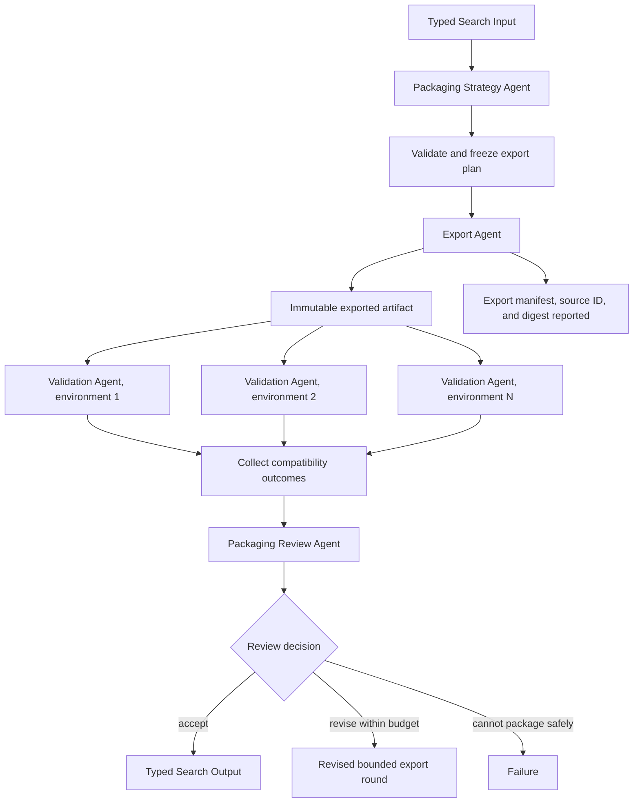

# Model Export and Compatibility Validation

## Intent

Use Model Export and Compatibility Validation when an Agent can choose a bounded deployment or interchange profile, an export role can convert an immutable source artifact under that frozen profile, fresh validation roles can execute fixed compatibility checks through a `validate` Action run once per target, and a later Agent must interpret failures or tradeoffs before accepting the packaged result.

The shape is:

```text
Packaging Strategy Agent
→ frozen export and compatibility plan
→ Export Agent
→ immutable packaged artifact, path and digest reported
→ Validation Agent, one fresh per compatibility profile, in parallel
→ Packaging Review Agent
→ accept, revise the plan, or stop
```

Typical targets include:

```text
ONNX export
TorchScript export
TensorRT engine build
quantized checkpoint packaging
portable tokenizer/model bundle
runtime-specific serialized artifact
```

The exact technologies are task-specific.

The Program boundary is valid only when the conversion and validation policies are closed before launch:

```text
source checkpoint is immutable
export target and version are fixed
shape and precision profiles are fixed
allowed conversion options are fixed
validation environments are offered and bounded
numeric tolerance is fixed
artifact and report contracts are fixed
terminal outcomes are mechanically classified
```

A Program may run a complex compiler or converter.

It must not diagnose an arbitrary graph failure semantically, edit model source, weaken tolerances, or switch targets after reading the result.

## Structure



The source artifact is never modified in place.

Every revised plan constructs a new export role, so a new round creates a new export artifact and new validation roles rather than reusing a rejected round's artifact.

## Core idea

This pattern separates:

```text
semantic packaging choices
from
mechanical conversion
from
mechanical compatibility measurement
from
semantic release judgment
```

The Strategy Agent decides:

```text
which offered target fits the deployment objective
which precision and shape profiles are appropriate
which compatibility environments matter
which quality, size, and latency tradeoffs should be examined
which optional conversion features should be enabled
```

The parent Search validates:

```text
target belongs to the offered set
all options are bounded and typed
source identity is preserved
requested environments are available
resource estimates fit the grant
numeric tolerances are not weakened
```

The export role:

```text
runs one fixed converter profile
writes an immutable packaged artifact
reports source ID, source digest, and tool versions
validates required files and hashes
returns a typed export result or Failure
```

Each validation role, spawned once per compatibility profile:

```text
receives the exported artifact path and digest by Input and checks the digest first
loads the exported artifact in one fixed environment profile
runs declared smoke, shape, numeric, and performance checks
writes a structured report
returns pass/fail facts or Failure
```

The Review Agent interprets:

```text
whether all hard environments pass
whether numeric drift is acceptable
whether size or latency gains justify quality changes
whether a failed environment suggests a different offered profile
whether another bounded export round is justified
```

## Distinction from adjacent patterns

### Export and Compatibility versus Sequential Chain

Sequential Chain provides the fixed ordering:

```text
plan
→ export
→ validate
→ review
```

This pattern specializes the execution-family boundaries and artifact invariants:

```text
Agent chooses a bounded plan
Program converts
Programs validate fixed environments
Agent interprets the release decision
```

Use the general chain when stages are not specifically packaging and compatibility work.

### Export and Compatibility versus Evaluator-Optimizer

Both may loop after fixed validation fails.

The candidate here is a generated package derived from an immutable source artifact and a versioned export plan.

A new round normally changes bounded packaging parameters:

```text
opset or target profile
precision
shape ranges
converter option
runtime profile
```

It should not become an unrestricted code-debugging loop unless an Agent is explicitly authorized to revise source implementation.

If source code itself must be repaired, compose with an Evaluator-Optimizer loop (pattern 11) as a separate stage.

### Export and Compatibility versus Dataset Materialization and Review

Dataset Materialization applies a record transformation policy.

Export converts a model or executable artifact and must preserve semantic behavior within declared tolerances.

The central evidence is not row acceptance. It is:

```text
artifact integrity
load compatibility
numeric equivalence
shape support
latency, memory, and size
```

### Export and Compatibility versus Benchmark Evaluation

Compatibility checks answer whether the artifact can run correctly under a target contract.

Benchmark Evaluation measures task quality under a reference evaluation.

A package may pass compatibility while losing task quality.

A complete release workflow often runs both:

```text
compatibility validation
and
quality benchmark
```

Do not treat one as a substitute for the other.

### Export and Compatibility versus one generic shell role

Do not create a universal role whose Input contains:

```text
converter command
runtime command
environment variables
parser source
```

Give each role the closed profiles it applies and the fixed toolchain it runs; the strategist chooses business options, not executable machinery.

### Export and Compatibility versus one role doing everything

One export role and one fresh validation role per environment profile give each profile:

```text
its own Action and its own Attempt history
parallel scheduling when the Search spawns every validation at once
independent retry of one failed environment without repeating export
a separate report per environment
partial compatibility evidence when some environments fail and others do not
```

Every validation role is handed the exported artifact's path and digest by Input, so none can read anything but the artifact the export role committed, and the digest check is the first thing each does.

## Search interpretation

| Search concept | Meaning in this pattern |
|---|---|
| State | Objective, source identity, export plan, export artifact, compatibility outcomes, review, and remaining rounds |
| Candidate | One immutable export artifact produced by one plan version |
| Action | Propose plan, export, validate one environment, or review |
| Observation | Export manifest, hash facts, validation report, performance facts, or Program Failure |
| Score | Optional quality, latency, size, memory, or composite release metric |
| Aggregation | Join validation outcomes by export ID and environment ID |
| Frontier | Compatibility profiles not yet terminal for the current export |
| Stop condition | Hard compatibility obligations pass and review accepts, or bounded rounds are exhausted |
| Result | Accepted export artifact with source identity and validation evidence |

A source artifact, export plan, and exported artifact each require separate immutable identities.

## Mapping to the AIBuildAI SDK

Every Input, Output, and record type below is frozen and forbids extra fields; the listings omit the `model_config = ConfigDict(frozen=True, extra="forbid")` line.

The bounded export plan is `PackagingStrategyOutput` in `search/agents/io.py`: the chosen `target_profile`, `precision_profile`, `shape_profile`, `converter_options`, `compatibility_profiles`, and `tolerance_profile`, each drawn from the Search Input's offered sets, plus a `rationale`. The Agent selects from values offered by Search Input.

It must not return:

```text
arbitrary command
arbitrary Python import path
untrusted plugin location
secret credentials
unbounded environment matrix
custom numeric tolerance outside offered profiles
source mutation instructions hidden in options
```

The export is one `ExportAgent` per round (`search/agents/export.py`), constructed from the accepted plan: its `ExportInput` carries the immutable `source_checkpoint_path`, the `toolchain_dir`, and the plan's target, precision, shape, and converter options. It declares `task_environment=True`, is granted the card, runs the fixed `export.py` once, and returns `ExportOutput` with the artifact directory and the artifact's SHA-256 digest. A failed export returns a Failure the Search captures.

Each validation is one fresh `ValidationAgent` (same module) per entry in `plan.compatibility_profiles`, spawned together and joined with one `await self.ctx.wait(handles)`. Its `ValidationInput` carries the artifact directory and digest the export role reported, the environment profile, and the tolerance profile; it checks the digest first, runs the fixed `validate.py` under that one profile, and returns `ValidationOutput`: `environment_profile`, `loaded`, `hard_passed`, `maximum_relative_error`. A compatibility failure such as `loaded=False` is a successful Output when the role executed the declared validation and measured incompatibility; a Failure means the validation itself could not produce a trustworthy report. A CPU profile is granted no GPU; a CUDA profile is granted one.

`PackagingStrategyAgent` still returns one bounded plan before the export starts, and `PackagingReviewAgent` still interprets the terminal export and validation evidence after every validation has settled; the Search itself validates plans, capabilities, round bounds, this fan-out/fan-in, and the final adaptation to `SearchOutput`.

## Complete package

The folder beside this file holds a complete package for this pattern, activated by the repository gate through the real generated-definition loader on every change: `search/` is the authored layout (`search/__init__.py` exports `SEARCH_TYPE`; `search.py`, `io.py`, `agents/`, `prompts/agent/`), and `input_payload.json` is the Input that builds its `SEARCH_TYPE`. Read `search/search.py` for the control flow and `search/agents/io.py` for the typed boundaries. `PackagingStrategyAgent` and `PackagingReviewAgent` are the two reasoning roles; `ExportAgent` and `ValidationAgent` run the fixed toolchain between them.

## Export and validation contracts

Before launch, the export role must know:

```text
source artifact path, ID, and digest
target and converter version
precision and shape profiles
closed converter options
output layout
manifest and hash requirements
```

Before launch, each validation role must know:

```text
the artifact directory and digest the export reported
its one environment profile and tolerance profile
fixed test vectors and manifest digest
fixed shape and smoke checks
fixed performance measurement protocol
report schema
```

Neither role interprets an unfamiliar traceback and redesigns the export or the check.

An artifact that cannot load is a measured compatibility outcome when the validation itself ran correctly.

## Artifact identity and source records

Every accepted package should record:

```text
source artifact ID and digest
export plan ID
export artifact ID and digest
converter name and version
closed option set
precision and shape profiles
validation environment profiles
validation report digests
creation timestamp or run identity
```

Do not infer source identity from directory names alone.

Do not overwrite the source checkpoint or a previous export attempt.

## Numeric equivalence

Compatibility is not only "loads successfully."

Declare before execution:

```text
reference implementation
input test vectors
dtypes and shapes
absolute and relative tolerances
aggregation rule
NaN/Inf policy
unsupported-case policy
```

The Strategy Agent may choose among offered tolerance profiles.

It may not invent a looser value after seeing drift.

When approximate conversion is expected, record the tradeoff explicitly and use a downstream quality benchmark before release.

## Environment matrix

Environment profiles should be parent-owned values such as:

```text
cpu-reference
cuda-current
cuda-previous
serving-runtime-v2
edge-runtime-arm64
```

Each profile maps to known runtime code and a narrowed capability.

The Agent should not return arbitrary container images, hosts, or installation commands.

## Review behavior

The Review Agent should distinguish:

```text
converter execution failure
valid artifact with incompatibility
numeric drift
unsupported dynamic shape
performance regression
non-blocking warning
missing mandatory environment
```

It receives bounded reports plus artifact paths.

It should not be allowed to declare acceptance when a deterministic hard gate fails.

The Review Agent's typed Output is `PackagingReviewOutput` in `search/agents/io.py`: `accepted`, `retry`, a comparable `score`, and the `reason` behind the decision. Recommendations become effective only through a new validated plan.

## When to use

Use Model Export and Compatibility Validation when:

- a source model or artifact already exists;
- target choice requires domain or deployment judgment;
- conversion can be fully specified before launch;
- conversion is long-running, resource-heavy, or crash-prone;
- several runtime environments should be checked consistently;
- source identity and hashes matter;
- numeric equivalence and shape support are machine-checkable;
- independent retry and failure isolation are useful;
- tradeoffs require semantic review;
- targets, environments, rounds, and resources are bounded.

Typical examples:

```text
export a checkpoint to ONNX and validate CPU/CUDA runtimes
build a TensorRT engine for several fixed shape profiles
package a quantized model and verify drift and memory use
create a portable model/tokenizer bundle and smoke-test loaders
compile a serving artifact and compare target-runtime latency
```

## When not to use

Do not use this pattern when:

- the source artifact is still being trained or debugged in the same Program;
- target requirements are unknown and require open-ended environment exploration;
- the converter must edit arbitrary model source semantically;
- one trivial serialization call is already the final deterministic result;
- compatibility checks cannot be stated before execution;
- the Agent would supply arbitrary commands or runtime images;
- no immutable source identity or artifact contract exists;
- the Search would silently weaken tolerances after failure;
- one Program can perform the small fixed export and check more simply.

Choose:

- **Agent Debugging with a Test Program** when source code must be repaired;
- **Benchmark Evaluation and Error Analysis** when task quality is the main question;
- **Sequential Chain** when packaging is one fixed stage without semantic review;
- **Parallel Best-of-N** when several export artifacts compete under one exact scalar rule;
- deterministic Python when conversion is trivial and local.

## Budget and stopping

Declare before execution:

```text
maximum export rounds
maximum compatibility profiles per round
per-Program wall-clock and resource limits
total conversion budget
mandatory and optional environments
numeric tolerance profiles
performance measurement repetitions
hard acceptance gate
review and budget-exhaustion behavior
```

The normal stop is:

```text
export artifact is valid
and all mandatory compatibility obligations are terminal
and the deterministic hard gate passes
and review accepts
```

A new round must create a new plan ID and export ID.

## Failure behavior

Distinguish:

```text
export role Failure
valid export with warnings
valid incompatibility result
validation role Failure
missing mandatory validation
numeric hard-gate failure
performance tradeoff
Review Agent failure
```

Do not convert a measured incompatibility into infrastructure Failure.

Do not treat an exporter crash as evidence that the target is semantically incompatible unless the fixed contract defines that classification.

If review fails and hard deterministic acceptance is insufficient, return Failure rather than releasing by default.

## Recursive form

A child Search may select one export profile when deployment design itself requires meaningful orchestration.

The export and validation roles remain leaves.

A larger recursive Search may package several independently produced components and then compose their accepted manifests.

## Useful hybrids

Export and Compatibility commonly combines with:

- **Sequential Chain**: train → select checkpoint → export → validate → benchmark.
- **Agent Debugging**: repair unsupported source operations, then retry export.
- **Benchmark Evaluation**: verify task quality after conversion.
- **Orchestrator–Workers**: validate many environment profiles independently.
- **Tournament**: promote only compatible exports to expensive quality benchmarks.
- **Committee**: review complex release tradeoffs with several domain judges.
- **Worker–Iterator**: add targeted environment checks after earlier evidence.

## Common mistakes

### Passing arbitrary commands from the Agent

Use closed business profiles mapped by the parent to known Program classes and toolchains.

### Mutating the source artifact

Every export is derived from an immutable source and written separately.

### Weakening tolerances after seeing drift

Tolerances are frozen before validation.

### Treating load success as full compatibility

Check numeric behavior, shapes, required cases, and declared performance facts.

### Treating incompatibility as Program Failure

A validator that runs and reports `loaded=False` has produced valid evidence.

### Hiding missing environments

Mandatory profiles must be explicit in the hard gate.

### Dynamically detecting and accepting the current host

Validate against declared environment profiles, not whatever runtime happens to be visible.

### Overwriting failed attempts

Preserve plan, artifact, and report lineage across rounds.

## Implementation checklist

Before implementing, verify:

```text
[ ] source ID, path, and digest are immutable
[ ] target, precision, shape, options, and tolerance profiles are closed
[ ] Agent Output contains no arbitrary executable machinery
[ ] the export role writes a versioned isolated artifact
[ ] export manifest records tool versions and digest
[ ] compatibility environments are a bounded offered set
[ ] each validation has a stable ID
[ ] incompatibility is separated from a role's Failure
[ ] numeric and coverage gates are deterministic
[ ] mandatory environments cannot be overridden by review prose
[ ] new plans create new export artifacts
[ ] rounds and resources are bounded
[ ] final accepted artifact is adapted to SearchOutput
[ ] every Action call declares `upstream=` with its direct producers
```

## Compact design template

```text
Pattern:
    Model Export and Compatibility Validation

Strategy Agent:
    chooses one bounded export and environment plan

Export Agent:
    converts one immutable source artifact once,
    reports its path and digest

Validation Agent (one fresh per environment profile):
    checks the reported artifact under one fixed environment profile

Review Agent:
    interprets tradeoffs and proposes accept/revise

State:
    source + plan + export + validation matrix + review

Fan-out:
    one validation role per compatibility profile, spawned together

Fan-in:
    join by export and validation IDs

Hard gate:
    artifact integrity + mandatory environments + numeric obligations

Stop:
    hard gate passes and review accepts, or rounds exhaust

Result:
    accepted packaged artifact adapted to SearchOutput
```

## Key invariant

Agents may choose among bounded packaging policies, but only the fixed toolchain performs the conversion and the checks, and no review may rewrite the source artifact or weaken a declared compatibility obligation after observing the result.

## References

- [Sequential Chain](../02-sequential-chain/02-sequential-chain.md)
- [Tournament](../07-tournament/07-tournament.md)
- [Orchestrator–Workers](../09-orchestrator-workers/09-orchestrator-workers.md)
- [Worker–Iterator](../10-worker-iterator/10-worker-iterator.md)
- [Evaluator–Optimizer](../11-evaluator-optimizer/11-evaluator-optimizer.md)
- [Evaluator-Optimizer](../11-evaluator-optimizer/11-evaluator-optimizer.md)
- [Benchmark Evaluation and Error Analysis](../25-benchmark-evaluation-and-error-analysis/25-benchmark-evaluation-and-error-analysis.md)
