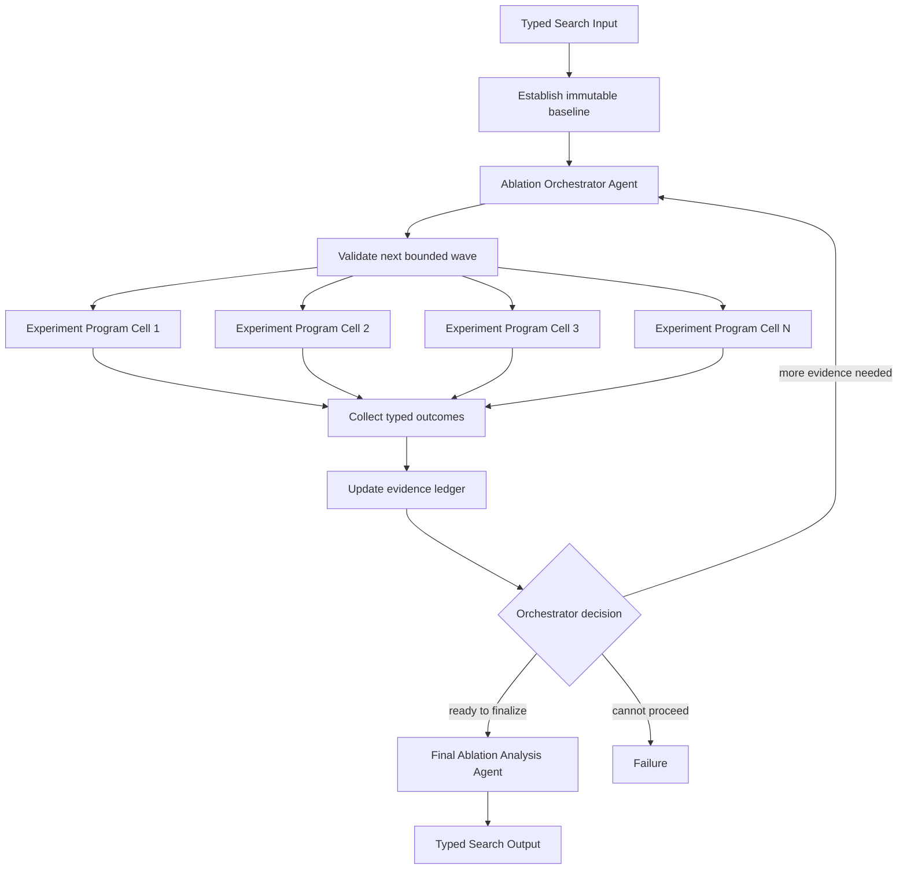

# Adaptive Ablation Waves

## Intent

Use Adaptive Ablation Waves when the complete ablation matrix should not be fixed in advance, because the next informative experiment depends on prior results, but every individual experiment can become a fully specified Program before it starts.

The shape is:

```text
Ablation Orchestrator Agent proposes one bounded wave
→ Experiment Programs execute frozen ablation cells
→ deterministic metric collection and lineage checks
→ Orchestrator Agent interprets the wave
→ propose another wave or finalize
→ Final Analysis Agent synthesizes component evidence
```

This is a concrete scientific specialization of Program-centered Orchestrator–Workers.

The high-level study is adaptive.

Each experiment is not.

Before a Program starts, its cell must have a closed contract:

```text
base artifact or source version is fixed
factor changes are explicit
training and evaluation recipe is fixed
seeds and repetitions are fixed
resource ceiling is fixed
metric and artifact contract is fixed
terminal outcomes are mechanically classified
```

The Program must not inspect its own score and choose another ablation, edit the method, or change the acceptance metric.

## Structure



The baseline is a named immutable evidence record, not an informal memory of the first run.

Every later cell declares exactly how it differs from a baseline or prior accepted parent.

## Core idea

Ablation studies contain two different kinds of work:

```text
scientific design and interpretation
and
mechanical experiment execution
```

The Orchestrator Agent decides:

```text
which uncertainty remains important
which factor or interaction should be tested next
whether a replicate is more informative than a new factor
which bounded wave best separates competing explanations
whether existing evidence is sufficient to finalize
```

The parent Search validates:

```text
cell count and total-work bounds
factor names and allowed values
baseline and parent identities
one-cell lineage
seed and repetition policy
resource feasibility
metric comparability
no duplicate cell without declared replicate intent
```

Each Experiment Program:

```text
materializes one frozen ablation cell
runs the declared training/evaluation procedure
writes checkpoint, metric, source, and tool-version artifacts
returns one typed result or Failure
```

The evidence ledger preserves:

```text
what was changed
relative to which parent
which source and data versions were used
which seeds ran
what metrics and artifacts resulted
which failures occurred
```

The Final Analysis Agent interprets main effects, interactions, uncertainty, and limits.

It does not retroactively change completed experiments.

## Distinction from adjacent patterns

### Adaptive Ablation Waves versus Batch Training Configurations

Batch Training freezes all configurations before launch.

Adaptive Ablation Waves chooses later cells from earlier evidence.

```text
Batch:
    design N configurations once
    run all N
    compare

Adaptive waves:
    design bounded Wave 1
    run and interpret
    design bounded Wave 2 or stop
```

Use Batch Training when the ablation matrix is known and affordable upfront.

Use adaptive waves when evidence should determine which experiments are worth spending next.

### Adaptive Ablation Waves versus Simulation Parameter Sweep

Simulation Sweep normally evaluates a predeclared grid or design.

Adaptive Ablation Waves changes the experimental design between waves and is centered on component removal, replacement, or interaction evidence.

A simulation study can use adaptive waves, but the Program body remains a simulator rather than a training/evaluation experiment.

### Adaptive Ablation Waves versus Evolutionary Search

Evolutionary Search optimizes a population through selection and mutation.

Ablation analysis aims to explain causal or functional contribution under a controlled comparison.

The best-performing cell is not necessarily the most informative cell.

Do not turn ablation into unconstrained architecture search.

### Adaptive Ablation Waves versus Worker–Iterator

Worker–Iterator often chooses one next action after every observation.

Ablation Waves chooses a bounded set of independent cells that can run in parallel, then reasons over the wave jointly.

Use a serial iterator when each experiment must wait for exactly one predecessor.

### Adaptive Ablation Waves versus Orchestrator–Workers

This pattern specializes every experimental worker as a Program with a frozen cell.

Use generic Orchestrator–Workers when a wave may also contain exploratory Agents, literature Searches, or other adaptive children.

### Adaptive Ablation Waves versus Agent Debugging

Debugging tries to repair a candidate until it satisfies checks.

Ablation tries to measure which components or interactions explain behavior.

A failed experiment may require diagnosis, but the study should not silently mutate that cell until it passes. Record the failure and let the Orchestrator decide whether a repaired rerun is methodologically valid.

## Search interpretation

| Search concept | Meaning in this pattern |
|---|---|
| State | Objective, immutable baseline, factor space, completed waves, evidence ledger, failures, unresolved questions, and remaining budget |
| Candidate | One frozen ablation cell or one scientific explanation |
| Action | Propose a wave, execute one cell, aggregate evidence, or finalize analysis |
| Observation | Cell metrics, artifacts, uncertainty facts, resource use, or Program Failure |
| Score | Shared metric plus optional uncertainty and resource components; information value may guide planning |
| Aggregation | Append outcomes to a lineage-aware evidence ledger |
| Frontier | Validated cells in the current wave |
| Stop condition | Orchestrator finalizes, hard evidence goals are met, or wave/experiment budget is exhausted |
| Result | Ablation report and selected supporting artifact adapted to SearchOutput |

The evidence ledger must contain business values only.

Do not store Handles, live WorkUnits, subprocess objects, or mutable runtime state in it.

## Mapping to the AIBuildAI SDK

Construct the Orchestrator Agent once and spawn it again each wave when later work needs the same identity state; a fresh identity spawns once. Put `upstream=` on each `ctx.spawn` call, not on the identity constructor. A Handle names the exact spawned Action.

## Complete package

The folder beside this file holds a complete package for this pattern, activated by the repository gate through the real generated-definition loader on every change: `search/` is the authored layout (`search/__init__.py` exports `SEARCH_TYPE`; `search.py`, `io.py`, `agents/`, `programs/`, `prompts/agent/`), and `input_payload.json` is the Input that builds its `SEARCH_TYPE`. Read `search/search.py` for the control flow and `search/agents/io.py` for the typed boundaries. `search/programs/cell.py` is the authored experiment Program; `OrchestratorAgent` plans each wave from the ledger and `AnalystAgent` writes the report.

## Experiment Program contract

Before launch, each Experiment Program must know:

```text
cell and parent IDs
immutable source and data versions
complete factor values
training and evaluation profiles
seed set and repetitions
artifact requirements
metric implementation and direction
resource and stop policy
known terminal categories
```

`search/programs/cell.py` is the complete Program: it copies the fixed source, writes the frozen configuration, runs `train.py` once, and classifies a stop, a crash, and a missing artifact mechanically.

The Program executes the declared cell even when early metrics look unfavorable, unless a predeclared mechanical early-stop rule fires.

## Baseline discipline

The baseline must be explicit and reproducible.

Record:

```text
baseline cell ID
source version
data version
factor values
training and evaluation profiles
seed set
metric implementation
artifact digest
```

If the baseline is rerun, distinguish:

```text
same baseline specification, new replicate
from
changed baseline specification
```

Do not silently replace the baseline with a later stronger configuration.

## Cell validation

Before launching a wave, validate every cell.

### Closed factor space

Every factor name and value must belong to the parent-owned factor space.

The Agent may not invent a new component or source patch through free text.

### Explicit lineage

Every non-baseline cell names a parent whose evidence exists.

The Search materializes the full factor-value vector and checks the declared changes.

### Duplicate policy

A repeated factor signature is allowed only when it is an explicit replicate with a new seed set or declared repetition purpose.

### Comparability

Cells intended for direct comparison should preserve:

```text
same data version
same evaluator
same metric direction
compatible seed policy
comparable resource policy
```

If a wave changes several factors at once, label it as an interaction or composite test rather than attributing the result to one component.

## Scientific design

Adaptive selection can save budget, but it can also bias interpretation.

The Search and Agents should preserve methodological discipline.

### Main effects

A one-factor change from a common parent supports a clean local comparison.

### Interactions

When one factor's effect depends on another, propose explicit factorial or paired cells.

Do not infer interaction from unrelated branches with different data or seed policies.

### Replication

When observed differences are near noise scale, another seed or repetition may be more informative than a new factor.

The Orchestrator should receive dispersion and completed-seed facts.

### Negative results

A cell that performs worse is still useful evidence.

Do not discard it merely because it is not a winning candidate.

### Multiple adaptive looks

Repeatedly choosing the next experiment from prior results increases the risk of overinterpretation.

Preserve the full ledger and let final analysis state which hypotheses were predeclared versus adaptively generated.

## Orchestrator behavior

A useful Orchestrator Input includes:

```text
objective and evidence goals
immutable baseline
closed factor space
completed cell summaries
failed cells
metric uncertainty
remaining waves and cells
resource budget
```

It returns either:

```text
ready_to_finalize=True and no new cells
```

or:

```text
ready_to_finalize=False
at least one unresolved question
one bounded set of valid cells
```

The Agent should explain what each proposed cell discriminates.

The Search validates the explanation only structurally; it validates execution facts exactly.

## Final analysis

The Final Analysis Agent should distinguish:

```text
observed main effects
possible interactions
noise-limited conclusions
failed or incomplete cells
resource confounds
adaptively proposed hypotheses
results that do not generalize beyond the tested setting
```

It should not simply rank cells by score.

The Output is `AnalystOutput` in `search/agents/io.py`: `best_cell`, `report_path`, and the `conclusion`.

The report artifact may contain tables, lineage diagrams, and effect summaries.

## When to use

Use Adaptive Ablation Waves when:

- the objective is explanatory rather than pure optimization;
- later informative cells depend on earlier evidence;
- each cell becomes fully specified before execution;
- experiments are long-running or resource-heavy;
- several cells in one wave can run independently;
- an immutable baseline and closed factor space exist;
- metrics, seeds, and artifact contracts are comparable;
- partial experiment failures can be recorded explicitly;
- wave, cell, and resource budgets are bounded;
- final semantic synthesis is valuable.

Typical examples:

```text
identify which modules drive an ML system's improvement
test whether data, optimizer, or architecture changes interact
select targeted follow-up ablations after a first coarse matrix
measure whether a memory mechanism helps across repeated runs
separate search-algorithm gains from model or prompt gains
```

## When not to use

Do not use this pattern when:

- the entire ablation matrix is already known and affordable;
- the goal is only to find the highest score;
- cells require live semantic editing while running;
- no immutable baseline or factor space exists;
- data, evaluator, and metric contracts change silently across cells;
- every next experiment is inherently serial and only one cell can be proposed;
- the Agent can launch arbitrary source patches or commands;
- the study cannot bound total experiments;
- a single deterministic comparison already answers the question.

Choose:

- **Batch Training Configurations** for one frozen matrix;
- **Evolutionary Search** for population optimization;
- **Worker–Iterator** for one-at-a-time adaptive experiments;
- **Simulation Parameter Sweep** for one predeclared simulator design;
- **Agent Debugging** when the objective is to repair rather than explain.

## Budget and stopping

Declare before execution:

```text
maximum waves
maximum cells per wave
maximum total cells
maximum seeds and repetitions per cell
per-Program resource limits
total study budget
minimum successful evidence
hard evidence goals
finalization and budget-exhaustion behavior
```

The normal stop is:

```text
Orchestrator requests finalization
or declared evidence goals are mechanically complete
then Final Analysis succeeds
```

Budget exhaustion may permit a bounded final analysis only when Search Input declares it.

If a wave becomes unnecessary under a predeclared hard rule, cancel pending cells and wait for terminal cancellation records.

Do not cancel cells merely because an Agent informally dislikes early results.

## Failure behavior

Distinguish:

```text
valid negative ablation result
valid noisy or inconclusive result
partial seed completion permitted by policy
Experiment Program Failure
invalid source record
incomparable metric contract
Orchestrator Agent failure
Final Analysis Agent failure
```

A failed cell remains in the evidence ledger.

The Orchestrator may propose a repaired rerun only when it preserves study validity and receives a new cell or attempt identity.

If final analysis fails, do not silently return the highest score as the scientific conclusion.

## Recursive form

A child Search may design an ablation wave for one subsystem when that design itself requires meaningful orchestration.

The Experiment Program remains a leaf.

Do not recurse from `Program.run()`.

A larger recursive study may decompose the system into subsystems, run one adaptive ablation study per subsystem, and then synthesize their typed reports.

## Useful hybrids

Adaptive Ablation Waves commonly combines with:

- **Batch Training Configurations**: use a fixed first wave, then adapt.
- **Benchmark Evaluation**: evaluate every cell through one blind fixed contract.
- **Committee**: review ambiguous causal interpretations with several judges.
- **Tournament**: promote only selected cells to expensive evaluations.
- **Evaluator–Optimizer**: refine one promising cell after the explanatory study.
- **Evolutionary Search**: keep optimization separate from ablation evidence.
- **Recursive Divide-and-Conquer**: study distinct subsystems independently.

## Common mistakes

### Optimizing instead of ablating

The best score is not automatically the most informative experiment.

### Changing several uncontrolled variables

Materialize the full factor vector and state composite changes explicitly.

### Replacing the baseline

Baseline identity is immutable across the study.

### Hiding failed or negative cells

They are part of the evidence ledger.

### Repeating cells without labeling replication

Duplicate signatures require an explicit seed or repetition purpose.

### Letting the Agent author arbitrary patches

Use a closed factor space mapped by the parent to known experiment specifications.

### Comparing different evaluators or data versions

Direct effects require comparable contracts.

### Stopping because the current story looks convincing

Use declared evidence goals, hard budgets, and explicit finalization.

### Returning only a leaderboard

Ablation output should explain component evidence, interactions, uncertainty, and limits.

## Implementation checklist

Before implementing, verify:

```text
[ ] baseline identity and source records are immutable
[ ] factor names and values form a closed parent-owned space
[ ] every cell has a stable ID and explicit parent
[ ] every Action call declares `upstream=` for its direct producers
[ ] full factor values are materialized before execution
[ ] duplicate signatures are rejected or labeled as replicates
[ ] seeds, metrics, data, and evaluator contracts are comparable
[ ] Program Inputs contain no arbitrary executable machinery
[ ] Programs execute one frozen cell and return typed evidence
[ ] negative results remain successful observations
[ ] failures remain in the evidence ledger
[ ] wave and total-cell budgets are enforced in code
[ ] Orchestrator finalization is structurally consistent
[ ] final analysis is explanatory, not merely a ranker
[ ] final report is adapted to SearchOutput
```

## Compact design template

```text
Pattern:
    Adaptive Ablation Waves

Baseline:
    one immutable reproducible experiment record

Orchestrator Agent:
    proposes one bounded informative wave from prior evidence

Program:
    executes one frozen ablation cell

Evidence ledger:
    records lineage, factors, metrics, artifacts, and failures

Final Analysis Agent:
    synthesizes effects, interactions, uncertainty, and limits

State:
    baseline + factor space + waves + evidence + remaining budget

Fan-out:
    one Program per validated cell in a wave

Fan-in:
    append lineage-aware typed outcomes

Stop:
    explicit finalization, evidence goals, or declared budget behavior

Result:
    ablation study report adapted to SearchOutput
```

## Key invariant

Agents may adapt which ablation cells are proposed between waves, but every Program executes one immutable, fully specified cell, and the complete lineage of positive, negative, failed, and inconclusive evidence remains visible to final analysis.

## References

- [Orchestrator–Workers](../09-orchestrator-workers/09-orchestrator-workers.md)
- [Worker–Iterator](../10-worker-iterator/10-worker-iterator.md)
- [Evaluator–Optimizer](../11-evaluator-optimizer/11-evaluator-optimizer.md)
- [Evolutionary / Population Search](../20-evolutionary-population/20-evolutionary-population.md)
- [Batch Training Configurations](../21-batch-training-configurations/21-batch-training-configurations.md)
- [Batch Training Configurations](../21-batch-training-configurations/21-batch-training-configurations.md)
