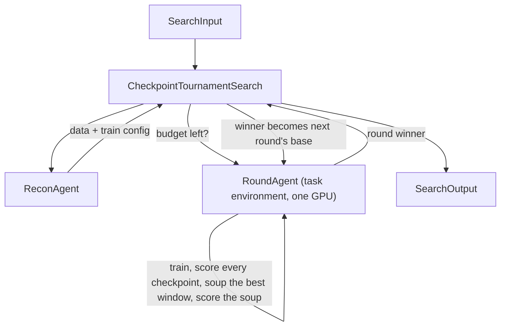

# Checkpoint Tournament with Model Soup

## Intent

Use this pattern when training is expensive (hours), many checkpoints exist along the trajectory, and the final checkpoint is not reliably the best. One round role, an Agent that runs in the task environment on the GPU, trains with checkpoint saving, scores every checkpoint, weight-averages the best adjacent window, and reports the round's winner. The Search repeats the round, continuing from the best checkpoint found so far, for as many rounds as the exploration budget pays for.

## Structure

## Core idea

A post-training run produces two kinds of waste that this pattern reclaims.

**Checkpoint waste.** Training saves only the final checkpoint, discarding intermediate states that may score higher. Overfitting, catastrophic forgetting, and evaluation noise all make the final checkpoint unreliable. Saving checkpoints at regular intervals and running a tournament to find the best one costs only evaluation time.

**Soup waste.** Adjacent strong checkpoints occupy similar regions of weight space but differ in which examples they get right. Weight-averaging them (model soup) smooths out per-example noise at zero training cost. An average of the last few strong checkpoints can match the best single checkpoint and vary less across repeated evaluations.

**Round waste.** A single training run stops at whatever the budget for one round happened to be, even when the exploration has time left. A further round costs nothing but one more round role: it resumes from the best checkpoint the tournament has found so far, under the same frozen data policy, and the tournament and soup steps repeat unchanged. Diagnosing failures and revising the data between rounds is a real extension of this pattern (see pattern 33 or a Diagnosis Agent of your own), but it is a second Agent role, not part of this minimal loop.

## How it works

1. **ReconAgent** runs once. It reads the eval script to understand the scoring mechanism, prompt template, stop tokens, and sampling parameters, prepares the training dataset (source selection, quality and length filters, shortest-trace deduplication for reasoning tasks, decontamination against the test set, prompts rendered as the eval renders them), and sets the training hyperparameters and the checkpoint save interval. When the task ships no corpus, finding one is part of the work and usually the largest lever.

2. **RoundAgent** runs once per round, a fresh identity each time, told which checkpoint to start from. It declares `task_environment=True`, so the task Conda env's python is first on its PATH, and its Search grants it the card with `gpus=1`. Inside one call it trains from that checkpoint with the frozen config, scores every saved checkpoint with the official eval script one after another, picks the contiguous window of `soup_k` step-adjacent checkpoints with the highest mean score, averages them with the fixed soup script, scores the soup, and reports every score plus the round's winner. It decides nothing about the data or the config.

3. **The Search** loops while `await self.budget.snapshot()` says the remainder pays for `min_round_seconds`, keeps the best winner across rounds, and hands the winner's directory to the next round as its base. A round that fails after a winner exists ends the loop with that winner; a round that fails before any winner ends the Search with that Failure.

## Mapping to the AIBuildAI SDK

The package lives under `search/`: `search/search.py` defines `CheckpointTournamentSearch`; `search/io.py` defines its `CheckpointTournamentSearchInput`; `search/agents/` holds `ReconAgent` and `RoundAgent` (`recon.py`, `round.py`, `io.py`, `policy.py`) and their prompts under `search/prompts/agent/`. There is no Program: the four Program questions fail on the last one, because the boundary a Program would add (a fresh worker process per Action) buys nothing when one Agent call runs the whole round on the one card it holds anyway.

`RoundAgent`'s Input carries everything a round needs and nothing that changes inside it: the objective, the scripts, the base checkpoint, the prepared data, the config, `save_steps`, and `soup_k`. Its Output, `RoundOutput`, lists every checkpoint it scored (`scored`), the soup and its score when one was made, and `best_name`, `best_dir`, `best_score`. The Search reads only the winner and passes `best_dir` on; `scored` stays in the Output as the record a reader or a later diagnosis role can open.

The `ROUND_POLICY` in `agents/policy.py` is the whole launch contract: `Bash`, `Read`, `Write`, `Glob`, `Grep`; the public data, `TMP`, and the run workspace to read; scratch and artifacts to write; `CONDA_PACKAGES` as the host system grant; and `task_environment=True`.

## Adjacency rule for soup

Model soup works best between checkpoints that are neighbors on the training trajectory — they occupy similar regions of weight space, so their average stays in a good region. Averaging distant or unrelated checkpoints (from different training runs, or early vs. late in the same run) typically hurts.

The soup step of `RoundAgent`'s prompt (`search/prompts/agent/round.j2`) tells the Agent to:

1. Sort all scored checkpoints by step number
2. Take the contiguous window of `soup_k` checkpoints with the highest mean score
3. Average that window, never the top-k by score

This is why the round's training must save checkpoints at regular intervals — the tournament needs enough candidates, and the soup needs adjacent neighbors.

## When to use

- Training takes hours and produces dozens of steps
- Evaluation is cheap relative to training (at least 5× faster)
- The task has a clear numeric score
- The final checkpoint is unreliable (overfitting, forgetting, noise)
- Budget allows at least one full train-tournament-soup cycle

## When not to use

- Training is so short that only 1–2 checkpoints exist
- The task needs RL/GRPO as the primary method (see pattern 31)
- Evaluation is as expensive as training (LLM-judge with many samples)
- The task is already near its ceiling and needs precision fixes (see pattern 33)

## References

- [Budget-Bounded Improvement](../29-budget-bounded-improvement/29-budget-bounded-improvement.md) — the round loop and budget gate
- [Single-Worker Rounds](../37-single-worker-rounds/37-single-worker-rounds.md) — the same loop with no selection policy, the baseline this pattern refines
- [Batch Training Configurations](../21-batch-training-configurations/21-batch-training-configurations.md) — when several configurations must train in parallel, the case a Program boundary is for
- [Tournament](../07-tournament/07-tournament.md) — the candidate selection topology
