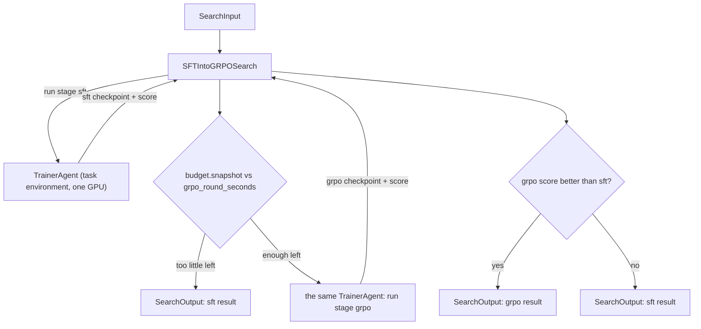

# SFT into GRPO

## Intent

Use this pattern when SFT gives the model the ability to produce correct answers (high pass@K) but greedy accuracy lags behind because probability mass is spread across many valid traces. GRPO concentrates that mass onto correct answers using the task's own verifier as the reward signal — no separate reward model needed.

## Structure

One `TrainerAgent` identity is called twice. Its conversation carries the lineage: the second call already knows the scripts it wrote, the data it prepared, and the SFT checkpoint it trained, so nothing is handed over by Input.

### Repair edge

The trainer writes `sft_train.py`, `grpo_train.py`, and `eval.py` itself, smokes each on a tiny slice, and when a script crashes reads the traceback and fixes it in the same call. That is the repair edge: the role that wrote the script is the role that runs it, so a bug in a generated script costs one more turn of the same conversation instead of a dead run. The Search adds one guard on top: the `grpo` call is spawned with `capture_failure=True`, so a GRPO stage that fails outright leaves the SFT result standing.

## Core idea

SFT and GRPO serve different purposes and compose naturally as a two-stage pipeline.

**SFT stage.** Train on curated data (open math datasets, teacher traces, or task-specific corpora) to give the model the raw ability to produce correct outputs. The model learns the output format, reasoning patterns, and domain knowledge. Save checkpoints, run a tournament, pick the best SFT checkpoint.

**GRPO stage.** Starting from the best SFT checkpoint, run Group Relative Policy Optimization. The model generates K candidate answers per problem, the task's own verifier scores each (correct / incorrect), and the policy gradient pushes probability toward correct traces. GRPO does not need a learned reward model — it uses the group-relative advantage within each batch.

The key diagnostic that tells you to add GRPO: a large gap between pass@K and pass@1. If at least one of eight samples solves nearly every problem but greedy decoding solves clearly fewer, the model already knows how to solve most problems — it just does not consistently choose the right trace. GRPO closes that gap.

## Mapping to the AIBuildAI SDK

The package lives beside this file: `search/agents/trainer.py` holds the one Agent, `search/agents/io.py` its `TrainerInput` and `StageOutput`, `search/agents/policy.py` its `TRAINER_POLICY` (`task_environment=True`, the task data readable, scratch and artifacts writable, `CONDA_PACKAGES` as the host system grant), `search/prompts/agent/trainer.j2` its prompt, and `search/search.py` `SFTIntoGRPOSearch`. There is no Program.

`SFTIntoGRPOSearch.explore()` constructs `TrainerAgent` once and declares each of its two calls separately: both are spawned with `gpus=1` and `wall_clock_seconds=trainer_wall_clock_seconds`, so the GRPO stage arrives with its own full clock rather than the remainder of the SFT stage's. It spawns `trainer.run` with the message `Run stage sft.` and reads back a `StageOutput`: the checkpoint directory, the metric name, and the score `eval.py` measured on it. It then reads `budget = await self.budget.snapshot()`: while `budget.wall_clock_remaining_s` cannot pay for `grpo_round_seconds`, the Search returns `SearchOutput` built from the SFT score alone. Otherwise it spawns `trainer.run` again on the same object with `Run stage grpo.`, `upstream=(sft_handle,)` and `capture_failure=True`, and returns whichever of the two scored checkpoints is higher.

The reward `grpo_train.py` optimizes must match the task's official scorer exactly: the prompt tells the trainer to make `grpo_train.py`'s reward call the same `eval.py` it scores with, so the signal trained on and the signal reported are one file.

## Agents

**TrainerAgent** (`search/agents/trainer.py`): reads the task data and scorer, prepares the prompt data, writes the three scripts, runs SFT and scores it on the first call, and runs GRPO from its own SFT checkpoint and scores it on the second. It repairs its own scripts when they crash.

## When to use

- The task has a cheap verifiable reward signal (exact match on a number, code execution pass/fail, function-call format check)
- SFT already produces correct answers at high pass@K but low pass@1
- Budget allows SFT + at least 1 GRPO round (each round is roughly as expensive as SFT)

## When not to use

- The task uses an LLM judge for evaluation (GRPO would need to call the judge for every training sample — too expensive)
- The model cannot produce correct answers even at pass@K (SFT data quality is the bottleneck, not sampling distribution)
- Budget fits only one training stage (use pattern 30 instead and spend the budget on better SFT)

## References

- [Checkpoint Tournament with Model Soup](../30-checkpoint-tournament-soup/30-checkpoint-tournament-soup.md) — the SFT stage uses the same tournament and soup pipeline
- [Budget-Bounded Improvement](../29-budget-bounded-improvement/29-budget-bounded-improvement.md) — the GRPO round loop uses `budget.snapshot()`
- [Evaluator-Optimizer](../11-evaluator-optimizer/11-evaluator-optimizer.md) — the SFT→GRPO transition is a special case of score-then-improve
