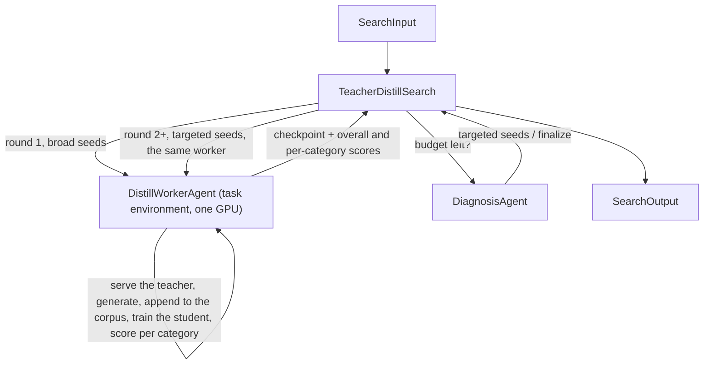

# Teacher Distillation with Iterative Refinement

## Intent

Use this pattern when no suitable open training dataset exists for the task and the agent must generate its own data using a large teacher model served locally. After each SFT round, the agent evaluates, diagnoses which categories are weakest, and generates targeted data addressing those weaknesses for the next round.

## Structure

## Core idea

Some tasks (open-ended writing, medical QA) have no public training corpus in the right format. The agent must create one. A large teacher model generates high-quality responses, and the student model learns from them through SFT.

The iteration loop refines the DATA, not the training recipe. After round 1, the eval reveals per-category scores, and one category can sit far below the others. The Diagnosis Agent identifies the weakest categories and prepares seed prompts targeting them. The next round's worker call serves the teacher on those seeds, appends what it generated to the corpus, and trains on the combined data.

**Why iteration works here.** The first data generation pass uses broad seed prompts and produces a balanced dataset. But the eval often reveals extreme imbalances — one category near zero while the others are well above it. Targeted generation for the weak category is cheap (minutes of teacher inference) and directly addresses the measured gap.

**Why DPO usually fails here.** Preference pairs drawn from small-model candidates carry a weak signal — a discriminator barely above chance and very small margins — so DPO on them often has no effect or degrades performance. The pattern includes DPO as an optional step but does not rely on it.

## Mapping to the AIBuildAI SDK

The package beside this file (`search/`, plus `input_payload.json`) is a complete, loader-verified implementation: `search/search.py` holds `TeacherDistillSearch`, `search/io.py` its `TeacherDistillSearchInput`, `search/agents/` `DistillWorkerAgent` and `DiagnosisAgent` with their typed `io.py` and `policy.py`, and `search/prompts/agent/` their two Jinja templates. There is no Program.

`DistillWorkerAgent` is one identity for the whole run, called once per round. Its Input carries the objective, the data directory, and `rows_per_round`; each call's message carries the round number and the seed prompts. Its policy declares `task_environment=True` and the Search grants it `gpus=1`, so inside one call it serves the teacher with vLLM, generates about `rows_per_round` rows from the seeds, drops empty and refusing responses, appends the kept rows to its corpus, stops the teacher, trains the student on the whole corpus with the fixed config it wrote in round 1, and scores the checkpoint overall and per category. Because the same conversation continues across rounds, the corpus, the scripts, and the teacher choice persist without any state file: the worker simply remembers them. Its `RoundOutput` reports the teacher it served, the corpus size, the checkpoint directory, and the scores.

`DiagnosisAgent` is a fresh identity every round. It reads the round's per-category scores and the checkpoint's own transcripts on the weak categories, and returns either targeted `seed_prompts` for the next round or `finalize`.

The loop: each round the Search reads `await self.budget.snapshot()`, spawns the worker with the round's seeds and `capture_failure=True`, keeps the best overall score and its checkpoint, reads the budget again, spawns the diagnosis, and either stops or feeds its seeds into the next worker call. A worker Failure after a checkpoint exists ends the loop with that checkpoint; before one exists it ends the Search. The Search returns `SearchOutput` built from the best round.

## Agents

**DistillWorkerAgent**: reads the eval script, chooses a teacher stronger than the student that fits the card (quantized as needed), measures its throughput on a few seeds before committing to the round's target, and does every generation, training, and evaluation itself, one GPU process at a time.

**DiagnosisAgent**: reads one round's per-category scores and the checkpoint's own transcripts on the weak categories, then prepares targeted seed prompts for the next round. Decides when the evidence suffices to `finalize` instead.

## When to use

- No suitable open training dataset exists for the task
- A teacher model (8B–120B) can generate high-quality responses when prompted with task-specific seeds
- The eval provides per-category breakdowns that reveal which areas to target
- Budget allows generation (30–90 min) + training (30–120 min) + eval for at least 2 rounds

## When not to use

- High-quality open training data already exists (use pattern 30 instead)
- No teacher that is stronger than the student on this task fits the card, even quantized
- The task has a single scalar score with no category breakdown (diagnosis has nothing to act on)
- The task needs RL for the second stage (use pattern 31)

## References

- [Checkpoint Tournament with Model Soup](../30-checkpoint-tournament-soup/30-checkpoint-tournament-soup.md) — the train-eval-soup cycle within each round
- [Sequential Chain](../02-sequential-chain/02-sequential-chain.md) — the generate-then-review shape
- [Worker-Iterator](../10-worker-iterator/10-worker-iterator.md) — each round informs the next
