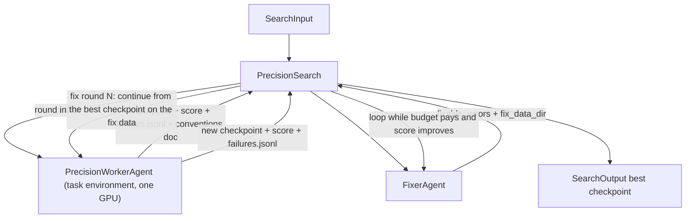

# Error-Driven Precision Continuation

## Intent

Use this pattern when the first SFT round already scores near its ceiling and the remaining errors are individually diagnosable. Each iteration analyzes the specific failing examples, generates synthetic training data that exercises those exact error patterns, and does a short low-lr continuation from the best checkpoint. Iterations are cheap (minutes, not hours).

## Structure

## Core idea

When a model is already near its ceiling, the remaining errors are few enough to analyze one by one. Each failing example reveals a specific convention the model does not follow — a formatting rule, a normalization convention, an argument inclusion policy. The fix is not more training data in general, but synthetic examples that specifically exercise the broken convention.

The iteration is cheap because:

1. **Error analysis is fast.** Near the ceiling, only a handful of examples fail. The Agent reads each one and categorizes the error.
2. **Synthetic data generation is fast.** The fix dataset is small (hundreds of examples targeting 1–2 conventions), not a full re-generation.
3. **Continuation training is fast.** Low learning rate (2e-6), 1 epoch, from the best checkpoint. Takes minutes on one GPU.

The risk is regression — fixing one error while breaking something that already works. The pattern guards against this by mixing a replay buffer (a sample of the original training data that the model already gets right) into each fix dataset, and by evaluating after every fix round.

## Mapping to the AIBuildAI SDK

The package lives under `search/`: `io.py` declares `PrecisionSearchInput`; `agents/io.py`, `agents/policy.py`, `agents/worker.py`, and `agents/fixer.py` declare `PrecisionWorkerAgent` and `FixerAgent`; `search.py` declares `PrecisionSearch`; and `prompts/agent/worker.j2` and `prompts/agent/fixer.j2` render the two Agents. There is no Program.

`PrecisionWorkerAgent` is one identity for the whole run. It declares `task_environment=True` and the Search grants it `gpus=1`. Its first call, `Run round initial.`, prepares the SFT data, writes `train.py` and the evaluation script, writes the conventions doc the fixer reads, smokes both scripts, runs the SFT, and evaluates it; its `RoundOutput` carries the checkpoint, the score, `failures_path`, `conventions_path`, and `replay_data_dir`. Every later call names a fix round, the best checkpoint to continue from, and the fix dataset the fixer built; the worker continues one low-learning-rate epoch and evaluates again. Its conversation carries the scripts and the data across calls.

`FixerAgent` is a fresh identity every fix round: reads `failures.jsonl` against the conventions doc, categorizes each wrong example into a nameable convention violation, and when at least one is fixable writes a small synthetic set that exercises it, mixed with a replay sample from the initial data so the continuation cannot fix one convention by breaking another. An empty `fixable_errors` ends the loop.

The Search reads `await self.budget.snapshot()` before each fix round and stops when the remainder cannot pay for `fix_round_seconds`; it spawns every worker call with `capture_failure=True`, so a round that fails leaves the best checkpoint standing and ends the loop instead of the run; after each round's evaluation it keeps the new checkpoint only if the score improved, and stops the first time a round fails to improve, the regression guard the Core idea section describes. `SearchOutput` reports the best `(output_dir, score)` reached, whether that is the initial SFT or a later fix round.

## Agents

**PrecisionWorkerAgent**: trains and evaluates every checkpoint itself, and repairs its own scripts when they crash. It also writes the conventions doc `FixerAgent` reads every round: the exact output conventions and the eval's rendering chain, so a later round's diagnosis never depends on the worker's own reasoning still being in context.

**FixerAgent**: reads one round's failures against the conventions doc and reports the fixable categories with a synthetic fix dataset, or reports that nothing more is fixable by data.

## When to use

- First SFT scores near its ceiling (the remaining errors are few and specific)
- The output format is narrow and well-specified (function calls, structured JSON, code)
- Individual errors can be diagnosed to specific conventions
- Synthetic examples exercising those conventions can be generated cheaply
- Budget allows many short fix rounds

## When not to use

- The model is far from its ceiling (too many errors to diagnose individually — use patterns 30 or 32)
- The task has open-ended output (writing, medical QA) where errors are not convention violations
- The remaining errors are fundamentally ambiguous (like symmetric argument ordering in a function-calling evaluation)
- Each eval is expensive (LLM judge) — the many eval rounds become the bottleneck

## References

- [Evaluator-Optimizer](../11-evaluator-optimizer/11-evaluator-optimizer.md) — the same iterate-until-fixed shape at the Agent scale
- [Benchmark Evaluation and Error Analysis](../25-benchmark-evaluation-and-error-analysis/25-benchmark-evaluation-and-error-analysis.md) — the eval-then-diagnose step
- [Checkpoint Tournament with Model Soup](../30-checkpoint-tournament-soup/30-checkpoint-tournament-soup.md) — the initial SFT stage
