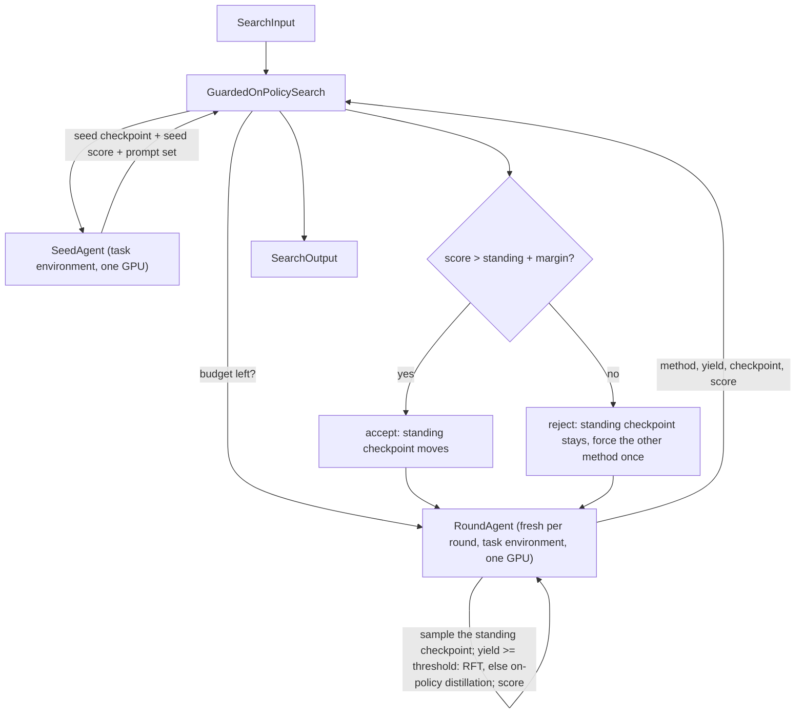

# Guarded On-Policy Rounds

## Intent

Use this pattern when the student model already answers in the task's format and succeeds at least sometimes, and the next gain has to come from the student's own output rather than from more supervised data. Each round samples the standing checkpoint, trains on what it drew, scores the result, and keeps the round only if it beat the standing checkpoint by more than the evaluation's noise. A round that loses is undone: the standing checkpoint does not move, and the next round samples the same model again.

## Structure

## Core idea

On-policy training has a failure mode that supervised training does not. The data a round learns from was written by the model that round starts from, so a round that goes wrong does not merely waste time: it teaches the student its own mistakes, and the next round then samples that damaged model. Left unguarded, the loop compounds its own errors, and the run's final model can be worse than the model it started from while every individual step looked like progress.

**The guard is the pattern.** After each round the new checkpoint is scored against the standing one. The round is kept only when it wins by more than `guard_margin`, which is sized above the evaluation's own repeat-to-repeat noise; otherwise the standing checkpoint stays exactly what it was and the losing checkpoint is left on disk as a record rather than becoming the next round's parent. This is what makes the loop safe to run for more rounds than anyone can watch.

**The method is a measurement, not a preference.** Self-training needs completions a verifier accepted, so it needs the student to succeed often enough to produce them. The round role reports how many of its draws the verifier kept, and the rule it applied: at or above `rft_min_yield` the round trained on the kept completions, and below it the round distilled against a teacher instead, which needs no correct answers at all. Choosing by the yield the round just measured, rather than once at design time, is what lets the same Search serve a student that starts weak and becomes strong.

**A rejection is a hypothesis, not a verdict.** A yield just either side of the threshold picks a method the round then disproves. So the first rejection forces the other method for one more round over a fresh shard; a second consecutive rejection ends the loop, because at that point neither method is finding anything.

## How it works

1. **SeedAgent** runs once, in the task environment on the card. It reads the eval script for the prompt template and scoring mechanism, reads the sample script to learn what the verifier counts as correct, runs supervised fine-tuning so the seed model already answers in the task's format, scores that seed with the eval script, writes the prompt set the rounds sample on (disjoint from the eval set), and freezes one training config both methods read.

2. **The seed's score is the first standing score.** Without it the guard has nothing to compare against, and the first round would be accepted by default whatever it produced.

3. **Each round**, while `await self.budget.snapshot()` still pays for one, a fresh **RoundAgent** is told the STANDING checkpoint. Inside one call it samples `samples_per_prompt` completions per prompt from it, verifies them, computes the yield, applies the method rule (or the forced method the message gave), trains from the standing checkpoint with the frozen config, and scores the new checkpoint. It reports the yield, the method, the checkpoint, and the score.

4. **The guard** compares that score with the standing score. Accept: the standing checkpoint, name, and score all move, and the rejection streak resets. Reject: nothing moves, the other method is forced for one more round, and a second consecutive rejection ends the loop.

5. `explore()` returns a `Failure` when no round ever beat the seed, and otherwise a `SearchOutput` naming the standing checkpoint.

## Mapping to the AIBuildAI SDK

The package lives under `search/`: `search/search.py` defines `GuardedOnPolicySearch`; `search/io.py` its `GuardedOnPolicySearchInput`; `search/agents/` the `SeedAgent` and `RoundAgent` roles (`seed.py`, `round.py`, `io.py`, `policy.py`) and their prompts under `search/prompts/agent/`. There is no Program: both roles declare `task_environment=True` and are granted `gpus=1`, and every step of a round is one call of one role.

`RoundInput` carries the standing checkpoint, the prompt set, the config, `samples_per_prompt`, `rft_min_yield`, and `forced_method` (empty unless a rejection set it). The method rule is therefore part of the round's Input, applied by the round and reported back in `RoundOutput.method`; the Search never re-derives it.

The guard lives in `explore()`, not in the round. The round's job ends at "this call produced this checkpoint with this score"; whether that checkpoint is worth keeping is a comparison against the standing score, which is a Search decision. A rejected round's checkpoint is left on disk as a record and never becomes a parent, because the next round's Input names the standing checkpoint again.

### Agents

**SeedAgent** runs once. Its most consequential output is `seed_checkpoint`: on-policy rounds train on the student's own writing, so a seed that cannot yet answer in the task's format gives every later round nothing to learn from. Its prompt asks it to run supervised fine-tuning rather than report the raw base model, and to score the seed.

**RoundAgent** runs once per round as a fresh identity. It samples, chooses by the rule, trains, and scores, one GPU process at a time, and repairs its own scripts when they crash.

## Sizing the guard margin

The margin is the whole difference between a guard and a coin flip. Set it from the evaluation's own repeatability, not from a round number: score one checkpoint several times under the eval script's real sampling parameters and take the spread. A margin under that spread accepts rounds that only got lucky, which is how an unguarded loop drifts. A margin far over it rejects real gains and the loop stops after `max_rejected_rounds` with the seed still standing. When the eval is fully deterministic, a small positive margin still earns its place: it refuses rounds that bought a rounding error with an hour of GPU time.

## When to use

- The student already produces valid, sometimes correct answers, so its own samples carry signal
- A verifier can label a completion, or a teacher model fits on the same card for the distillation step
- The evaluation is cheap relative to a training round, so scoring every round is affordable
- The loop will run unattended for more rounds than anyone will watch

## When not to use

- The student cannot yet answer in the task's format; run supervised fine-tuning first, and see pattern 32 when a teacher must write the data
- No verifier and no teacher exist, so a round has no signal to train on
- One long training run is the whole budget, and there is no room for a second round to overturn the first
- The scoring is an expensive LLM-judge pass, which makes the per-round guard cost as much as the round; see pattern 36, where the judge is measured once instead

## References

- [Checkpoint Tournament with Model Soup](../30-checkpoint-tournament-soup/30-checkpoint-tournament-soup.md) — the round loop this pattern guards
- [Teacher Distillation with Iterative Refinement](../32-teacher-distillation-iterative-refinement/32-teacher-distillation-iterative-refinement.md) — the fixed-teacher-data case, for a student too weak to sample from
- [Budget-Bounded Improvement](../29-budget-bounded-improvement/29-budget-bounded-improvement.md) — the budget snapshot that decides whether another round fits
- [Evaluator-Optimizer](../11-evaluator-optimizer/11-evaluator-optimizer.md) — the accept-or-revise loop at the Agent scale
- [Judge-Calibrated Preference Branch](../36-judge-calibrated-preference/36-judge-calibrated-preference.md) — the same branch-on-a-measurement idea where the measurement is the judge itself
