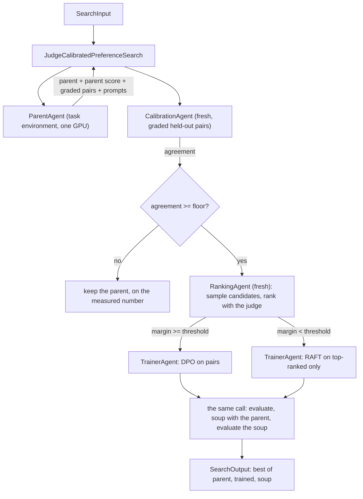

# Judge-Calibrated Preference Branch

## Intent

Use this pattern when the task is scored by a rubric or a human-like preference rather than by an exact answer, and the training signal has to come from a judge model. The judge is measured against the official grader before it is allowed to build any training data, the preference method is chosen from what that measurement and the ranking show, and the trained model is averaged back with the supervised parent so a weak round cannot cost more than it gained.

## Structure

## Core idea

A preference pipeline replaces the grader with a judge, and then trains on the judge. Everything downstream inherits whatever the judge got wrong, and nothing later in the pipeline can detect it: a model that learned a judge's idiosyncrasy scores well under that judge and badly under the grader, which is the only score that counts. The usual mitigations — a lower learning rate, fewer epochs, a smaller dataset — all assume the signal points the right way and is merely weak. A miscalibrated judge points somewhere else.

**Measure the judge before trusting it.** A calibration role runs the judge over held-out pairs the official grader has already separated, and reports how often the judge chose the same side. Below `min_judge_agreement` the Search abandons the preference branch and returns the supervised parent. The measured number is on the calibration Action's own Output, which the journal keeps; `SearchOutput` carries the attempt that was selected, never a narration of how it was selected. Abandoning is the correct response, not a fallback: there is no version of "train more carefully on a signal pointing elsewhere" that helps.

**Then branch on what the ranking measured.** The judge's mean score gap between the chosen and rejected sides says whether the pairs are actually separated. A wide gap means the two sides really differ and a pairwise loss can read that difference, so the round trains on pairs. A narrow gap means the judge is close to indifferent, and training on its ordering mostly fits its noise, so the round keeps only the top-ranked completion per prompt and trains on it as ordinary supervised data. Which method the trainer runs is decided by a number this run measured, not by the author's guess.

**Average back with the parent.** The last step soups the trained checkpoint with the supervised parent and scores all three. Preference training on a judge's ordering moves the model further than the ordering justifies, and the average pulls it back toward the model that was already known to work. Because the parent, the trained model, and the soup are all scored by the official grader, the Search returns whichever of them actually won rather than assuming the newest is best.

**Why this pattern returns a result where pattern 35 returns a `Failure`.** The two answer the same question opposite ways on purpose. Pattern 35 runs rounds whose only reason to exist is to beat the seed, so a run where none did has produced nothing and says so with a `Failure`. This pattern's supervised parent is already the deliverable; the branch is an attempt to improve on it. So a gate that refuses the branch, and a stage that crashes inside it, both leave a usable model behind, and the honest report is that model. What makes it honest is not a sentence on the Output -- `SearchOutput` has no reason field -- but that every path back to the parent is an explicit branch on a measured number or on a `Failure` captured with `capture_failure=True`, each of which is its own Action's recorded outcome. A pattern that slid back to the parent without that branch would be the fallback this one is meant to avoid.

## How it works

1. **ParentAgent** runs once, in the task environment on the card. It fine-tunes the supervised parent and scores it with the official eval script, writes the prompt set, and builds `calibration_pairs_path`: held-out completion pairs the OFFICIAL grader separates into a better and a worse side, drawn from a split the training prompts do not touch. Both sides of a pair must be on the same prompt, or the measurement compares prompts rather than completions.

2. **CalibrationAgent**, a fresh identity that sees only the graded pairs, scores both sides with the judge and reports how often the judge agrees with the grader, and over how many pairs.

3. **The gate.** Agreement under the floor returns the parent, naming the measured agreement and the pair count. A calibration that failed outright does the same rather than proceeding on an unmeasured judge.

4. **RankingAgent**, another fresh identity, draws `candidates_per_prompt` completions per prompt from the parent and ranks them with the judge into chosen-rejected pairs and a top-ranked-only file, reporting the pair count and the mean margin. Too few pairs returns the parent.

5. **The branch**: `mean_margin >= dpo_min_margin` sends the pairs to DPO; otherwise the top-ranked file goes to RAFT. **TrainerAgent** trains the chosen method from the parent, scores the result, averages it with the parent, scores the soup, and reports every candidate it scored; a step that failed is named in its notes.

6. The Search returns the best of the parent, the trained model, and the soup; a branch that produced nothing better returns the parent. The agreement, the margin, the pair count and any lost step stay on the Actions that measured them, which is where a reader of the run finds them.

## Mapping to the AIBuildAI SDK

The package lives under `search/`: `search/search.py` defines `JudgeCalibratedPreferenceSearch`; `search/io.py` its `JudgeCalibratedPreferenceSearchInput`; `search/agents/` the four roles (`parent.py`, `judge.py` with `CalibrationAgent` and `RankingAgent`, `trainer.py`, `io.py`, `policy.py`) and their prompts under `search/prompts/agent/`. There is no Program: every role declares `task_environment=True` and is granted `gpus=1`.

**The calibration is enforced by the Search's call order.** `RankingAgent` is spawned with `upstream=(calibrate_handle,)` only after the calibration Output passed the floor, and the two judge roles are separate fresh identities on purpose: a judge that ranks must never have seen the grader's answers, and a judge that was measured must never rank. The order in `explore()` is the guarantee, written in one place and read in one place.

**The gate and the branch live in `explore()`.** A role's job ends at "this call measured this number". Comparing that number against a threshold, and choosing which method the trainer runs, is a Search decision that reads outputs from two different roles; the decision arrives at the trainer as `TrainerInput.method`.

### Agents

**ParentAgent**: the judgement it cannot delegate is the calibration set: pairs the official grader separated, on prompts that appear in neither the evaluation set nor the training prompt set. A calibration set drawn from the training prompts measures nothing, because the judge and the training data would then agree by construction.

**CalibrationAgent** and **RankingAgent**: two fresh judge roles, so the one that is measured and the one that ranks never share a conversation.

**TrainerAgent**: runs the chosen method, evaluates, soups with the parent, evaluates the soup, and reports every candidate with a score; one GPU process at a time.

## What the agreement floor is worth

The floor is not a quality knob. Set it from what the measurement can support: a hundred graded pairs put a coin-flip judge at roughly 0.5 with several points of sampling error, so a floor near 0.5 refuses almost nothing, and a floor near 1.0 refuses judges that are merely imperfect. A floor around 0.7 over a few hundred pairs is a judge that agrees with the grader far more often than chance while leaving room for the disagreement any rubric has. Report the pair count beside the agreement, as `CalibrationOutput` does, because an agreement measured over twenty pairs is not a measurement.

## When to use

- The metric is a rubric or a preference, so no verifier can label a completion
- A judge model is available and the official grader can separate a held-out set to measure it against
- The supervised parent is already usable, so souping back with it is meaningful
- One preference round fits the budget, and its value depends on the judge being right

## When not to use

- The task has an exact answer or a test suite; use a verifier and see pattern 35
- No grader-separated pairs can be built, so the judge cannot be measured and the gate would be decoration
- The judge IS the official grader, in which case there is nothing to calibrate and the branch is a plain preference round
- Several rounds of self-improvement are wanted rather than one measured branch; see pattern 35

## References

- [Guarded On-Policy Rounds](../35-guarded-on-policy-rounds/35-guarded-on-policy-rounds.md) — the verifiable-reward sibling, and the same branch-on-a-measurement idea across rounds
- [Checkpoint Tournament with Model Soup](../30-checkpoint-tournament-soup/30-checkpoint-tournament-soup.md) — the soup step and the adjacency rule for averaging
- [Tournament](../07-tournament/07-tournament.md) — relative preference as the selection topology
- [Committee Voting](../08-committee-voting/08-committee-voting.md) — several blind judges instead of one measured judge
- [Benchmark Evaluation and Error Analysis](../25-benchmark-evaluation-and-error-analysis/25-benchmark-evaluation-and-error-analysis.md) — fixed evaluation followed by analysis
