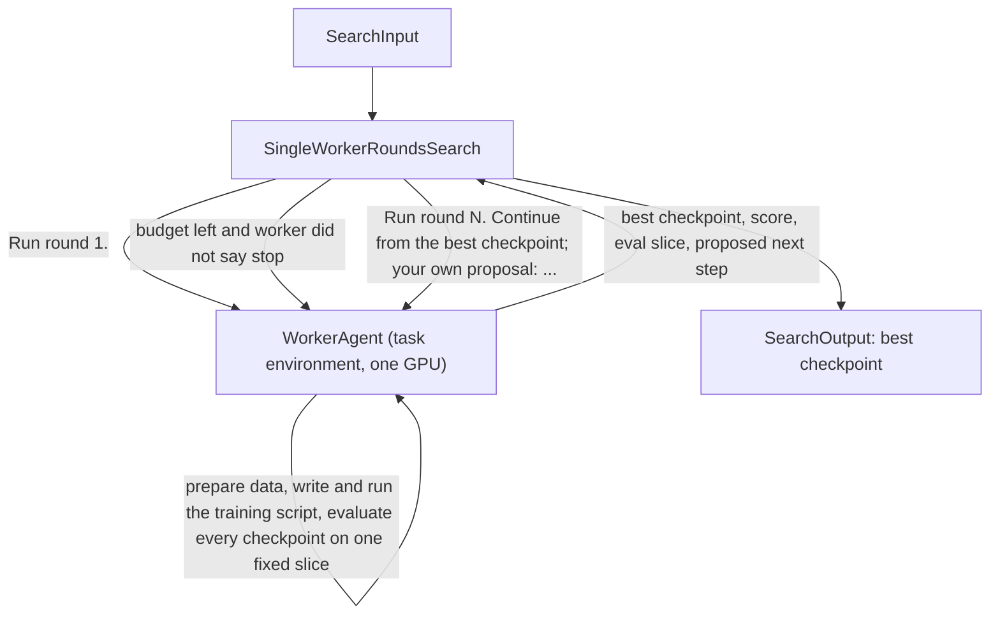

# Single-Worker Rounds

## Intent

Use this pattern as the baseline shape of every post-training run: one worker Agent that holds the task environment and the GPU does a whole round itself, from data to a scored checkpoint, and the Search does nothing but loop while the budget pays and keep the best checkpoint. The post-training trajectories that reached their scores had exactly this shape, one agent session doing the whole job; patterns 30 to 33, 35 and 36 each add one specific policy on top of it.

## Structure

## Core idea

Most of what a post-training run does is settled judgment in a loop: read the scorer, render prompts the way it does, prepare data, write a training script, run it, read the crash, fix the script, evaluate, look at what failed, decide what to change. One Agent with the task environment on its PATH and the card visible to it does all of that in one conversation, and does it better than a fixed pipeline because it reads its own results.

A Program earns its place only when a separate boundary has real value: many candidates in parallel, a loser to cancel, a fixed long worker process. One card, one round at a time, has none of those, so this pattern has no Program at all.

What the Search adds is the two things the worker cannot do for itself: the budget gate, read from `await self.budget.snapshot()` before each round, and a memory of the best checkpoint that does not depend on the worker's own judgment. The worker proposes its next step; the Search hands that proposal back with the best checkpoint's path and score, so a round that lost is still visible and the next round starts from the winner.

## How it works

1. **WorkerAgent** is one identity for the whole run, and every round is its own call with its own declaration: the Search spawns it with `gpus=1` and a `wall_clock_seconds` that bounds that round alone, so a round never eats the next round's clock. Its policy declares `task_environment=True`, so the task Conda env's python is first on its PATH, plus `Bash`, `Read`, `Write`, `Edit`, `Glob`, `Grep`, the public data and the run workspace to read, and scratch and artifacts to write.

2. **Round 1** is the message `Run round 1.`: the worker reads the scorer, prepares the data, writes and smokes the training and evaluation scripts, trains with checkpoints saved along the way, evaluates every checkpoint on one fixed held-out slice, and reports the best one, its score, the slice it used, and what it would change next.

3. **Every later round** is a message naming the round, the best checkpoint so far with its score and slice, and the worker's own last proposal. The worker applies the change and continues from that checkpoint. Its conversation carries the scripts and the data, so nothing is handed over by Input.

4. **The Search** keeps the best score, refuses a round that scored on a different slice (scores compare only on the same slice), stops when the worker says `stop`, when `max_rounds` is reached, or when the budget no longer pays for `min_round_seconds`, and returns the best checkpoint. It keeps a per-round history for the one return that can carry it: the `Failure` reason it raises when no round produced a checkpoint at all.

## Mapping to the AIBuildAI SDK

The package lives under `search/`: `search/search.py` defines `SingleWorkerRoundsSearch`; `search/io.py` its `SingleWorkerRoundsSearchInput` (`objective`, `data_dir`, `max_rounds`, `min_round_seconds`, `worker_wall_clock_seconds`); `search/agents/` the one `WorkerAgent` (`worker.py`, `io.py`, `policy.py`) and `search/prompts/agent/worker.j2` its prompt.

`WorkerInput` carries only the objective and the data directory. `RoundOutput` carries `round_index`, `checkpoint_dir`, `score`, `eval_slice`, and `next_step`. Each round is one `await self.ctx.spawn(worker.run, message, upstream=upstream, capture_failure=True)` on the same object; a Failure after a checkpoint exists ends the loop with that checkpoint, before one exists it ends the Search.

## When to use

- Any fine-tuning task, as the first design to consider; add a pattern from 30 to 36 only for the specific policy it names
- One card, one training run at a time
- The scorer is cheap enough to run on every checkpoint of every round

## When not to use

- Several candidates must train in parallel with losers cancelled (see patterns 18 to 21 and 28, where a Program per candidate is the boundary that matters)
- The round needs a guard the worker must not be trusted to apply to itself (see pattern 35) or a judge that must be measured before it ranks (see pattern 36)

## References

- [Budget-Bounded Improvement](../29-budget-bounded-improvement/29-budget-bounded-improvement.md) — the round loop and the budget gate
- [Checkpoint Tournament with Model Soup](../30-checkpoint-tournament-soup/30-checkpoint-tournament-soup.md) — the same loop with a checkpoint-selection policy the round applies
- [Worker-Iterator](../10-worker-iterator/10-worker-iterator.md) — each round informs the next
