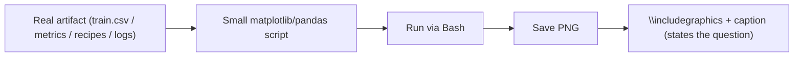

# Figures Writing Guide

## Goal

Choose figures that answer a question about the run, generate each one from a real artifact, and never draw a curve the data does not contain. A figure earns its place only if it answers an analysis question; a decorative plot is wasted space.

`Every figure maps to (a) the real artifact it is drawn from and (b) the one analysis question it answers; if the artifact does not exist, the figure does not exist.`

## How a Figure Is Made (mechanism)

The writer does not hand-draw figures. The mechanism is always the same:

1. Write a small matplotlib/pandas script that reads the real artifact (`train.csv`, the graded metrics, the plan or revision in a result's Coder Input, the upstream edges between results, or a result's logged training records).
2. Run the script with Bash over the real files.
3. Save the output as a PNG into the paper's figure directory.
4. Embed it in LaTeX with `\includegraphics` and a caption that states the question it answers.



## Hard Rule: No Fabricated Data

`A figure must use only data that really exists on this run. If the data for a figure is absent, say so in the text and do not draw it.`

1. The run usually ships the graded metrics, recipes, and upstream edges, and sometimes `train.csv`, but usually NOT step-by-step training logs.
2. If a result never recorded per-step loss, you cannot draw a loss curve. Do not invent one.
3. State the absence in prose ("per-step training logs were not retained for these results, so we omit optimization-dynamics plots") rather than fabricating a smooth curve.
4. A fabricated curve is a fatal integrity failure; an honest "not available" is acceptable.

## Figure Catalogue

Each entry lists the figure, its real artifact, and the question it answers.

### Data EDA (artifact: `train.csv`)

1. Label-balance bar -> from the label column -> "How imbalanced is the task, and does it justify reweighting / a PR-style metric?"
2. Feature-distribution box / violin -> from numeric columns grouped by label -> "Which features separate the classes, and are there outliers an imputation choice must handle?"
3. Missingness heatmap -> from `train.csv.isna()` -> "Which columns are heavily missing, and is the missingness structured (driving a missing-indicator choice)?"
4. Correlation matrix -> from numeric columns -> "Are features redundant, and is any single feature suspiciously correlated with the label (leakage)?"

### Search results (artifacts: graded metrics, upstream edges, recipes)

1. Per-result leaderboard bar -> from the graded holdout metrics -> "Which results won, and how large is the winner's margin?"
2. Holdout-vs-budget or holdout-vs-design-dimension scatter -> from metrics + recipes -> "Did more budget buy accuracy, or did a specific design dimension (model family, encoding) drive the score?"
3. Search-tree diagram -> from the upstream edges -> "How did the search explore, and which parent produced the winning child?"

### Single-model diagnostics (only when predictions + labels exist)

1. Tree-model feature importance -> from a tree model's importances -> "Which features did the winning model actually rely on (and is a leaking feature on top)?"
2. Confusion matrix -> from predictions vs labels -> "Where do errors concentrate (which class is missed)?"
3. ROC curve -> from scores vs labels -> "How well separated are the classes across thresholds?"
4. Calibration plot -> from predicted probabilities vs labels -> "Are predicted probabilities trustworthy, or do they need recalibration?"

### Training dynamics (ONLY when a result recorded step-by-step logs)

1. Loss curve + trend -> from a result's per-step loss log -> "Did training converge, plateau, or diverge?"
2. Grad-norm over steps -> from the same log -> "Were there instability spikes?"
3. Learning-rate schedule -> from the same log -> "Did the schedule match the loss behavior?"
4. If no result logged steps, omit this entire group and note the absence (see the Hard Rule).

## Worked Example (label-balance bar from `train.csv`)

Write a tiny script that reads the real `train.csv`, plots the label balance, and saves a PNG:

```python
import pandas as pd
import matplotlib
matplotlib.use("Agg")
import matplotlib.pyplot as plt

df = pd.read_csv("train.csv")
counts = df["label"].value_counts().sort_index()

fig, ax = plt.subplots(figsize=(4, 3))
ax.bar(counts.index.astype(str), counts.values)
ax.set_xlabel("class")
ax.set_ylabel("count")
ax.set_title("Label balance")
fig.tight_layout()
fig.savefig("figures/label_balance.png", dpi=200)
```

Run it with Bash (`python make_label_balance.py`), then reference the saved PNG in LaTeX:

```latex
\begin{figure}[t]
  \centering
  \includegraphics[width=0.7\linewidth]{figures/label_balance.png}
  \caption{Class distribution on the training set. The 94/6 imbalance motivates PR-AUC as the
  primary metric and the class reweighting used by the top result.}
  \label{fig:label-balance}
\end{figure}
```

## Quick Quality Checklist

1. Does every figure name the real artifact it was generated from?
2. Does every figure answer one stated analysis question in its caption?
3. Did you generate each figure with a script over real files, not by hand?
4. Did you omit (and explicitly note) any figure whose data does not exist on this run?
5. Are there zero fabricated curves or invented numbers?
